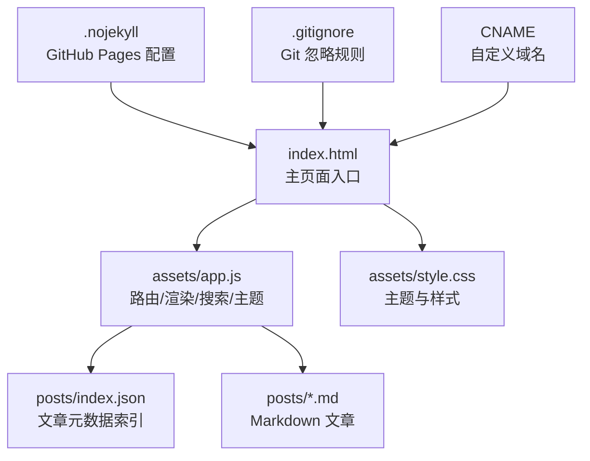
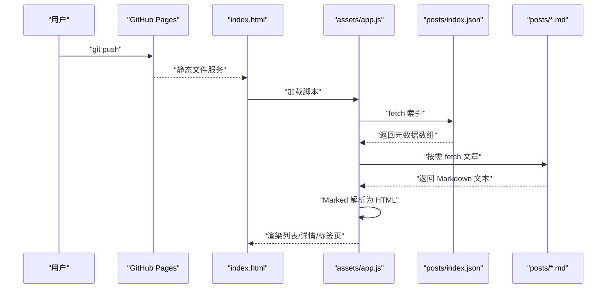
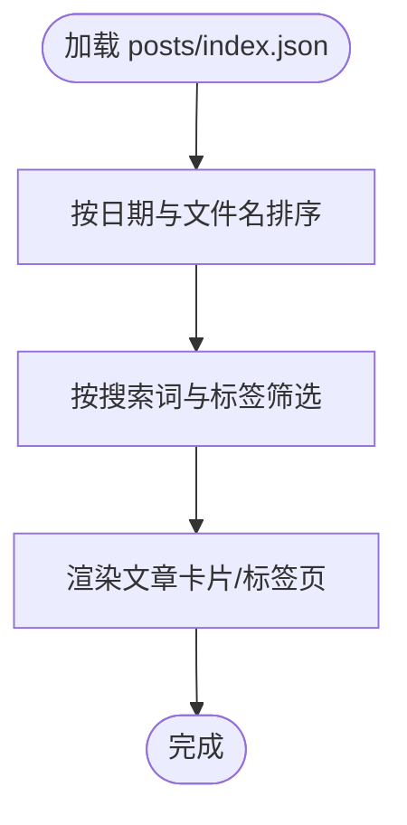
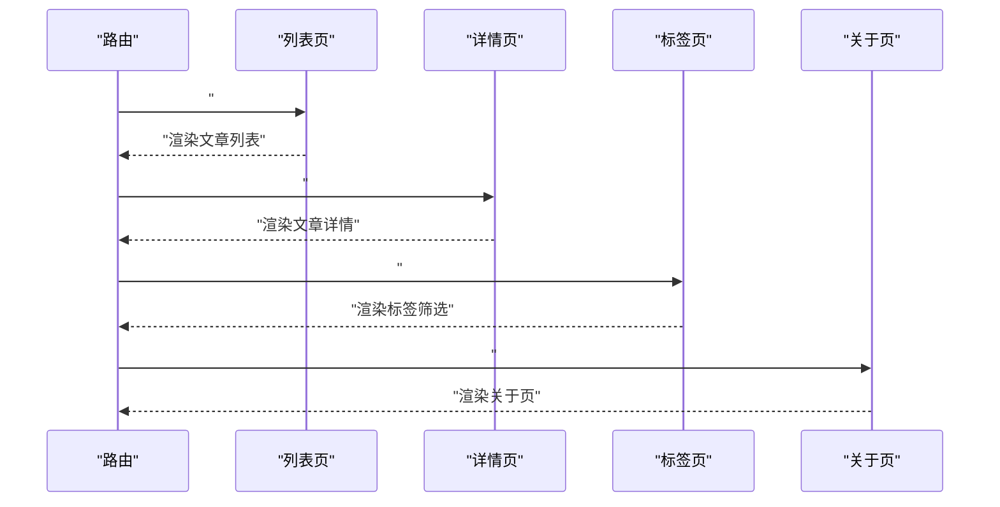
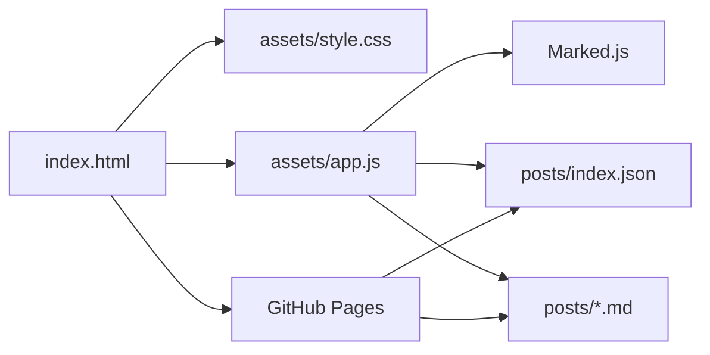

# 内容管理

<cite>
**本文档引用的文件**
- [posts/index.json](file://posts/index.json)
- [posts/2026-02-09-hello.md](file://posts/2026-02-09-hello.md)
- [posts/2026-02-09-博客搭建过程.md](file://posts/2026-02-09-博客搭建过程.md)
- [index.html](file://index.html)
- [assets/app.js](file://assets/app.js)
- [assets/style.css](file://assets/style.css)
- [.gitignore](file://.gitignore)
- [.nojekyll](file://.nojekyll)
- [CNAME](file://CNAME)
</cite>

## 目录
1. [简介](#简介)
2. [项目结构](#项目结构)
3. [核心组件](#核心组件)
4. [架构总览](#架构总览)
5. [详细组件分析](#详细组件分析)
6. [依赖关系分析](#依赖关系分析)
7. [性能考虑](#性能考虑)
8. [故障排除指南](#故障排除指南)
9. [结论](#结论)
10. [附录](#附录)

## 简介
本内容管理系统采用“无编译”的静态博客架构，以 Markdown 文件作为内容载体，配合浏览器端 Markdown 解析与 JSON 元数据索引，实现“本地维护 + Git 推送即发布”的高效工作流。系统通过单一入口 HTML 页面加载 JavaScript 与样式，运行时动态加载文章索引与 Markdown 内容，支持路由、搜索、标签云、主题切换与响应式布局。

## 项目结构
项目采用扁平化的静态文件组织方式，核心目录与文件如下：
- 根目录：HTML 入口、配置文件与静态资源
- posts 目录：文章 Markdown 文件与索引 JSON
- assets 目录：前端脚本与样式

图表来源
- [index.html](file://index.html#L1-L104)
- [assets/app.js](file://assets/app.js#L1-L313)
- [assets/style.css](file://assets/style.css#L1-L629)
- [posts/index.json](file://posts/index.json#L1-L16)
- [.nojekyll](file://.nojekyll#L1-L1)
- [.gitignore](file://.gitignore#L1-L2)
- [CNAME](file://CNAME#L1-L1)

章节来源
- [index.html](file://index.html#L1-L104)
- [assets/app.js](file://assets/app.js#L1-L313)
- [assets/style.css](file://assets/style.css#L1-L629)
- [posts/index.json](file://posts/index.json#L1-L16)
- [.nojekyll](file://.nojekyll#L1-L1)
- [.gitignore](file://.gitignore#L1-L2)
- [CNAME](file://CNAME#L1-L1)

## 核心组件
- 文章索引文件：posts/index.json，用于集中管理文章元数据，驱动列表页、标签云与搜索功能。
- Markdown 文章：posts/*.md，遵循时间戳前缀命名规范，内容为标准 Markdown。
- 前端渲染引擎：assets/app.js 使用 Marked.js 在浏览器端解析 Markdown。
- 页面骨架与交互：index.html 定义页面结构，assets/app.js 控制路由、搜索、标签筛选与主题切换。
- 样式系统：assets/style.css 提供深浅主题、响应式布局与 Markdown 渲染样式。

章节来源
- [posts/index.json](file://posts/index.json#L1-L16)
- [posts/2026-02-09-hello.md](file://posts/2026-02-09-hello.md#L1-L8)
- [assets/app.js](file://assets/app.js#L1-L313)
- [index.html](file://index.html#L1-L104)
- [assets/style.css](file://assets/style.css#L1-L629)

## 架构总览
系统采用“前端渲染 + 静态文件 + GitHub Pages”的无编译架构：
- 用户在本地维护 posts/*.md 与 posts/index.json
- 通过 Git 推送到远程仓库，GitHub Pages 自动发布
- 浏览器加载 index.html，运行 assets/app.js，异步获取 posts/index.json 与对应 Markdown 文件，使用 Marked.js 渲染为 HTML

图表来源
- [assets/app.js](file://assets/app.js#L140-L182)
- [posts/index.json](file://posts/index.json#L1-L16)
- [posts/2026-02-09-hello.md](file://posts/2026-02-09-hello.md#L1-L8)
- [index.html](file://index.html#L1-L104)

## 详细组件分析

### 文章元数据与索引文件
- 结构字段
  - file：文章 Markdown 文件名（含时间戳前缀）
  - title：文章标题
  - date：发布日期（YYYY-MM-DD）
  - tags：标签数组
  - summary：摘要
- 加载与排序
  - 应用启动时异步加载 posts/index.json
  - 按日期降序排序，日期相同时按文件名降序排序
- 列表渲染
  - 根据搜索词与标签筛选显示
  - 标签云根据出现频次生成

图表来源
- [assets/app.js](file://assets/app.js#L140-L147)
- [assets/app.js](file://assets/app.js#L85-L138)
- [posts/index.json](file://posts/index.json#L1-L16)

章节来源
- [posts/index.json](file://posts/index.json#L1-L16)
- [assets/app.js](file://assets/app.js#L140-L147)
- [assets/app.js](file://assets/app.js#L85-L138)

### Markdown 文章组织与命名规范
- 文件命名
  - 采用 YYYY-MM-DD-标题.md 的前缀命名
  - 示例：2026-02-09-hello.md、2026-02-09-博客搭建过程.md
- 内容组织
  - 文章内容为标准 Markdown，支持标题、列表、代码块、链接等
  - 建议在文章开头使用一级标题作为标题，便于渲染与 SEO
- 时间戳命名的作用
  - 便于按时间排序与检索
  - 与索引文件中的 date 字段保持一致，确保排序一致性

章节来源
- [posts/2026-02-09-hello.md](file://posts/2026-02-09-hello.md#L1-L8)
- [posts/2026-02-09-博客搭建过程.md](file://posts/2026-02-09-博客搭建过程.md#L1-L196)

### 前端渲染与路由系统
- 路由
  - #/：文章列表
  - #/post/<file>：文章详情页
  - #/tag/<tag>：标签筛选页
  - #/about：关于页
- 渲染流程
  - 列表页：加载索引，渲染卡片与标签云
  - 详情页：根据 file 参数加载对应 Markdown，结合索引元数据渲染标题、日期与标签
  - 标签页：展示标签云或按标签筛选列表
  - 关于页：展示系统说明
- 搜索与快捷键
  - 输入框支持实时搜索标题、摘要、标签与日期
  - 支持 Cmd/Ctrl+K 聚焦搜索框

图表来源
- [assets/app.js](file://assets/app.js#L200-L230)
- [assets/app.js](file://assets/app.js#L149-L182)
- [assets/app.js](file://assets/app.js#L85-L138)
- [assets/app.js](file://assets/app.js#L184-L198)

章节来源
- [assets/app.js](file://assets/app.js#L200-L230)
- [assets/app.js](file://assets/app.js#L149-L182)
- [assets/app.js](file://assets/app.js#L85-L138)
- [assets/app.js](file://assets/app.js#L184-L198)

### 样式系统与主题切换
- 主题变量
  - 深色与浅色主题通过 CSS 变量切换
  - 支持系统偏好检测与手动切换
- 响应式设计
  - 桌面端双栏布局，移动端单栏布局
  - 多断点适配，针对不同屏幕尺寸优化排版与交互
- Markdown 渲染样式
  - 代码块、引用块、标题层级等具备统一视觉风格

章节来源
- [assets/style.css](file://assets/style.css#L1-L629)
- [assets/app.js](file://assets/app.js#L232-L253)

### 页面骨架与交互组件
- 导航栏：品牌标识、主导航、搜索框、主题切换
- 侧边栏：个人资料、标签云、外链
- 内容区：文章列表、文章详情、关于页面
- 通知与错误提示：统一的 notice 区域用于提示加载与错误状态

章节来源
- [index.html](file://index.html#L1-L104)
- [assets/app.js](file://assets/app.js#L30-L38)

## 依赖关系分析
- 前端依赖
  - Marked.js：浏览器端 Markdown 解析
  - 本地存储：主题偏好保存
- 静态资源依赖
  - index.html 引入样式与脚本
  - app.js 依赖 posts/index.json 与 posts/*.md
- 部署依赖
  - GitHub Pages：静态文件托管
  - .nojekyll：禁用 Jekyll 构建
  - CNAME：自定义域名

图表来源
- [index.html](file://index.html#L1-L104)
- [assets/app.js](file://assets/app.js#L1-L313)
- [posts/index.json](file://posts/index.json#L1-L16)

章节来源
- [index.html](file://index.html#L1-L104)
- [assets/app.js](file://assets/app.js#L1-L313)
- [posts/index.json](file://posts/index.json#L1-L16)
- [.nojekyll](file://.nojekyll#L1-L1)
- [CNAME](file://CNAME#L1-L1)

## 性能考虑
- 静态资源缓存
  - 使用 GitHub Pages 的静态文件缓存机制
  - 避免不必要的构建与打包，减少传输体积
- 前端渲染优化
  - 列表与标签页仅在必要时重新渲染
  - 搜索输入采用防抖策略（在输入事件中触发路由）
- Markdown 解析
  - 使用 Marked.js 进行客户端解析，避免服务器端压力
- 响应式与交互
  - 样式与脚本按需加载，移动端交互优化减少重绘

## 故障排除指南
- 文章未显示
  - 检查 posts/index.json 是否包含对应 file 字段
  - 确认 posts/*.md 文件存在且可访问
  - 查看浏览器控制台是否存在网络请求错误
- 标题/日期不正确
  - 确保 posts/index.json 中的 date 与文件名前缀一致
  - 确认排序逻辑按日期降序排列
- 搜索无效
  - 确认搜索框输入事件已绑定
  - 检查过滤函数是否包含 title、summary、tags、date、file
- 主题切换异常
  - 检查本地存储键值 theme 是否被意外覆盖
  - 确认 CSS 变量与 data-theme 属性设置正确
- 部署问题
  - 确认 .nojekyll 存在以禁用 Jekyll
  - 检查 CNAME 文件与 DNS 设置
  - 确认 GitHub Pages 源设置为正确的分支与目录

章节来源
- [assets/app.js](file://assets/app.js#L140-L147)
- [assets/app.js](file://assets/app.js#L75-L83)
- [assets/app.js](file://assets/app.js#L232-L253)
- [.nojekyll](file://.nojekyll#L1-L1)
- [CNAME](file://CNAME#L1-L1)

## 结论
该内容管理系统通过极简的静态文件与浏览器端渲染，实现了“无编译、易维护、可扩展”的博客架构。文章以 Markdown 组织，索引文件集中管理元数据，前端脚本负责路由、渲染与交互。配合 GitHub Pages 的自动化部署，作者可以专注于内容创作，而无需处理复杂的构建流程。

## 附录

### Markdown 语法参考与最佳实践
- 标题层级
  - 使用 # 作为主标题，二级标题使用 ##，依此类推
  - 建议每个文章使用一个主标题作为文章标题
- 列表格式
  - 有序与无序列表均可，注意缩进与层级对齐
- 代码块
  - 使用三个反引号包裹代码块，可指定语言类型
  - 注意代码块的边界与缩进
- 链接与图片
  - 使用标准 Markdown 链接与图片语法
  - 图片路径建议使用相对路径
- 引用与强调
  - 使用 > 表示引用块
  - 使用 * 或 _ 表示斜体，使用 ** 或 __ 表示粗体

### 添加新文章的步骤
- 在 posts/ 目录下创建新的 Markdown 文件，命名格式为 YYYY-MM-DD-标题.md
- 在 posts/index.json 中添加对应的元数据条目（file、title、date、tags、summary）
- 提交并推送代码：git add . && git commit -m "Add new post" && git push
- 在 GitHub Pages 上确认发布成功

章节来源
- [posts/2026-02-09-博客搭建过程.md](file://posts/2026-02-09-博客搭建过程.md#L130-L139)
- [posts/index.json](file://posts/index.json#L1-L16)
- [assets/app.js](file://assets/app.js#L140-L147)

### 编辑现有内容
- 修改 Markdown 文件：直接编辑 posts/*.md
- 更新索引元数据：修改 posts/index.json 对应条目
- 预览效果：本地打开 index.html 查看渲染结果
- 发布更新：git add . && git commit -m "Update post" && git push

### 管理媒体文件
- 建议将媒体文件放置在 posts/ 目录下的子文件夹中，例如 posts/media/
- 在 Markdown 中使用相对路径引用媒体文件
- 确保媒体文件大小合理，避免影响页面加载速度

### 内容创作工作流程与质量控制
- 写作流程
  - 在 posts/ 目录下创建新的 Markdown 文件
  - 更新 posts/index.json 添加元数据
  - 提交并推送代码
- 维护流程
  - 修改样式：编辑 assets/style.css
  - 添加功能：编辑 assets/app.js
  - 更新内容：修改相应文件后 git push
- 质量控制建议
  - 使用语义化标题层级，避免跳级
  - 控制段落长度，提升可读性
  - 使用合适的标签，便于分类与检索
  - 定期检查链接有效性与媒体文件可用性
  - 保持索引文件与文章内容的一致性

章节来源
- [posts/2026-02-09-博客搭建过程.md](file://posts/2026-02-09-博客搭建过程.md#L163-L174)
- [assets/app.js](file://assets/app.js#L140-L147)