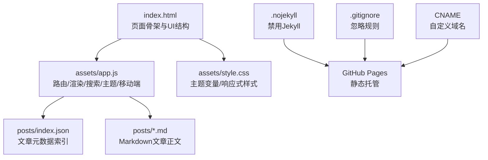
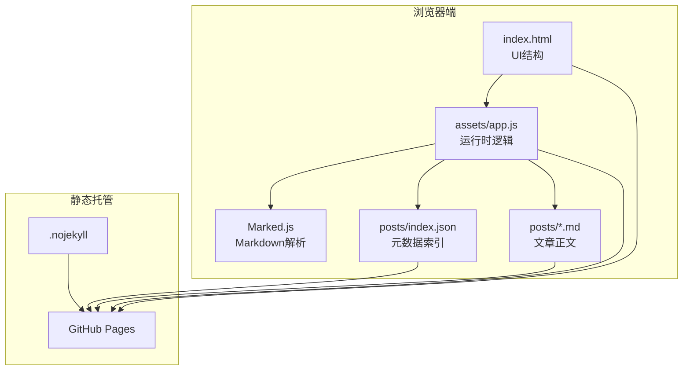
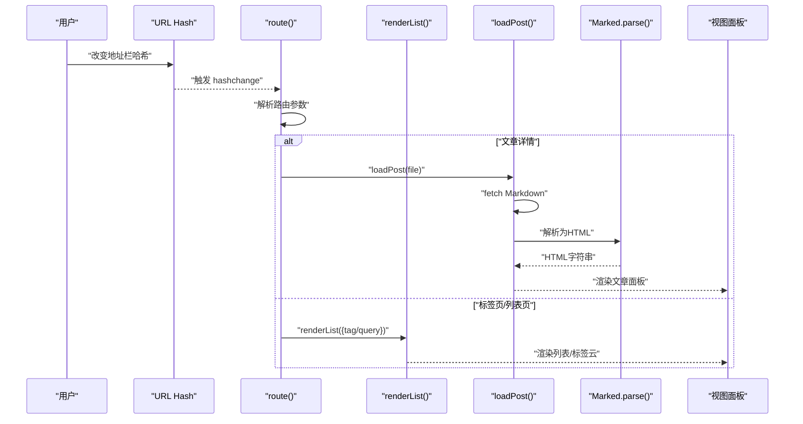
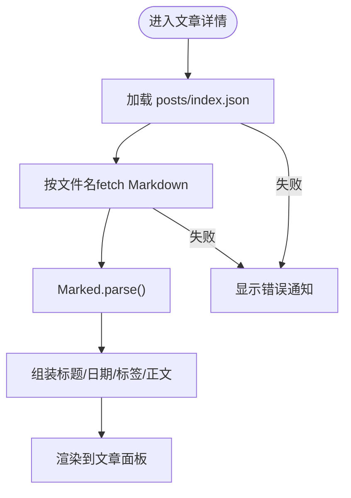
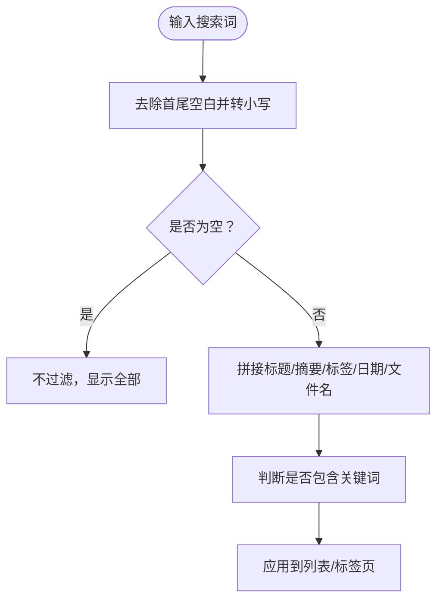
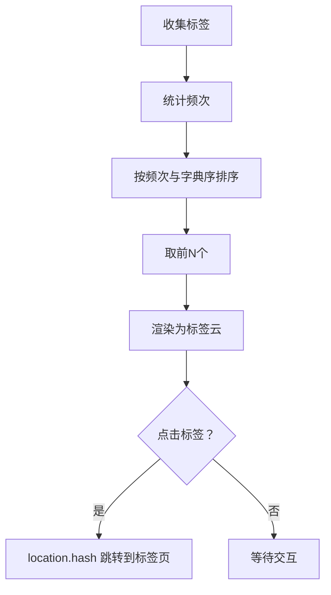
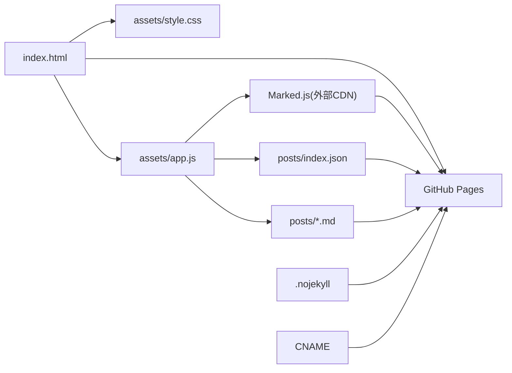

# 开发指南

<cite>
**本文引用的文件**
- [index.html](file://index.html)
- [app.js](file://assets/app.js)
- [style.css](file://assets/style.css)
- [index.json](file://posts/index.json)
- [hello.md](file://posts/2026-02-09-hello.md)
- [博客搭建过程.md](file://posts/2026-02-09-博客搭建过程.md)
- [.gitignore](file://.gitignore)
- [.nojekyll](file://.nojekyll)
- [CNAME](file://CNAME)
</cite>

## 目录
1. [简介](#简介)
2. [项目结构](#项目结构)
3. [核心组件](#核心组件)
4. [架构总览](#架构总览)
5. [详细组件分析](#详细组件分析)
6. [依赖关系分析](#依赖关系分析)
7. [性能考虑](#性能考虑)
8. [调试与测试](#调试与测试)
9. [扩展开发指南](#扩展开发指南)
10. [代码规范与提交规范](#代码规范与提交规范)
11. [常见问题排查](#常见问题排查)
12. [升级与迁移指引](#升级与迁移指引)
13. [结论](#结论)

## 简介
本指南面向开发者与贡献者，帮助你快速理解并扩展这个“无编译”静态博客系统。该系统以纯 HTML/CSS/JavaScript 构建，使用 Marked.js 在浏览器端渲染 Markdown 文章，通过 posts/index.json 管理文章元数据，借助 GitHub Pages 实现“git push 即发布”。文档涵盖代码结构、模块划分、开发环境搭建、扩展开发、调试测试、性能优化、规范与最佳实践以及常见问题解决。

## 项目结构
该项目采用扁平化的静态站点结构，核心文件与职责如下：
- index.html：页面骨架与入口，引入样式与脚本，定义 UI 结构与交互元素。
- assets/app.js：核心逻辑，负责路由、文章加载与渲染、搜索、标签云、主题切换、移动端菜单等。
- assets/style.css：主题变量与响应式样式，支持亮/暗主题与多端适配。
- posts/index.json：文章元数据索引，包含文件名、标题、日期、标签、摘要等。
- posts/*.md：Markdown 文章正文，按约定命名（例如：YYYY-MM-DD-标题.md）。
- .nojekyll：禁用 GitHub Pages 的 Jekyll 渲染，确保静态文件直出。
- .gitignore：忽略系统无关文件。
- CNAME：自定义域名配置文件（若启用）。

图表来源
- [index.html](file://index.html#L1-L104)
- [app.js](file://assets/app.js#L1-L313)
- [style.css](file://assets/style.css#L1-L629)
- [index.json](file://posts/index.json#L1-L16)

章节来源
- [index.html](file://index.html#L1-L104)
- [app.js](file://assets/app.js#L1-L313)
- [style.css](file://assets/style.css#L1-L629)
- [index.json](file://posts/index.json#L1-L16)
- [.nojekyll](file://.nojekyll#L1-L1)
- [.gitignore](file://.gitignore#L1-L2)
- [CNAME](file://CNAME#L1-L1)

## 核心组件
- 页面骨架与导航
  - 顶部导航栏包含品牌标识、导航链接、搜索框与主题切换按钮。
  - 侧边栏包含个人资料、热门标签云、外链与提示信息。
  - 内容区包含通知区域、文章列表面板、文章详情面板与关于页面。
- JavaScript 核心逻辑
  - 路由系统：基于 URL hash 的单页应用路由，支持文章列表、文章详情、标签筛选、关于页面。
  - 文章加载与渲染：异步拉取 Markdown 文件，使用 Marked.js 解析为 HTML，并注入到文章面板。
  - 搜索与过滤：根据输入关键词实时过滤文章标题、摘要、标签与日期等字段。
  - 标签云：统计文章标签频率，渲染为可点击的标签云，点击跳转至对应标签页。
  - 主题切换：支持亮/暗主题，优先读取本地存储偏好，否则根据系统偏好自动选择。
  - 移动端菜单：汉堡菜单展开/收起，点击外部区域自动关闭，点击导航链接自动关闭。
- 样式与主题
  - 使用 CSS 变量定义主题色彩，支持 data-theme 属性切换亮/暗主题。
  - 响应式布局：桌面端双栏、移动端单栏，针对不同断点进行样式调整。
  - Markdown 渲染样式：代码块、引用块、标题层级等预设样式。
- 数据与内容
  - posts/index.json：统一管理文章元数据，用于列表渲染、标签统计、排序与搜索。
  - posts/*.md：文章正文，按约定命名，与 index.json 的 file 字段一一对应。

章节来源
- [index.html](file://index.html#L20-L100)
- [app.js](file://assets/app.js#L10-L313)
- [style.css](file://assets/style.css#L1-L629)
- [index.json](file://posts/index.json#L1-L16)

## 架构总览
系统采用“前端渲染 + 静态托管”的无编译架构：
- 前端：index.html 引入样式与脚本，app.js 负责所有运行时逻辑。
- 内容：posts/index.json 作为索引，posts/*.md 作为正文。
- 渲染：Marked.js 在浏览器端解析 Markdown。
- 部署：GitHub Pages 静态托管，.nojekyll 确保不被 Jekyll 处理。
- 访问：通过 URL hash 实现 SPA 导航，无需服务端路由。

图表来源
- [index.html](file://index.html#L1-L104)
- [app.js](file://assets/app.js#L140-L182)
- [index.json](file://posts/index.json#L1-L16)
- [.nojekyll](file://.nojekyll#L1-L1)

## 详细组件分析

### 路由与视图切换
- 路由规则
  - #/：默认文章列表页
  - #/post/:file：文章详情页，:file 对应 posts/*.md 的文件名
  - #/tag/:tag：标签筛选页，:tag 为标签名
  - #/about：关于页面
- 视图切换
  - 通过隐藏/显示不同面板实现 SPA 切换，避免整页刷新。
- 关键流程
  - 初始化：设置年份、应用主题、绑定事件、加载索引、渲染标签云、执行初始路由。
  - hashchange：监听 URL 变化，重新计算并渲染当前视图。
  - 输入事件：搜索框输入时，在列表/标签页实时触发路由以更新视图。

图表来源
- [app.js](file://assets/app.js#L200-L230)
- [app.js](file://assets/app.js#L140-L182)
- [app.js](file://assets/app.js#L85-L138)

章节来源
- [app.js](file://assets/app.js#L200-L230)
- [app.js](file://assets/app.js#L297-L313)

### 文章加载与渲染
- 数据来源
  - 先加载 posts/index.json 获取元数据数组，再按需加载对应 Markdown 文件。
- 渲染流程
  - 使用 Marked.js 设置选项（如 GitHub 风格与换行），将 Markdown 转为 HTML。
  - 注入标题、日期、标签、正文到文章面板。
- 错误处理
  - 加载失败时显示通知，避免页面空白。

图表来源
- [app.js](file://assets/app.js#L140-L182)
- [index.json](file://posts/index.json#L1-L16)

章节来源
- [app.js](file://assets/app.js#L140-L182)

### 搜索与过滤
- 过滤字段
  - 标题、摘要、标签、日期、文件名（来自 index.json）。
- 实时过滤
  - 监听搜索框输入事件，在列表/标签页实时生效。
- 交互细节
  - 支持快捷键 Cmd/Ctrl+K 聚焦搜索框。

图表来源
- [app.js](file://assets/app.js#L75-L83)
- [app.js](file://assets/app.js#L307-L312)

章节来源
- [app.js](file://assets/app.js#L75-L83)
- [app.js](file://assets/app.js#L307-L312)

### 标签云与标签筛选
- 标签统计
  - 遍历 index.json 中的 tags，统计频次并排序，取前若干个渲染为标签云。
- 点击行为
  - 点击标签云项，跳转到对应标签页（如 #/tag/:tag）。
- 标签页渲染
  - 展示所有标签与数量，支持点击进一步筛选。

图表来源
- [app.js](file://assets/app.js#L49-L73)
- [app.js](file://assets/app.js#L85-L138)

章节来源
- [app.js](file://assets/app.js#L49-L73)
- [app.js](file://assets/app.js#L85-L138)

### 主题切换与移动端菜单
- 主题切换
  - 读取本地存储偏好，否则根据系统偏好自动选择；支持手动切换并持久化。
- 移动端菜单
  - 汉堡菜单展开/收起；点击导航链接自动关闭；点击外部区域自动关闭。

章节来源
- [app.js](file://assets/app.js#L232-L263)
- [app.js](file://assets/app.js#L255-L263)

### 样式体系与响应式设计
- 主题变量
  - 使用 CSS 变量定义背景、卡片、文字、分割线、阴影、品牌色等，支持 data-theme="light" 切换。
- 响应式断点
  - 桌面端双栏布局，平板与手机端单栏布局；针对不同断点调整字体、间距与组件尺寸。
- Markdown 渲染样式
  - 预置标题、段落、代码块、引用块等样式，确保阅读体验。

章节来源
- [style.css](file://assets/style.css#L1-L629)

## 依赖关系分析
- 外部依赖
  - Marked.js：浏览器端 Markdown 解析。
- 内部依赖
  - index.html 依赖 assets/app.js 与 assets/style.css。
  - app.js 依赖 posts/index.json 与 posts/*.md。
  - app.js 依赖浏览器内置 API（fetch、localStorage、URL hash、DOM API）。
- 部署依赖
  - .nojekyll：确保 GitHub Pages 不使用 Jekyll。
  - CNAME：可选，用于自定义域名。

图表来源
- [index.html](file://index.html#L14-L17)
- [app.js](file://assets/app.js#L140-L182)
- [index.json](file://posts/index.json#L1-L16)
- [.nojekyll](file://.nojekyll#L1-L1)
- [CNAME](file://CNAME#L1-L1)

章节来源
- [index.html](file://index.html#L14-L17)
- [app.js](file://assets/app.js#L140-L182)
- [index.json](file://posts/index.json#L1-L16)
- [.nojekyll](file://.nojekyll#L1-L1)
- [CNAME](file://CNAME#L1-L1)

## 性能考虑
- 资源加载
  - 使用 CDN 引入 Marked.js，减少本地体积与下载时间。
  - 避免重复解析：文章详情仅在进入时加载一次，可通过缓存策略进一步优化。
- 渲染性能
  - 列表渲染使用模板字符串拼接，建议在大数据量时考虑虚拟滚动或分页。
  - 标签云与搜索过滤为内存操作，注意大数据量时的节流与防抖。
- 网络与缓存
  - fetch 请求设置 cache: "no-store"，确保每次获取最新内容，适合频繁更新场景。
- 样式与动画
  - 使用 CSS 变量与 transform/border 等 GPU 友好属性，提升滚动与交互流畅度。
- 建议
  - 对 index.json 进行分页或懒加载；对 Markdown 文件进行压缩；在移动端减少一次性渲染的 DOM 数量。

[本节为通用性能建议，不直接分析具体文件]

## 调试与测试
- 浏览器调试
  - 使用开发者工具检查网络请求（posts/index.json 与 Markdown 文件）、控制台错误、DOM 结构与样式变量。
  - 在路由切换、搜索过滤、标签云点击等关键路径设置断点验证逻辑。
- 单元级验证
  - 可通过构造小型测试页面，模拟 posts/index.json 与 Markdown 文件，验证渲染与过滤逻辑。
- 部署验证
  - 推送后在 GitHub Pages 上确认页面正常加载、样式与交互无异常。
- 常见问题定位
  - 文章加载失败：检查 posts/*.md 文件名与 posts/index.json 的 file 是否一致。
  - 标签云不显示：检查 index.json 的 tags 字段是否正确。
  - 主题切换无效：检查 data-theme 属性与 localStorage 存储值。

章节来源
- [app.js](file://assets/app.js#L140-L182)
- [app.js](file://assets/app.js#L300-L304)

## 扩展开发指南
- 新增功能模块
  - 在 assets/app.js 中新增函数与事件绑定，遵循现有命名与组织方式。
  - 若涉及样式，优先在 assets/style.css 中扩展，使用 CSS 变量保持主题一致性。
- 新增页面或视图
  - 在 index.html 中添加容器元素与必要的交互控件。
  - 在 app.js 的路由中新增匹配规则与渲染逻辑。
- 修改现有组件
  - 列表/标签页：调整 renderList 的模板与过滤逻辑。
  - 文章详情：调整 loadPost 的元数据读取与 HTML 注入。
  - 搜索：扩展 matchesFilter 的匹配字段或增加正则/模糊匹配。
- 集成第三方库
  - 在 index.html 中引入所需脚本（如 Prism.js 用于代码高亮），并在 app.js 中调用其初始化与渲染接口。
  - 注意版本兼容性与加载时机，确保在 DOM 准备就绪后再初始化。
- 数据模型变更
  - 若 index.json 增加字段，需同步更新 app.js 的读取与渲染逻辑。
  - 保持向后兼容，避免破坏既有文章的显示。

章节来源
- [index.html](file://index.html#L1-L104)
- [app.js](file://assets/app.js#L1-L313)
- [style.css](file://assets/style.css#L1-L629)
- [index.json](file://posts/index.json#L1-L16)

## 代码规范与提交规范
- JavaScript 规范
  - 使用严格模式与现代语法，保持函数单一职责。
  - DOM 操作集中管理，避免分散在多处。
  - 事件绑定与解绑，确保生命周期内不会重复绑定。
- CSS 规范
  - 使用语义化类名，避免过度嵌套。
  - 主题变量统一管理，避免硬编码颜色。
  - 响应式断点集中定义，便于维护。
- HTML 规范
  - 语义化标签优先，保持结构清晰。
  - 链接与按钮具备可访问性属性（aria-label、title）。
- 提交规范
  - 提交信息清晰描述变更目的与范围（如 feat(app): 新增代码高亮功能）。
  - 分离功能提交，避免一次提交包含多个不相关的改动。
- 版本管理
  - 使用分支管理功能开发与热修复，合并前进行本地测试与代码审查。
  - 发布版本时更新 README 或变更说明，记录重大变更。

[本节为通用规范建议，不直接分析具体文件]

## 常见问题排查
- 文章无法加载
  - 检查 posts/*.md 文件是否存在且与 index.json 的 file 字段一致。
  - 确认 posts/index.json 可被正确访问（无 404）。
- 标签云不显示
  - 确认 index.json 的 tags 字段为数组且非空。
  - 检查标签点击事件是否绑定成功。
- 搜索无效
  - 确认搜索框事件已绑定，且在列表/标签页才触发过滤。
  - 检查 matchesFilter 的匹配逻辑是否符合预期。
- 主题切换异常
  - 检查 data-theme 属性与 localStorage 的值是否一致。
  - 确认 CSS 变量覆盖顺序正确。
- 移动端菜单不响应
  - 检查汉堡菜单与导航的事件绑定是否正确。
  - 确认点击外部区域关闭逻辑未被阻止。

章节来源
- [app.js](file://assets/app.js#L140-L182)
- [app.js](file://assets/app.js#L300-L304)
- [app.js](file://assets/app.js#L255-L263)

## 升级与迁移指引
- 升级 Marked.js
  - 在 index.html 中更新 CDN 地址与版本号，测试渲染效果与兼容性。
  - 若 API 变更，同步修改 app.js 中的 setOptions 与 parse 调用。
- 迁移至新目录结构
  - 若未来需要分目录存放文章，需同步更新 app.js 的 fetch 路径与 index.json 的 file 字段。
- 从 Jekyll 迁移
  - 确保保留 posts/*.md 与 posts/index.json 的映射关系。
  - 移除 Jekyll 相关配置文件，添加 .nojekyll。
- 自定义域名
  - 在根目录创建 CNAME 文件，写入域名；在 DNS 中配置 CNAME 记录。
- 国际化扩展
  - 可在 app.js 中增加语言检测与文案映射，配合 index.json 增加多语言字段。

章节来源
- [index.html](file://index.html#L14-L17)
- [app.js](file://assets/app.js#L140-L182)
- [.nojekyll](file://.nojekyll#L1-L1)
- [CNAME](file://CNAME#L1-L1)

## 结论
本项目以极简架构实现了“无编译”的静态博客系统，前端渲染与静态托管相结合，具备良好的可维护性与扩展性。通过本文档的结构化说明与实践建议，你可以快速上手开发、安全地进行功能扩展，并在 GitHub Pages 上稳定发布。建议在扩展功能时遵循现有代码风格与模块边界，确保主题一致性与交互体验的连贯性。