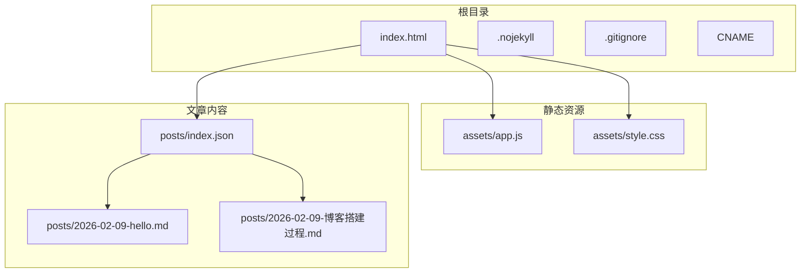
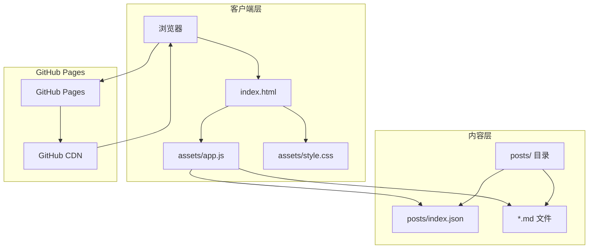
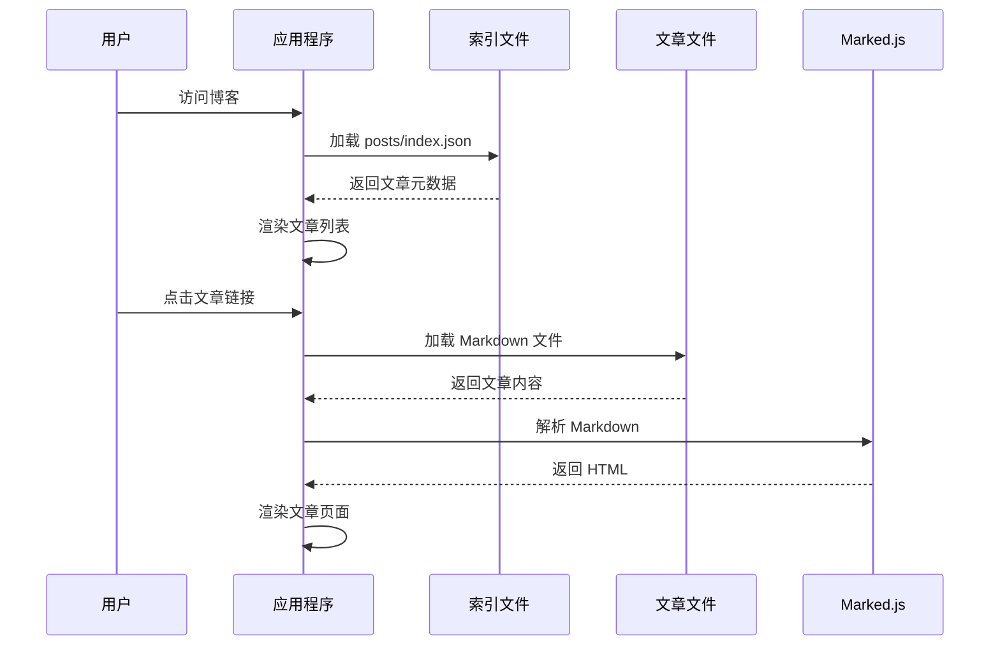
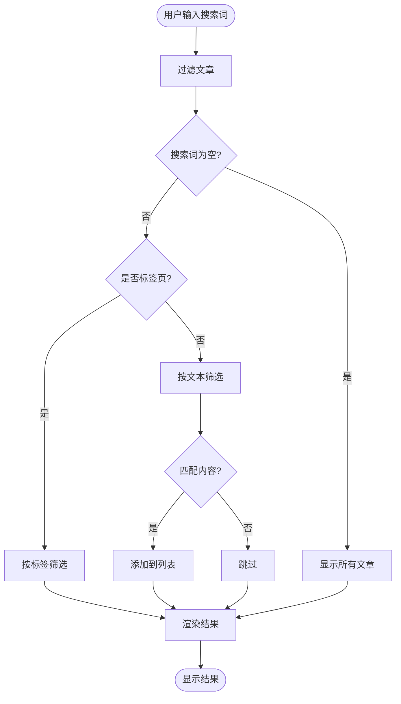
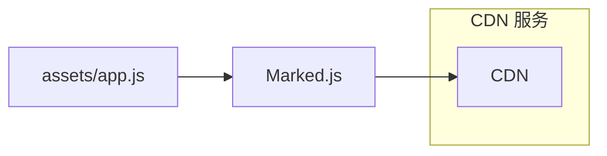
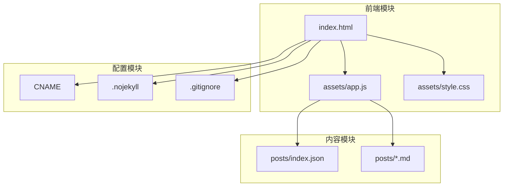

# 快速开始

<cite>
**本文档引用的文件**
- [index.html](file://index.html)
- [assets/app.js](file://assets/app.js)
- [assets/style.css](file://assets/style.css)
- [posts/index.json](file://posts/index.json)
- [posts/2026-02-09-hello.md](file://posts/2026-02-09-hello.md)
- [posts/2026-02-09-博客搭建过程.md](file://posts/2026-02-09-博客搭建过程.md)
- [.gitignore](file://.gitignore)
- [.nojekyll](file://.nojekyll)
- [CNAME](file://CNAME)
</cite>

## 目录
1. [简介](#简介)
2. [项目结构](#项目结构)
3. [环境要求](#环境要求)
4. [本地运行](#本地运行)
5. [GitHub Pages 部署](#github-pages-部署)
6. [内容创作入门](#内容创作入门)
7. [架构概览](#架构概览)
8. [详细组件分析](#详细组件分析)
9. [依赖关系分析](#依赖关系分析)
10. [性能考虑](#性能考虑)
11. [故障排除指南](#故障排除指南)
12. [结论](#结论)

## 简介

这是一个基于纯静态文件和 Markdown 的无编译博客系统。该系统采用现代 Web 技术，通过浏览器端渲染 Markdown 文件，实现"git push 即发布"的高效工作流。项目完全开源，适合专注于写作而非技术维护的博主使用。

## 项目结构

该项目采用极简的静态博客架构，主要包含以下核心文件：



**图表来源**
- [index.html](file://index.html#L1-L104)
- [assets/app.js](file://assets/app.js#L1-L313)
- [assets/style.css](file://assets/style.css#L1-L629)
- [posts/index.json](file://posts/index.json#L1-L16)

**章节来源**
- [index.html](file://index.html#L1-L104)
- [posts/index.json](file://posts/index.json#L1-L16)

## 环境要求

### 浏览器兼容性

该博客系统支持现代浏览器，包括：
- Chrome 80+
- Firefox 78+
- Safari 13+
- Edge 80+

### 本地开发环境

- **操作系统**: macOS、Windows 或 Linux
- **Git**: 版本控制工具
- **文本编辑器**: 支持 Markdown 语法高亮的编辑器
- **Web 服务器**: 可选，用于本地预览

## 本地运行

### 方法一：直接打开 HTML 文件

最简单的方式是直接在浏览器中打开 `index.html` 文件：
1. 下载或克隆项目到本地
2. 双击 `index.html` 文件
3. 浏览器会自动加载博客页面

### 方法二：使用本地 Web 服务器

为了更好的开发体验，建议使用本地服务器：

#### 使用 Python 内置服务器
```bash
python -m http.server 8000
```

#### 使用 Node.js http-server
```bash
npm install -g http-server
http-server
```

#### 使用 PHP 内置服务器
```bash
php -S localhost:8000
```

**章节来源**
- [index.html](file://index.html#L1-L104)
- [assets/app.js](file://assets/app.js#L265-L313)

## GitHub Pages 部署

### 步骤 1：创建 GitHub 仓库

1. 登录 GitHub，点击右上角的 "+" 号，选择 "New repository"
2. 输入仓库名称（例如：your-blog-name）
3. 选择公开仓库（Public）
4. 不要勾选初始化 README、.gitignore 或 license

### 步骤 2：启用 GitHub Pages

1. 进入仓库页面，点击 "Settings" 标签
2. 在左侧菜单找到 "Pages"（Pages）
3. 在 "Source" 下拉菜单中选择：
   - Branch: `main`
   - Folder: `/ (root)`
4. 点击 "Save" 保存设置

### 步骤 3：推送代码到 GitHub

```bash
# 初始化本地仓库
git init
git add .
git commit -m "Initial commit"

# 添加远程仓库
git remote add origin https://github.com/your-username/your-blog-name.git

# 推送到 GitHub
git branch -M main
git push -u origin main
```

### 步骤 4：配置自定义域名（可选）

如果需要使用自定义域名：

1. 在仓库根目录创建 `CNAME` 文件，内容为你的域名：
   ```
   hexo.chaochao3321.xyz
   ```

2. 在域名提供商处添加 DNS 记录：
   - 类型：A 记录
   - 主机名：@ 或 www
   - 值：185.199.108.153
   - TTL：3600

3. 在 GitHub Pages 设置中启用自定义域名

**章节来源**
- [CNAME](file://CNAME#L1-L1)
- [.nojekyll](file://.nojekyll#L1-L1)

## 内容创作入门

### 添加新文章

#### 步骤 1：创建 Markdown 文件

在 `posts/` 目录下创建新的 Markdown 文件，命名格式为：`YYYY-MM-DD-标题.md`

示例文件名：`2026-02-10-我的新文章.md`

#### 步骤 2：编辑文章内容

在 Markdown 文件中添加文章内容：

```markdown
# 我的新文章标题

这是文章的正文内容。

- 支持列表
- 支持链接 [GitHub](https://github.com)
- 支持代码块
- 支持图片

```javascript
console.log('Hello World');
```
```

#### 步骤 3：更新文章索引

编辑 `posts/index.json` 文件，添加新文章的元数据：

```json
[
  {
    "file": "2026-02-09-hello.md",
    "title": "Hello, GitHub Pages",
    "date": "2026-02-09",
    "tags": ["blog", "markdown"],
    "summary": "纯静态 + Markdown，无需编译。"
  },
  {
    "file": "2026-02-10-我的新文章.md",
    "title": "我的新文章标题",
    "date": "2026-02-10",
    "tags": ["技术", "教程"],
    "summary": "这是新文章的摘要。"
  }
]
```

#### 步骤 4：提交和发布

```bash
git add .
git commit -m "添加新文章：我的新文章标题"
git push origin main
```

### 编辑配置文件

#### 修改站点信息

编辑 `index.html` 文件中的标题和描述：

```html
<title>你的博客标题</title>
<meta name="description" content="你的博客描述">
```

#### 自定义样式

编辑 `assets/style.css` 文件来自定义外观：

```css
/* 修改主题颜色 */
:root {
  --brand: #your-color;
}

/* 修改字体 */
body {
  font-family: "Your Font", sans-serif;
}
```

#### 添加导航链接

编辑 `index.html` 文件中的导航部分：

```html
<nav id="navMenu" class="nav">
  <a class="nav-link" href="#/">Posts</a>
  <a class="nav-link" href="#/tag/all">Tags</a>
  <a class="nav-link" href="#/about">About</a>
  <a class="nav-link" href="#/contact">Contact</a> <!-- 新增链接 -->
</nav>
```

**章节来源**
- [posts/index.json](file://posts/index.json#L1-L16)
- [posts/2026-02-09-hello.md](file://posts/2026-02-09-hello.md#L1-L8)
- [index.html](file://index.html#L20-L104)

## 架构概览

该博客系统采用无编译的纯静态架构，主要特点包括：



**图表来源**
- [assets/app.js](file://assets/app.js#L140-L182)
- [posts/index.json](file://posts/index.json#L1-L16)
- [index.html](file://index.html#L1-L104)

### 核心特性

1. **无编译架构**：纯静态文件，无需构建工具
2. **浏览器端渲染**：使用 Marked.js 解析 Markdown
3. **响应式设计**：适配桌面和移动设备
4. **主题切换**：支持亮/暗色模式
5. **实时搜索**：支持按标题、标签、摘要搜索
6. **标签系统**：支持标签云和标签筛选

## 详细组件分析

### 前端渲染系统

#### JavaScript 核心功能



**图表来源**
- [assets/app.js](file://assets/app.js#L140-L182)
- [assets/app.js](file://assets/app.js#L200-L230)

#### 路由系统

应用程序使用基于哈希的单页应用路由：

| URL 路径 | 功能 | 描述 |
|---------|------|------|
| `#/` | 文章列表 | 显示所有文章的列表 |
| `#/post/<file>` | 文章详情 | 显示指定文章的详细内容 |
| `#/tag/<tag>` | 标签筛选 | 显示指定标签的所有文章 |
| `#/about` | 关于页面 | 显示关于信息 |

#### 搜索功能



**图表来源**
- [assets/app.js](file://assets/app.js#L75-L83)
- [assets/app.js](file://assets/app.js#L85-L138)

**章节来源**
- [assets/app.js](file://assets/app.js#L1-L313)

### 样式系统

#### 主题变量系统

系统采用 CSS 变量实现主题切换：

```css
:root {
  --bg: #0b0d12;      /* 背景色 */
  --panel: #0f121a;   /* 面板背景色 */
  --card: #0f121a;    /* 卡片背景色 */
  --text: #e9edf5;    /* 主文字颜色 */
  --muted: #9aa3b2;   /* 次要文字颜色 */
  --line: rgba(255,255,255,.08); /* 分割线颜色 */
  --brand: #8ab4ff;   /* 品牌色 */
}

:root[data-theme="light"] {
  --bg: #f6f8fc;      /* 亮色主题 */
  --panel: #ffffff;
  --card: #ffffff;
  --text: #121622;
  --muted: #56607a;
  --line: rgba(14,20,40,.10);
  --brand: #1f6feb;
}
```

#### 响应式设计

系统支持多种屏幕尺寸：

| 断点 | 屏幕宽度 | 布局特征 |
|------|----------|----------|
| 大屏 | > 1200px | 三栏布局，侧边栏宽 320px |
| 中屏 | 980px - 1200px | 两栏布局，侧边栏缩窄至 260px |
| 平板 | 768px - 980px | 两栏布局，侧边栏进一步缩窄 |
| 移动端 | < 768px | 单栏布局，侧边栏隐藏 |

**章节来源**
- [assets/style.css](file://assets/style.css#L1-L629)

## 依赖关系分析

### 外部依赖

该系统仅依赖一个外部库：



**图表来源**
- [index.html](file://index.html#L16-L17)
- [assets/app.js](file://assets/app.js#L155-L162)

### 内部模块依赖



**图表来源**
- [index.html](file://index.html#L14-L17)
- [assets/app.js](file://assets/app.js#L140-L153)
- [posts/index.json](file://posts/index.json#L1-L16)

**章节来源**
- [index.html](file://index.html#L1-L104)
- [assets/app.js](file://assets/app.js#L1-L313)

## 性能考虑

### 加载优化

1. **缓存策略**：使用 `cache: "no-store"` 确保内容实时更新
2. **CDN 加速**：Marked.js 通过 jsDelivr CDN 提供
3. **响应式图片**：根据屏幕尺寸自动调整布局

### 性能最佳实践

- **文件大小**：保持 Markdown 文件简洁，避免大图片
- **网络请求**：减少外部依赖，当前仅依赖一个 CDN
- **渲染性能**：使用虚拟 DOM 风格的字符串拼接，避免复杂 DOM 操作

## 故障排除指南

### 常见问题

#### 1. 文章无法显示

**症状**：文章列表为空或显示错误

**解决方法**：
1. 检查 `posts/index.json` 文件格式是否正确
2. 确认每个文章的 `file` 字段与实际文件名一致
3. 验证 JSON 文件语法是否正确

#### 2. Markdown 渲染异常

**症状**：文章内容显示为原始 Markdown

**解决方法**：
1. 检查网络连接是否正常
2. 确认 Marked.js CDN 可访问
3. 查看浏览器开发者工具的网络面板

#### 3. 主题切换失效

**症状**：主题切换按钮无反应

**解决方法**：
1. 检查浏览器是否支持 CSS 变量
2. 确认 `assets/style.css` 文件正确加载
3. 清除浏览器缓存后重试

#### 4. GitHub Pages 部署失败

**症状**：GitHub Pages 无法正常显示

**解决方法**：
1. 确认 GitHub Pages 设置正确（Branch: main, Folder: /)
2. 检查 `.nojekyll` 文件是否存在
3. 验证 CNAME 文件内容（如有使用自定义域名）

#### 5. 搜索功能异常

**症状**：搜索框无响应或搜索结果不准确

**解决方法**：
1. 检查 `assets/app.js` 中的搜索函数是否正常
2. 确认文章元数据包含正确的 `title`、`summary` 和 `tags`
3. 验证搜索输入是否包含特殊字符

### 调试技巧

#### 使用浏览器开发者工具

1. **Network 面板**：检查文件加载状态
2. **Console 面板**：查看 JavaScript 错误
3. **Elements 面板**：检查 HTML 结构和 CSS 样式
4. **Sources 面板**：调试 JavaScript 代码

#### 日志输出

在 `assets/app.js` 中可以添加临时日志来调试：

```javascript
console.log('Debug:', variableName);
```

**章节来源**
- [assets/app.js](file://assets/app.js#L30-L38)
- [assets/app.js](file://assets/app.js#L297-L304)

## 结论

这个无编译静态博客系统提供了一个简洁、高效的内容发布平台。其核心优势包括：

### 主要优势

1. **极简架构**：无需构建工具，直接部署
2. **易于维护**：专注内容创作，无需关注技术细节
3. **快速加载**：纯静态文件，加载速度快
4. **灵活定制**：支持自定义样式和功能扩展
5. **可靠托管**：基于 GitHub Pages，托管稳定

### 适用场景

- 个人技术博客
- 项目文档
- 学习笔记
- 知识分享平台

### 扩展建议

1. **添加评论系统**：集成第三方评论插件
2. **SEO 优化**：添加 meta 标签和 sitemap.xml
3. **多语言支持**：添加国际化功能
4. **备份机制**：定期备份重要文章

通过遵循本指南，您可以快速搭建并运行这个静态博客系统，专注于内容创作而无需担心技术实现细节。