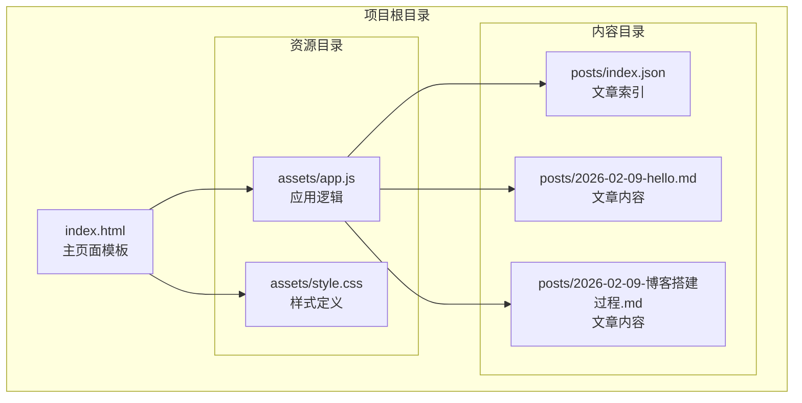
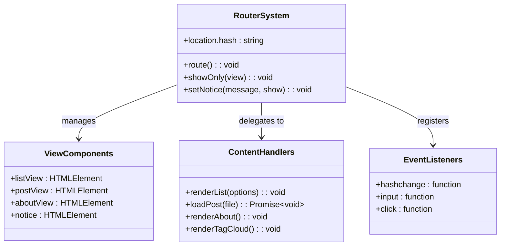
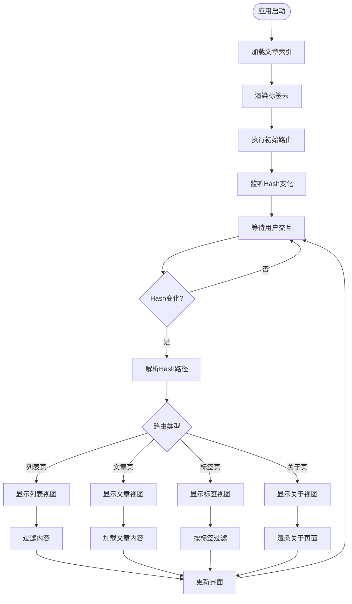
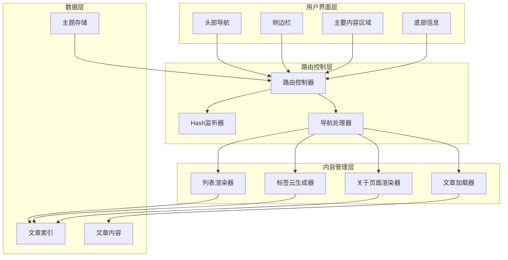
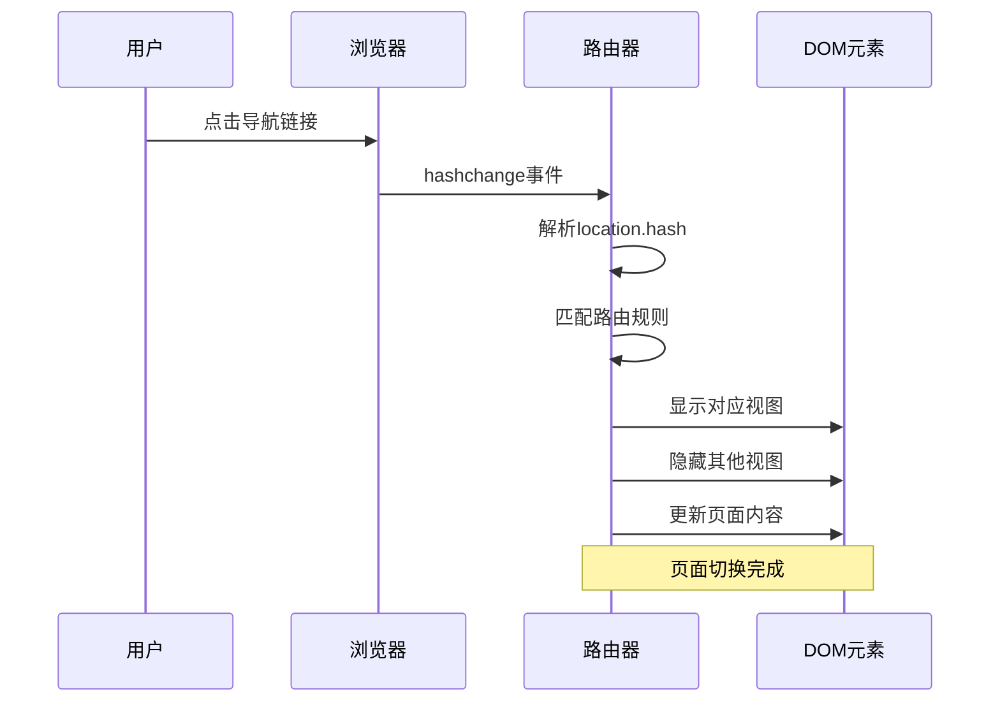
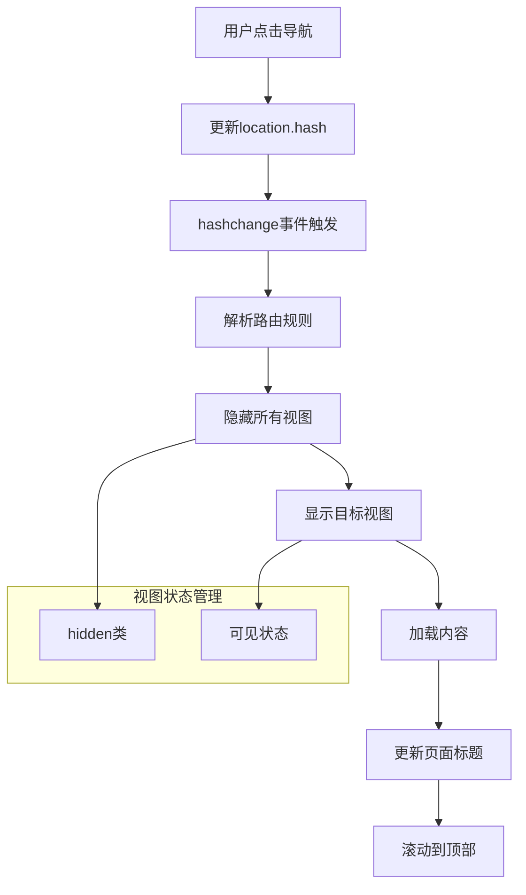
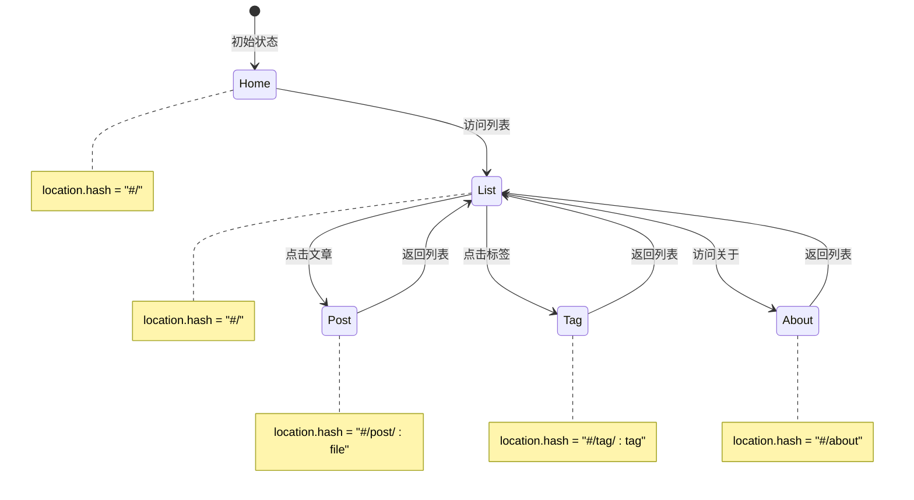
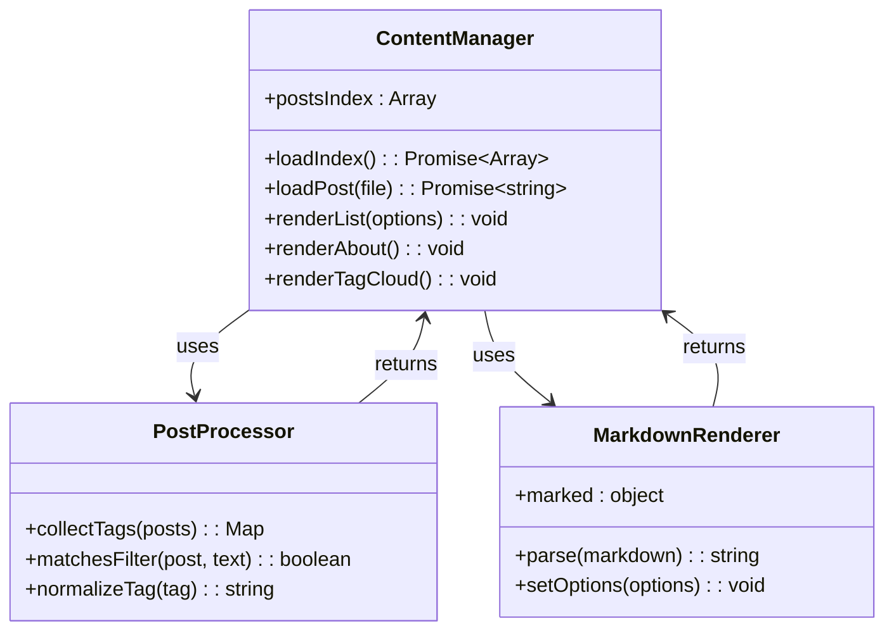
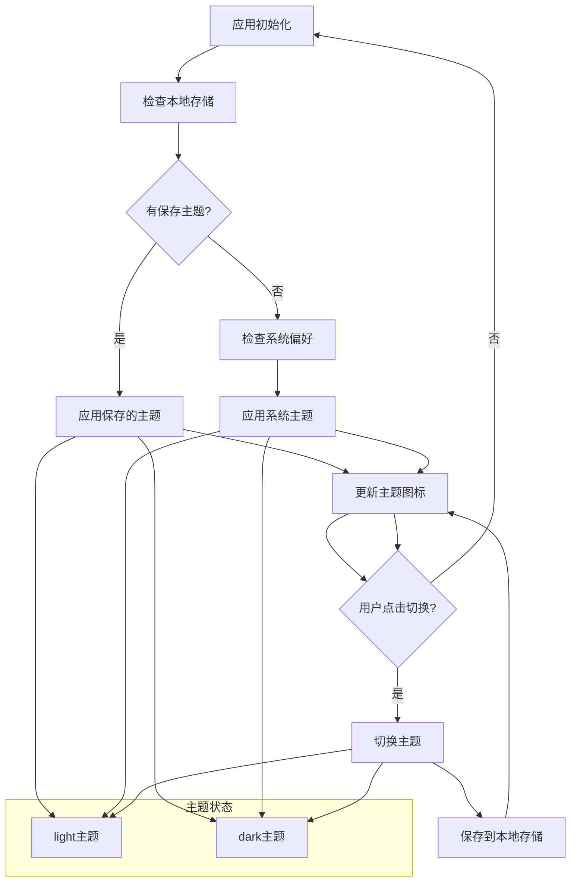
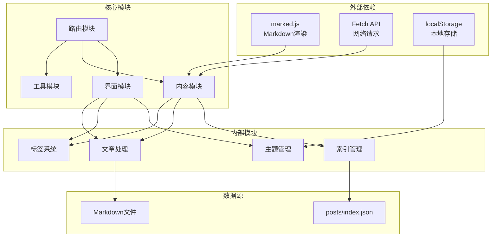

# 单页应用架构

<cite>
**本文档引用的文件**
- [index.html](file://index.html)
- [app.js](file://assets/app.js)
- [style.css](file://assets/style.css)
- [posts/index.json](file://posts/index.json)
</cite>

## 目录
1. [简介](#简介)
2. [项目结构](#项目结构)
3. [核心组件](#核心组件)
4. [架构概览](#架构概览)
5. [详细组件分析](#详细组件分析)
6. [依赖关系分析](#依赖关系分析)
7. [性能考虑](#性能考虑)
8. [故障排除指南](#故障排除指南)
9. [结论](#结论)

## 简介

这是一个基于Hash的单页应用(SPA)架构实现，采用"无编译"模式构建的静态博客系统。该应用使用浏览器原生的URL Hash机制实现客户端路由，通过JavaScript动态更新页面内容，实现了快速的页面切换和良好的用户体验。

该SPA架构的核心特点：
- 基于Hash的客户端路由系统
- 静态资源托管，无需服务器端渲染
- Markdown内容动态渲染
- 响应式设计和主题切换功能
- 实时搜索和标签云功能

## 项目结构

该项目采用极简的文件组织结构，主要由HTML模板、JavaScript路由逻辑和CSS样式组成：

**图表来源**
- [index.html](file://index.html#L1-L104)
- [app.js](file://assets/app.js#L1-L313)
- [style.css](file://assets/style.css#L1-L629)
- [posts/index.json](file://posts/index.json#L1-L16)

**章节来源**
- [index.html](file://index.html#L1-L104)
- [app.js](file://assets/app.js#L1-L313)
- [style.css](file://assets/style.css#L1-L629)
- [posts/index.json](file://posts/index.json#L1-L16)

## 核心组件

### 路由系统组件

该SPA的核心是基于Hash的客户端路由系统，通过监听URL变化实现页面切换：

**图表来源**
- [app.js](file://assets/app.js#L10-L313)

### 数据管理组件

应用使用JSON格式存储文章元数据，通过异步加载实现内容管理：

**图表来源**
- [app.js](file://assets/app.js#L200-L230)
- [app.js](file://assets/app.js#L140-L182)

**章节来源**
- [app.js](file://assets/app.js#L1-L313)

## 架构概览

该SPA采用模块化架构设计，各组件职责清晰分离：

**图表来源**
- [index.html](file://index.html#L20-L96)
- [app.js](file://assets/app.js#L10-L313)

### 路由配置详解

应用支持四种主要路由模式：

| 路由路径 | 功能描述 | 对应视图 | 参数 |
|---------|----------|----------|------|
| `#/` | 文章列表页 | listView | 无 |
| `#/post/:file` | 文章详情页 | postView | 文件名参数 |
| `#/tag/:tag` | 标签过滤页 | listView | 标签名参数 |
| `#/about` | 关于页面 | aboutView | 无 |

**章节来源**
- [app.js](file://assets/app.js#L3-L8)
- [app.js](file://assets/app.js#L200-L230)

## 详细组件分析

### 路由事件处理系统

路由系统的核心是`route()`函数，它负责解析当前Hash并决定显示哪个视图：

**图表来源**
- [app.js](file://assets/app.js#L200-L230)
- [app.js](file://assets/app.js#L306-L313)

### 页面切换逻辑

页面切换通过`showOnly()`函数实现，确保同一时间只有一个视图可见：

**图表来源**
- [app.js](file://assets/app.js#L40-L43)
- [app.js](file://assets/app.js#L200-L230)

### 历史记录管理

虽然该应用使用Hash路由而非HTML5 History API，但仍具备基本的历史记录管理能力：

**图表来源**
- [app.js](file://assets/app.js#L200-L230)

### 内容管理系统

内容管理采用异步加载模式，支持多种内容类型：

**图表来源**
- [app.js](file://assets/app.js#L140-L182)
- [app.js](file://assets/app.js#L49-L83)
- [app.js](file://assets/app.js#L155-L162)

**章节来源**
- [app.js](file://assets/app.js#L140-L182)
- [app.js](file://assets/app.js#L49-L83)
- [app.js](file://assets/app.js#L155-L162)

### 主题切换系统

应用实现了完整的主题切换功能，支持明暗主题自动检测：

**图表来源**
- [app.js](file://assets/app.js#L233-L253)

**章节来源**
- [app.js](file://assets/app.js#L233-L253)

## 依赖关系分析

该SPA架构具有清晰的依赖层次结构：

**图表来源**
- [index.html](file://index.html#L17-L17)
- [app.js](file://assets/app.js#L140-L182)
- [app.js](file://assets/app.js#L233-L253)

**章节来源**
- [index.html](file://index.html#L17-L17)
- [app.js](file://assets/app.js#L140-L182)
- [app.js](file://assets/app.js#L233-L253)

## 性能考虑

### 加载优化策略

1. **懒加载机制**：文章内容仅在需要时加载
2. **缓存策略**：使用`cache: "no-store"`避免缓存问题
3. **异步渲染**：内容加载与界面渲染分离

### 内存管理

1. **DOM元素复用**：通过类名切换实现视图切换
2. **事件监听器管理**：避免重复绑定
3. **垃圾回收友好**：及时清理不需要的对象引用

### 网络优化

1. **最小化HTTP请求**：合并CSS和JavaScript文件
2. **CDN加速**：使用JSDelivr CDN加载marked.js
3. **压缩传输**：利用浏览器默认压缩

## 故障排除指南

### 常见问题及解决方案

| 问题类型 | 症状 | 可能原因 | 解决方案 |
|---------|------|----------|----------|
| 路由不生效 | 页面无法切换 | Hash监听器未注册 | 检查`window.addEventListener("hashchange", route)` |
| 内容加载失败 | 文章或列表空白 | 网络请求错误 | 检查`loadIndex()`和`loadPost()`的Promise处理 |
| 标签云不显示 | 标签云为空 | JSON格式错误 | 验证`posts/index.json`格式 |
| 主题切换失效 | 主题无法切换 | localStorage访问失败 | 检查浏览器隐私设置 |

### 调试技巧

1. **控制台日志**：在关键函数中添加console.log输出
2. **网络面板**：监控fetch请求的状态码
3. **元素检查**：验证DOM元素的类名和属性
4. **路由跟踪**：监听hashchange事件查看路由变化

**章节来源**
- [app.js](file://assets/app.js#L300-L304)
- [app.js](file://assets/app.js#L210-L211)

## 结论

该单页应用架构展现了现代Web开发的最佳实践：

### 优势总结

1. **快速响应**：基于Hash的路由实现即时页面切换
2. **低服务器负载**：完全静态化部署，无需服务器端渲染
3. **良好用户体验**：流畅的动画效果和响应式设计
4. **易于维护**：简洁的代码结构和明确的职责分离

### 技术亮点

1. **无编译架构**：直接使用Markdown和JSON，简化了构建流程
2. **主题系统**：完整的明暗主题切换功能
3. **搜索功能**：实时内容过滤和标签云导航
4. **移动端优化**：完善的响应式设计和触摸交互

### 改进建议

1. **增加错误边界**：为关键组件添加错误处理机制
2. **性能监控**：集成性能指标收集和分析
3. **SEO优化**：考虑添加基础的SEO元数据
4. **国际化支持**：扩展多语言支持功能

该SPA架构为构建轻量级、高性能的静态网站提供了优秀的参考实现，特别适合技术博客、文档站点和个人作品集等场景。