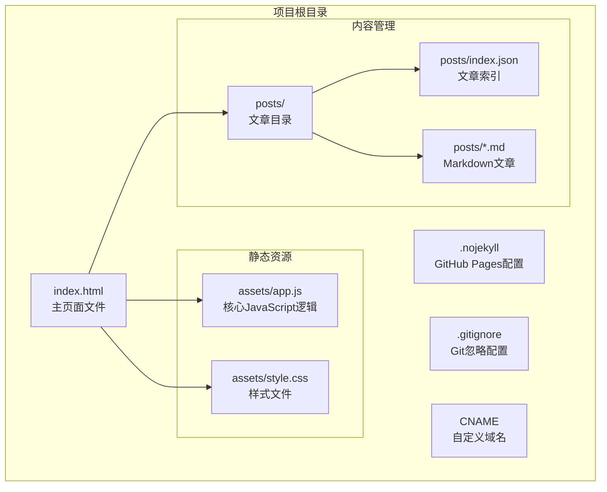
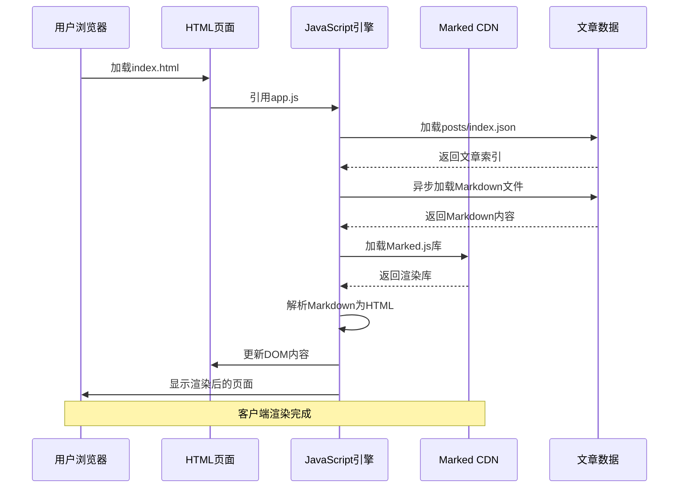
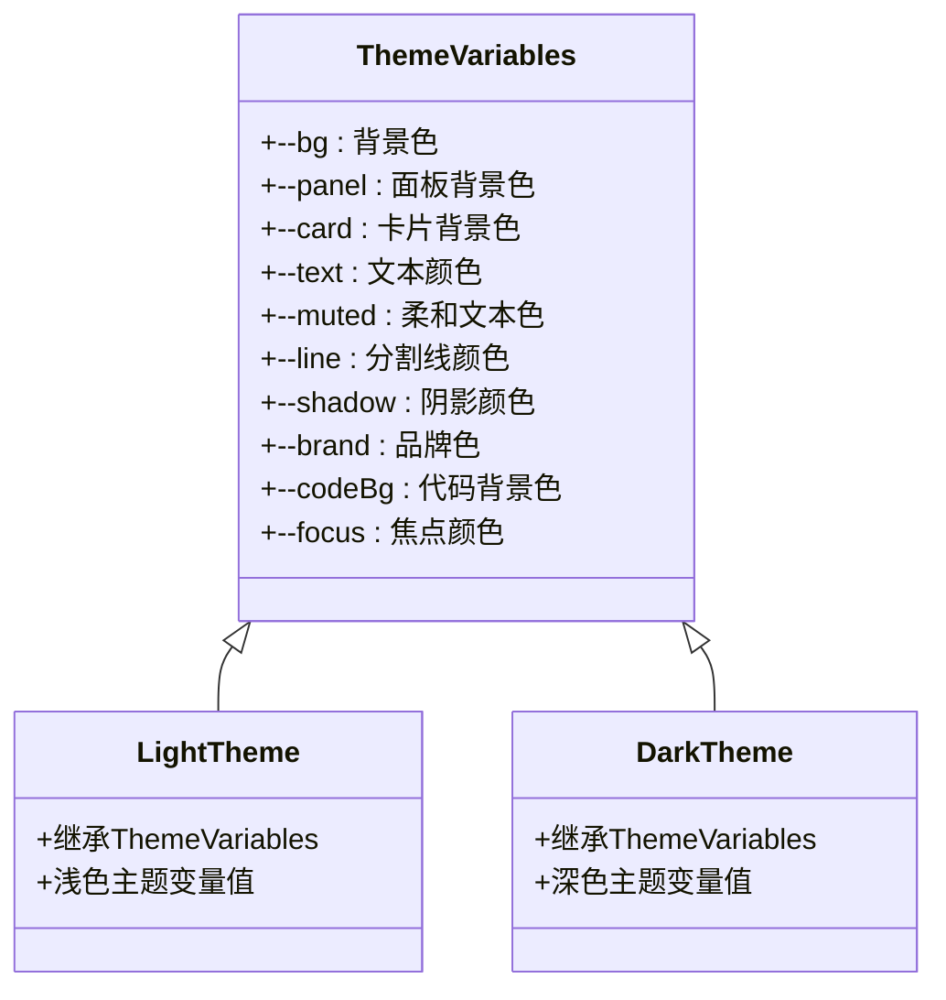
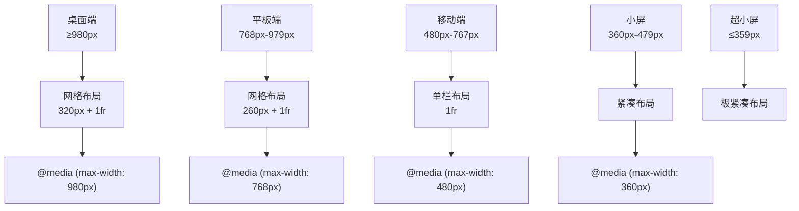
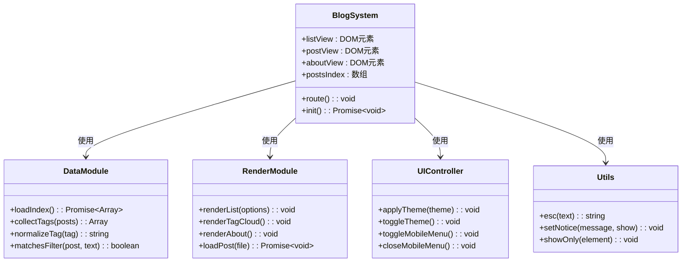
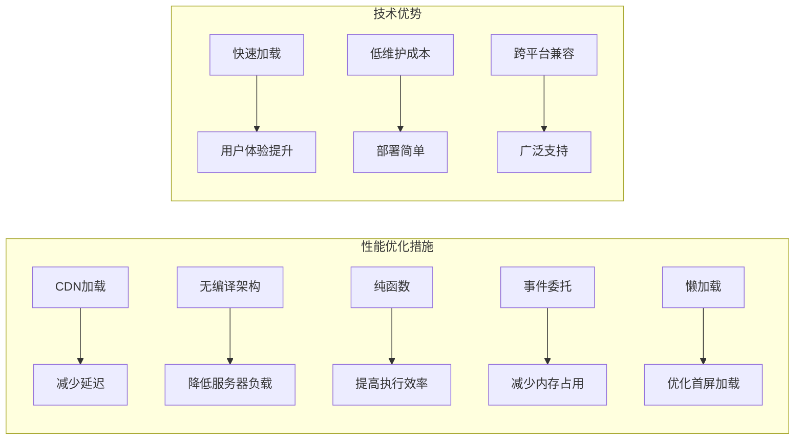
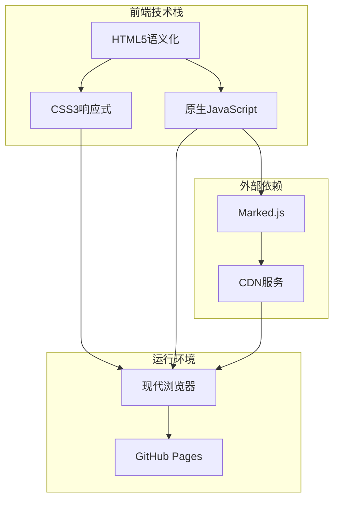

# 技术栈选择

<cite>
**本文档引用的文件**
- [index.html](file://index.html)
- [assets/app.js](file://assets/app.js)
- [assets/style.css](file://assets/style.css)
- [posts/index.json](file://posts/index.json)
- [posts/2026-02-09-博客搭建过程.md](file://posts/2026-02-09-博客搭建过程.md)
</cite>

## 目录
1. [简介](#简介)
2. [项目结构](#项目结构)
3. [核心组件](#核心组件)
4. [架构概览](#架构概览)
5. [详细组件分析](#详细组件分析)
6. [依赖分析](#依赖分析)
7. [性能考虑](#性能考虑)
8. [故障排除指南](#故障排除指南)
9. [结论](#结论)
10. [附录](#附录)

## 简介

这是一个基于静态文件的无编译Markdown博客系统，采用极简技术栈实现"git push即发布"的工作流程。项目通过HTML5语义化结构、CSS3响应式设计和原生JavaScript模块化架构，构建了一个高性能、可访问性强的静态博客平台。

该博客系统的核心特点是完全无编译架构：内容以Markdown文件维护，浏览器端进行渲染，无需任何构建工具或服务器端处理。这种设计不仅简化了部署流程，还提供了更好的性能表现和更低的维护成本。

## 项目结构

项目采用扁平化的文件组织结构，所有核心文件都位于仓库根目录：

**图表来源**
- [index.html](file://index.html#L1-L104)
- [assets/app.js](file://assets/app.js#L1-L313)
- [assets/style.css](file://assets/style.css#L1-L629)
- [posts/index.json](file://posts/index.json#L1-L16)

**章节来源**
- [index.html](file://index.html#L1-L104)
- [assets/app.js](file://assets/app.js#L1-L313)
- [assets/style.css](file://assets/style.css#L1-L629)
- [posts/index.json](file://posts/index.json#L1-L16)

## 核心组件

### HTML5语义化结构

项目采用完整的HTML5语义化标记，确保良好的可访问性和SEO表现：

- **头部结构**：包含完整的元数据配置，支持主题颜色检测和移动Web应用特性
- **导航区域**：使用语义化的`<header>`、`<nav>`元素，提供清晰的页面层次结构
- **内容区域**：采用`<main>`、`<section>`、`<article>`等语义化元素组织内容
- **辅助功能**：通过`aria-label`和`aria-hidden`属性提升无障碍体验

### CSS3响应式设计

系统实现了多层次的响应式布局，适配从手机到桌面的各种设备：

- **网格布局**：使用CSS Grid实现灵活的两栏布局
- **媒体查询**：针对不同屏幕尺寸提供专门的样式规则
- **主题系统**：通过CSS变量实现亮/暗两种主题的无缝切换
- **动画效果**：利用CSS过渡和变换提供流畅的用户体验

### JavaScript模块化架构

采用原生JavaScript模块化设计，实现功能分离和事件驱动：

- **路由系统**：基于URL hash的单页应用路由
- **数据管理**：独立的数据处理和状态管理
- **DOM操作**：封装的DOM操作函数
- **事件处理**：模块化的事件监听和处理机制

**章节来源**
- [index.html](file://index.html#L20-L100)
- [assets/style.css](file://assets/style.css#L1-L629)
- [assets/app.js](file://assets/app.js#L1-L313)

## 架构概览

系统采用客户端渲染架构，所有内容在浏览器端生成：

**图表来源**
- [index.html](file://index.html#L14-L17)
- [assets/app.js](file://assets/app.js#L140-L182)
- [posts/index.json](file://posts/index.json#L1-L16)

**章节来源**
- [index.html](file://index.html#L1-L104)
- [assets/app.js](file://assets/app.js#L140-L182)

## 详细组件分析

### HTML5语义化结构分析

#### 语义化优势

项目充分利用HTML5的语义化特性，为用户提供更好的可访问性和搜索引擎优化：

- **结构清晰**：使用`<header>`、`<main>`、`<aside>`、`<section>`、`<article>`、`<footer>`等元素明确页面结构
- **SEO友好**：语义化标记帮助搜索引擎更好地理解页面内容和层次关系
- **无障碍支持**：配合ARIA属性，为残障用户提供更好的浏览体验
- **维护性**：清晰的语义结构便于后续维护和功能扩展

#### 元数据配置

页面头部包含了丰富的元数据配置：

- **视口设置**：支持响应式设计和移动设备适配
- **主题颜色**：为深色/浅色模式提供主题色支持
- **移动应用**：启用移动Web应用功能
- **颜色方案**：支持系统颜色方案检测

**章节来源**
- [index.html](file://index.html#L1-L12)
- [index.html](file://index.html#L20-L100)

### CSS3响应式设计策略

#### 主题变量系统

系统采用CSS变量实现主题切换功能：

**图表来源**
- [assets/style.css](file://assets/style.css#L2-L30)

#### 响应式布局策略

系统实现了多层次的响应式设计：

- **桌面端**：双栏布局，侧边栏固定宽度320px
- **平板端**：单栏布局，适配触摸设备
- **移动端**：优化的触摸交互和字体大小
- **超小屏**：进一步缩小元素尺寸和间距

#### 媒体查询实现

**图表来源**
- [assets/style.css](file://assets/style.css#L384-L567)

**章节来源**
- [assets/style.css](file://assets/style.css#L1-L629)

### JavaScript模块化设计

#### 功能分离架构

系统采用模块化设计，将不同功能分离到独立的函数中：

**图表来源**
- [assets/app.js](file://assets/app.js#L10-L313)

#### 事件驱动机制

系统采用事件驱动的设计模式：

- **路由事件**：基于URL hash变化触发页面切换
- **用户交互**：按钮点击、键盘输入等用户操作
- **异步事件**：网络请求完成后的回调处理
- **生命周期**：页面初始化、主题切换等系统事件

#### 纯函数应用

项目大量使用纯函数，提高代码的可测试性和可维护性：

- **字符串处理**：HTML转义、标签标准化等纯函数
- **数据过滤**：文章搜索、标签收集等纯函数
- **计算函数**：主题计算、布局计算等纯函数
- **验证函数**：输入验证、类型检查等纯函数

**章节来源**
- [assets/app.js](file://assets/app.js#L1-L313)

### 外部依赖选择

#### Marked.js的选择考量

项目选择Marked.js作为Markdown渲染库，主要基于以下考虑：

- **轻量级特性**：库体积小，加载速度快
- **CDN加载**：通过CDN分发，减少服务器压力
- **功能完整**：支持标准Markdown语法和GFM扩展
- **社区活跃**：有良好的维护和更新记录

#### 性能优化策略

**图表来源**
- [index.html](file://index.html#L17)
- [assets/app.js](file://assets/app.js#L149-L182)

**章节来源**
- [index.html](file://index.html#L17)
- [assets/app.js](file://assets/app.js#L155)

## 依赖分析

### 技术栈依赖关系

**图表来源**
- [index.html](file://index.html#L1-L104)
- [assets/app.js](file://assets/app.js#L1-L313)
- [assets/style.css](file://assets/style.css#L1-L629)

### 依赖权重分析

| 依赖类型 | 权重 | 重要性 | 影响范围 |
|---------|------|--------|----------|
| HTML5语义化 | 100% | 核心 | 全局影响 |
| CSS3响应式 | 95% | 核心 | 全局影响 |
| JavaScript模块化 | 90% | 核心 | 全局影响 |
| Marked.js | 85% | 重要 | 内容渲染 |
| CDN服务 | 80% | 重要 | 性能相关 |

**章节来源**
- [index.html](file://index.html#L1-L104)
- [assets/app.js](file://assets/app.js#L1-L313)
- [assets/style.css](file://assets/style.css#L1-L629)

## 性能考虑

### 加载性能优化

系统在多个层面进行了性能优化：

- **静态资源缓存**：通过CDN实现静态资源的全球加速
- **按需加载**：Markdown内容按需异步加载，避免首屏阻塞
- **CSS变量优化**：使用CSS变量减少重复样式定义
- **事件委托**：减少事件监听器数量，提高事件处理效率

### 内存管理

- **DOM复用**：通过innerHTML复用DOM元素，减少内存分配
- **事件清理**：及时移除不需要的事件监听器
- **数据缓存**：合理缓存文章索引和渲染结果
- **垃圾回收**：避免创建不必要的全局变量

### 网络优化

- **CDN加速**：Marked.js通过CDN分发，就近访问
- **HTTP缓存**：合理设置缓存头，提高重复访问速度
- **连接复用**：利用HTTP/2的多路复用特性
- **压缩传输**：确保静态资源启用Gzip压缩

## 故障排除指南

### 常见问题诊断

#### Markdown渲染问题

**症状**：文章内容显示为原始Markdown格式

**可能原因**：
- Marked.js库加载失败
- 网络连接问题
- Markdown语法错误

**解决方案**：
- 检查CDN连接状态
- 验证Markdown文件格式
- 查看浏览器控制台错误信息

#### 主题切换失效

**症状**：主题切换按钮无法正常工作

**可能原因**：
- localStorage访问受限
- CSS变量未正确应用
- JavaScript执行错误

**解决方案**：
- 检查浏览器隐私设置
- 验证CSS变量定义
- 查看JavaScript错误日志

#### 响应式布局异常

**症状**：页面在某些设备上显示不正常

**可能原因**：
- 媒体查询条件不匹配
- 视口设置错误
- 设备像素比问题

**解决方案**：
- 检查媒体查询断点设置
- 验证视口元标签配置
- 测试不同设备模拟器

**章节来源**
- [assets/app.js](file://assets/app.js#L30-L38)
- [assets/app.js](file://assets/app.js#L232-L253)
- [assets/style.css](file://assets/style.css#L105-L137)

## 结论

该技术栈选择体现了"极简主义"的设计理念，在保证功能完整性的同时最大化地简化了技术复杂度。通过HTML5语义化结构、CSS3响应式设计和原生JavaScript模块化架构的有机结合，构建了一个高性能、可维护、可扩展的静态博客系统。

### 技术选型优势

1. **部署简单**：纯静态文件，无需服务器端处理
2. **性能优异**：CDN加速、按需加载、内存优化
3. **维护成本低**：无编译流程，减少构建工具依赖
4. **可访问性强**：语义化标记和ARIA属性支持
5. **扩展性好**：模块化设计便于功能扩展

### 替代方案对比

| 方案 | 优点 | 缺点 | 适用场景 |
|------|------|------|----------|
| Next.js | 功能丰富、SEO优化好 | 需要构建、学习曲线高 | 大型应用 |
| Vue.js | 组件化开发、生态完善 | 需要构建、依赖较多 | 中大型项目 |
| 原生JavaScript | 轻量、灵活 | 开发复杂度高 | 小型应用 |
| WordPress | 功能全面、插件丰富 | 性能开销大、维护复杂 | 传统CMS需求 |

## 附录

### 开发最佳实践

1. **代码组织**：保持功能模块的独立性和单一职责
2. **错误处理**：完善的异常捕获和用户提示机制
3. **性能监控**：定期检查关键性能指标
4. **兼容性测试**：在主流浏览器中进行充分测试
5. **文档维护**：保持代码注释和文档的同步更新

### 扩展建议

1. **渐进增强**：在现有基础上逐步添加新功能
2. **性能监控**：集成性能监控工具
3. **自动化测试**：建立单元测试和集成测试体系
4. **持续集成**：配置自动化部署流程
5. **用户反馈**：建立用户反馈收集机制