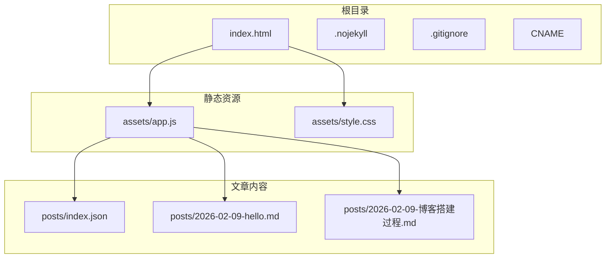
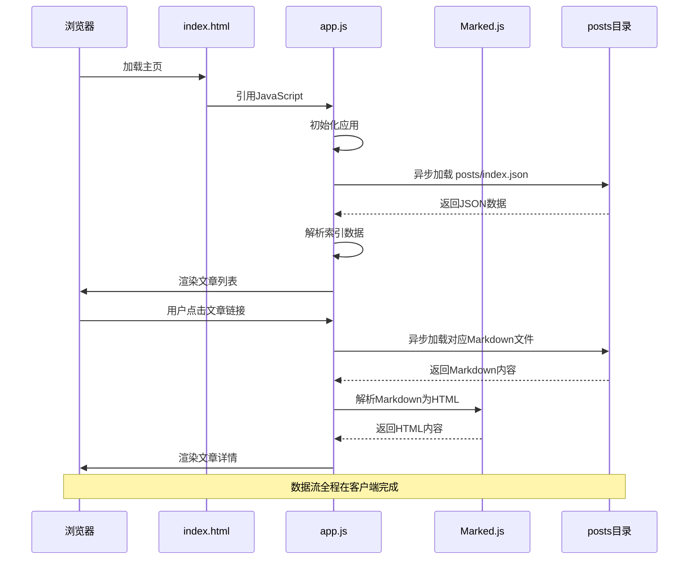
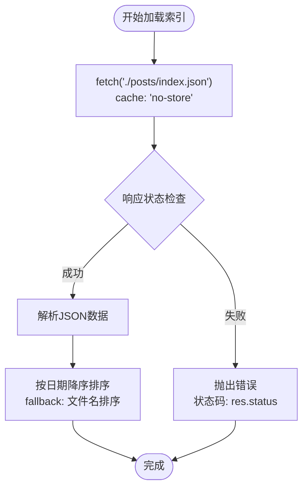
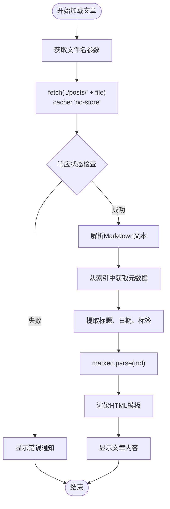
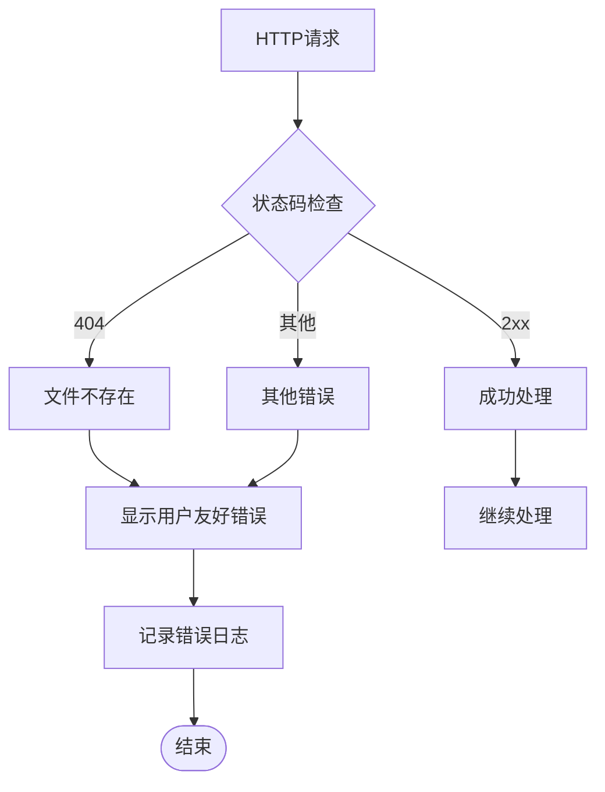
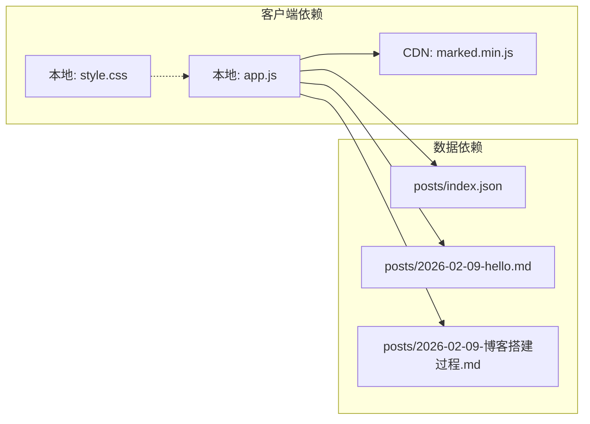

# 数据流设计

<cite>
**本文档中引用的文件**
- [index.html](file://index.html)
- [assets/app.js](file://assets/app.js)
- [assets/style.css](file://assets/style.css)
- [posts/index.json](file://posts/index.json)
- [posts/2026-02-09-hello.md](file://posts/2026-02-09-hello.md)
- [posts/2026-02-09-博客搭建过程.md](file://posts/2026-02-09-博客搭建过程.md)
</cite>

## 目录
1. [简介](#简介)
2. [项目结构](#项目结构)
3. [核心组件](#核心组件)
4. [架构概览](#架构概览)
5. [详细组件分析](#详细组件分析)
6. [依赖关系分析](#依赖关系分析)
7. [性能考虑](#性能考虑)
8. [故障排除指南](#故障排除指南)
9. [结论](#结论)

## 简介

本项目是一个无编译的静态Markdown博客系统，采用纯前端技术实现从Markdown文件到HTML渲染的完整数据流程。系统通过异步加载JSON索引文件获取文章元数据，动态读取对应的Markdown内容，并使用Marked.js进行实时解析渲染。该设计实现了"git push即发布"的工作流，无需任何构建工具或服务器端渲染。

## 项目结构

项目采用极简的静态文件架构，主要包含以下核心文件：

**图表来源**
- [index.html](file://index.html#L1-L104)
- [assets/app.js](file://assets/app.js#L1-L313)
- [posts/index.json](file://posts/index.json#L1-L16)

**章节来源**
- [index.html](file://index.html#L1-L104)
- [assets/app.js](file://assets/app.js#L1-L313)
- [posts/index.json](file://posts/index.json#L1-L16)

## 核心组件

### 数据获取层
系统通过异步HTTP请求获取数据，确保不阻塞页面渲染：

- **索引文件加载**：`loadIndex()`函数异步获取`posts/index.json`
- **文章内容加载**：`loadPost()`函数根据文件名动态加载对应Markdown文件
- **缓存策略**：使用`cache: "no-store"`强制绕过浏览器缓存，确保内容实时性

### 数据转换层
Marked.js负责将Markdown语法转换为HTML：

- **语法解析**：支持GitHub Flavored Markdown (GFM)
- **HTML生成**：输出标准HTML结构供后续渲染
- **安全处理**：内置XSS防护机制

### 数据渲染层
JavaScript负责将解析后的HTML插入DOM并应用样式：

- **模板渲染**：使用模板字符串生成HTML结构
- **事件绑定**：为交互元素添加事件监听器
- **状态管理**：维护应用状态和视图切换

**章节来源**
- [assets/app.js](file://assets/app.js#L140-L182)
- [assets/app.js](file://assets/app.js#L155-L162)

## 架构概览

系统采用单页应用(SPA)架构，基于URL哈希实现客户端路由：

**图表来源**
- [index.html](file://index.html#L16-L17)
- [assets/app.js](file://assets/app.js#L140-L182)

## 详细组件分析

### 数据获取组件

#### 索引文件加载机制
`loadIndex()`函数负责获取文章元数据索引：

**图表来源**
- [assets/app.js](file://assets/app.js#L140-L147)

#### 文章内容加载机制
`loadPost()`函数处理单篇文章的加载和渲染：

**图表来源**
- [assets/app.js](file://assets/app.js#L149-L182)

**章节来源**
- [assets/app.js](file://assets/app.js#L140-L182)

### 数据转换组件

#### Marked.js集成
系统集成了Marked.js进行Markdown到HTML的转换：

- **配置选项**：启用GFM支持，禁用硬换行
- **安全性**：默认XSS防护，自动转义危险字符
- **性能**：轻量级解析器，适合浏览器端运行

#### HTML渲染流程
渲染过程包括多个步骤：

1. **元数据提取**：从索引中获取文章标题、日期、标签
2. **Markdown解析**：使用Marked.js转换为HTML
3. **模板组合**：将元数据和解析内容组合成最终HTML
4. **DOM插入**：将HTML插入到目标容器中

**章节来源**
- [assets/app.js](file://assets/app.js#L155-L162)

### 数据验证与错误处理

#### 输入验证机制
系统实施多层次的数据验证：

- **索引格式验证**：检查必需字段存在性
- **文件存在性检查**：确认Markdown文件实际存在
- **路由参数验证**：解码URL参数并验证格式

#### 错误处理策略
错误处理采用渐进式策略：

**图表来源**
- [assets/app.js](file://assets/app.js#L141-L153)
- [assets/app.js](file://assets/app.js#L200-L211)

**章节来源**
- [assets/app.js](file://assets/app.js#L140-L153)
- [assets/app.js](file://assets/app.js#L200-L211)

## 依赖关系分析

系统依赖关系相对简单，主要依赖外部CDN资源：

**图表来源**
- [index.html](file://index.html#L16-L17)
- [assets/app.js](file://assets/app.js#L1-L313)

**章节来源**
- [index.html](file://index.html#L16-L17)
- [assets/app.js](file://assets/app.js#L1-L313)

## 性能考虑

### 缓存策略
系统采用"无缓存"策略以确保内容实时性：

- **索引文件**：每次访问都重新获取最新数据
- **文章内容**：实时加载避免陈旧内容
- **样式文件**：由浏览器自动缓存，提升二次访问速度

### 加载优化
为了提升用户体验，系统实施了多项优化：

- **异步加载**：所有数据获取都是异步的，不阻塞页面渲染
- **增量渲染**：先显示列表，再加载详细内容
- **懒加载**：仅在需要时才加载对应文章

### 内存管理
系统注意内存使用效率：

- **数据复用**：索引数据在内存中缓存，避免重复请求
- **DOM清理**：切换视图时清理不需要的DOM元素
- **事件解绑**：移除不再使用的事件监听器

## 故障排除指南

### 常见问题诊断

#### 索引文件加载失败
**症状**：页面显示初始化失败通知
**可能原因**：
- 网络连接问题
- 文件路径错误
- CORS跨域限制

**解决方案**：
- 检查网络连接状态
- 验证文件路径是否正确
- 确认服务器支持CORS

#### 文章内容加载失败
**症状**：单篇文章页面显示加载失败
**可能原因**：
- Markdown文件不存在
- 文件名编码问题
- 权限设置错误

**解决方案**：
- 确认文件存在于指定路径
- 检查文件名编码格式
- 验证文件权限设置

#### Marked.js解析异常
**症状**：Markdown内容无法正确渲染
**可能原因**：
- Markdown语法错误
- 特殊字符未正确转义
- 浏览器兼容性问题

**解决方案**：
- 检查Markdown语法规范
- 确保特殊字符正确转义
- 测试不同浏览器兼容性

**章节来源**
- [assets/app.js](file://assets/app.js#L297-L304)
- [assets/app.js](file://assets/app.js#L200-L211)

## 结论

本数据流设计成功实现了从Markdown文件到HTML渲染的完整自动化流程。通过异步数据获取、客户端渲染和实时内容更新，系统提供了流畅的用户体验。主要优势包括：

1. **极简架构**：无需构建工具，直接部署静态文件
2. **实时更新**：git push后立即生效
3. **高性能**：纯前端实现，加载速度快
4. **易维护**：代码结构清晰，易于扩展

该设计为内容创作者提供了一个高效、可靠的博客平台，特别适合需要快速迭代和内容管理的场景。