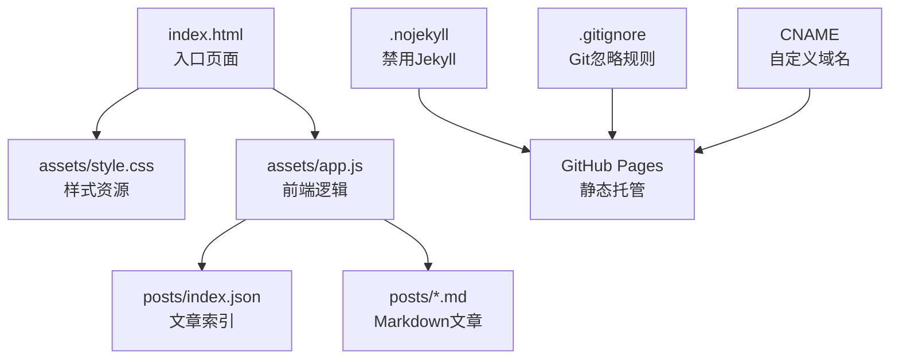
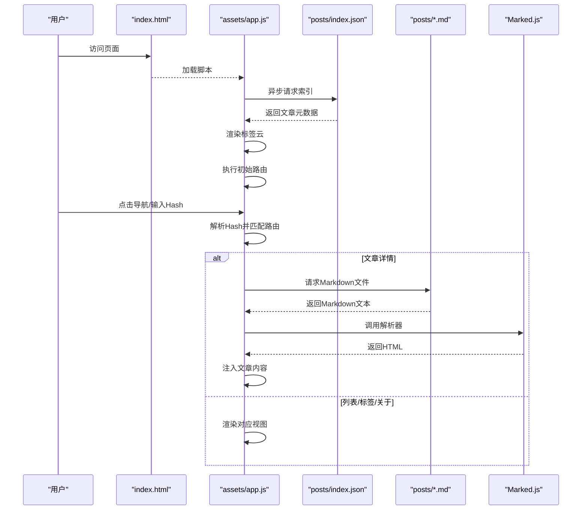
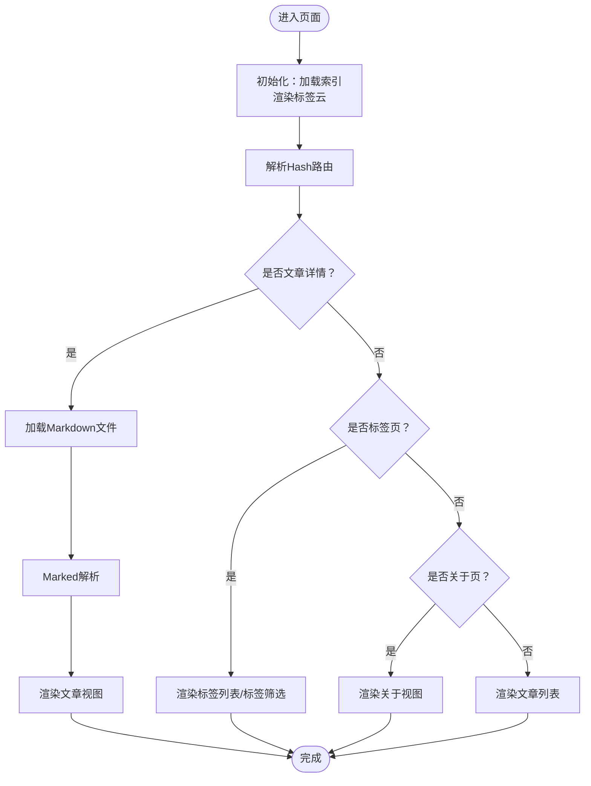
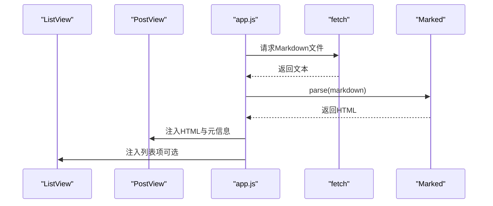
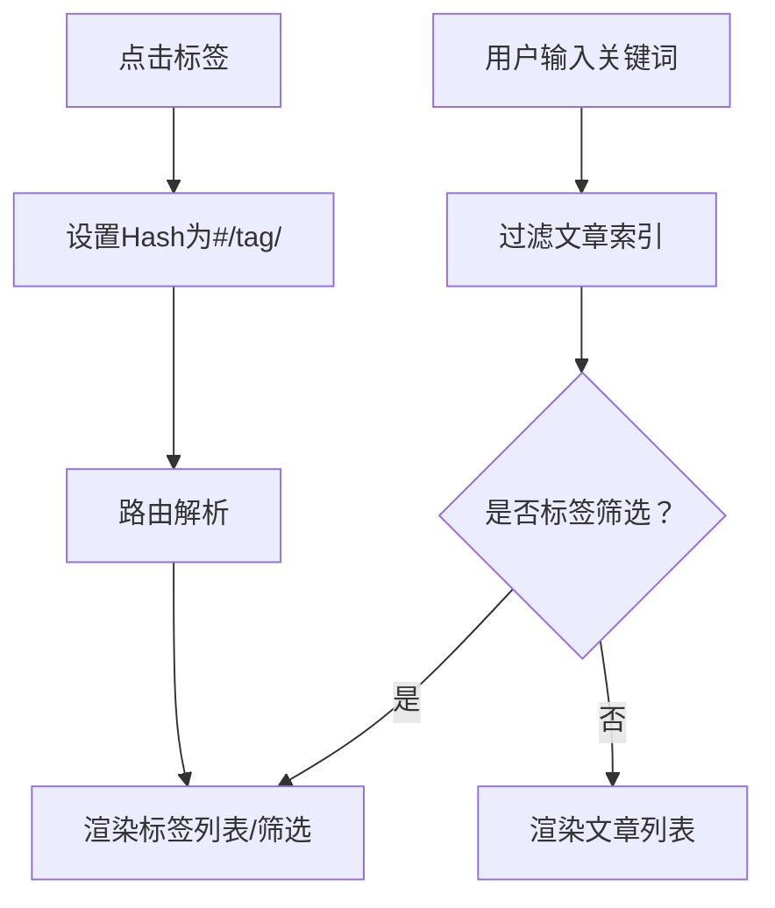
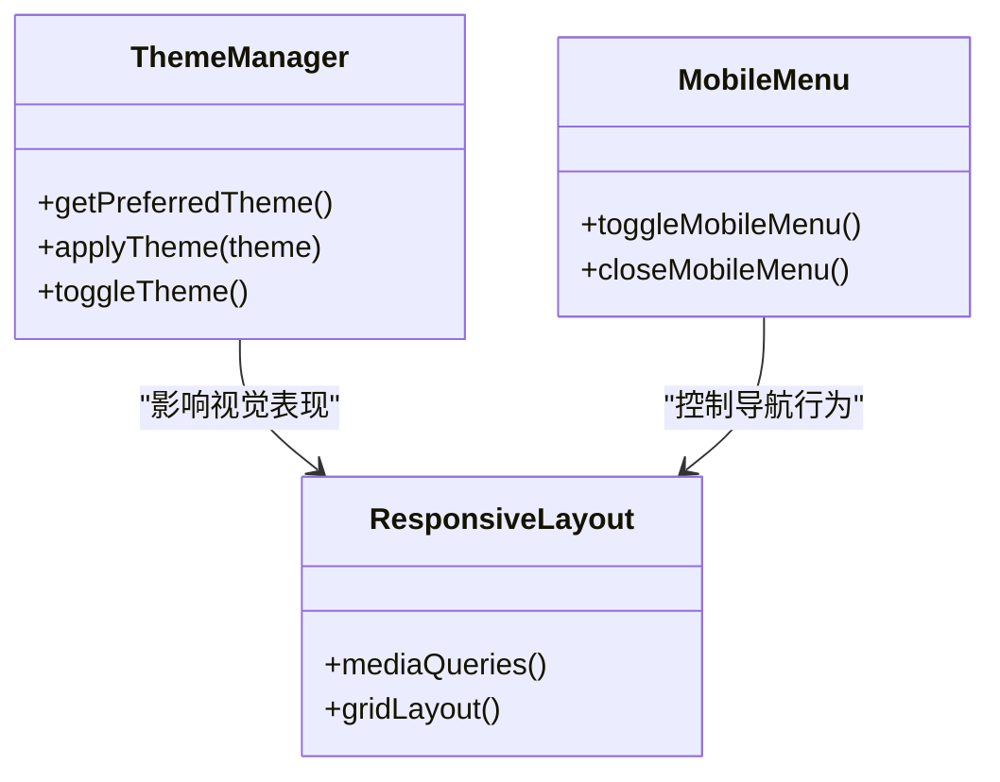
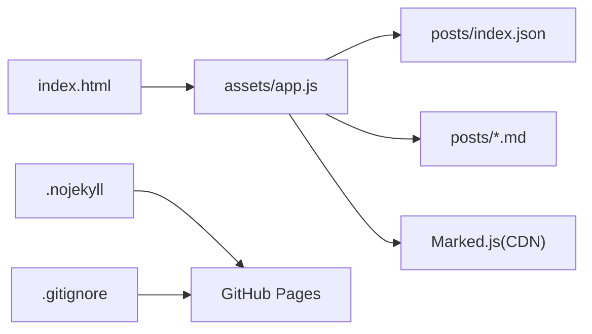

# 架构设计

<cite>
**本文档引用的文件**
- [index.html](file://index.html)
- [app.js](file://assets/app.js)
- [style.css](file://assets/style.css)
- [index.json](file://posts/index.json)
- [hello.md](file://posts/2026-02-09-hello.md)
- [博客搭建过程.md](file://posts/2026-02-09-博客搭建过程.md)
- [.gitignore](file://.gitignore)
- [.nojekyll](file://.nojekyll)
</cite>

## 目录
1. [简介](#简介)
2. [项目结构](#项目结构)
3. [核心组件](#核心组件)
4. [架构总览](#架构总览)
5. [详细组件分析](#详细组件分析)
6. [依赖关系分析](#依赖关系分析)
7. [性能考虑](#性能考虑)
8. [故障排查指南](#故障排查指南)
9. [结论](#结论)
10. [附录](#附录)

## 简介
本项目是一个“无编译”的静态博客系统，采用纯前端SPA（单页应用）架构，通过Hash路由实现页面切换，使用Marked.js在浏览器端将Markdown内容渲染为HTML。系统以GitHub Pages作为托管平台，实现“维护静态文件 + Markdown”即可发布的轻量化工作流。该架构强调简洁性、可维护性和可扩展性，适合专注于写作的博主以及希望降低技术门槛的团队。

## 项目结构
项目采用扁平化的静态站点组织方式，核心文件与资源分布清晰：
- 入口页面：index.html
- 样式资源：assets/style.css
- 前端逻辑：assets/app.js
- 内容索引：posts/index.json
- 文章内容：posts/*.md
- 部署配置：.nojekyll、.gitignore、CNAME（存在时）

图表来源
- [index.html](file://index.html#L1-L104)
- [app.js](file://assets/app.js#L1-L313)
- [style.css](file://assets/style.css#L1-L629)
- [.nojekyll](file://.nojekyll#L1-L1)

章节来源
- [index.html](file://index.html#L1-L104)
- [app.js](file://assets/app.js#L1-L313)
- [style.css](file://assets/style.css#L1-L629)
- [.gitignore](file://.gitignore#L1-L2)
- [.nojekyll](file://.nojekyll#L1-L1)

## 核心组件
- HTML5语义化结构：使用header、main、footer等语义化标签，配合语义化类名，提升可读性与可访问性。
- CSS3响应式设计：通过媒体查询与CSS Grid/Flex布局，适配桌面与移动端，支持暗/亮主题切换。
- JavaScript模块化逻辑：以IIFE初始化，集中管理路由、渲染、搜索、主题切换等功能，避免全局污染。
- Hash路由系统：基于location.hash实现SPA路由，支持文章列表、文章详情、标签筛选、关于页面。
- Markdown渲染：通过CDN引入Marked.js，在浏览器端将Markdown文本转换为HTML。
- 数据索引：posts/index.json提供文章元数据（文件名、标题、日期、标签、摘要），驱动列表与筛选。

章节来源
- [index.html](file://index.html#L1-L104)
- [app.js](file://assets/app.js#L1-L313)
- [style.css](file://assets/style.css#L1-L629)
- [index.json](file://posts/index.json#L1-L16)

## 架构总览
系统采用“静态文件 + 浏览器端渲染”的前端架构，核心流程如下：
- 用户访问index.html，加载样式与脚本。
- 初始化阶段：读取posts/index.json，构建文章索引，渲染标签云，执行初始路由。
- 用户交互：点击导航或Hash变化触发路由函数，根据路径动态渲染对应视图。
- 文章渲染：按需加载对应Markdown文件，调用Marked进行渲染，并注入到文章容器中。

图表来源
- [index.html](file://index.html#L1-L104)
- [app.js](file://assets/app.js#L140-L182)
- [index.json](file://posts/index.json#L1-L16)
- [hello.md](file://posts/2026-02-09-hello.md#L1-L8)

## 详细组件分析

### Hash路由系统
- 路由规则
  - #/：默认文章列表
  - #/post/<file>：文章详情页
  - #/tag/<tag>：标签筛选页（tag=all显示标签页）
  - #/about：关于页面
- 实现机制
  - 使用location.hash监听URL变化，route函数解析当前Hash并决定渲染哪个视图。
  - 支持实时搜索过滤（仅在列表/标签页生效），输入变化时重新计算并渲染。
- 优势
  - 无需服务端支持，完全客户端渲染。
  - URL可分享，便于书签与社交传播。
  - 与GitHub Pages兼容良好，无需额外配置。

图表来源
- [app.js](file://assets/app.js#L200-L230)
- [app.js](file://assets/app.js#L140-L182)
- [app.js](file://assets/app.js#L184-L198)

章节来源
- [app.js](file://assets/app.js#L200-L230)
- [app.js](file://assets/app.js#L306-L313)

### Markdown渲染流程
- 数据来源：posts/index.json提供元数据；文章内容来自posts/*.md。
- 渲染步骤
  - 读取Markdown文本
  - 设置Marked选项（如启用GFM）
  - 解析为HTML
  - 注入到文章容器，同时渲染标题、日期、标签等元信息
- 容错处理：加载失败时显示通知提示，避免页面崩溃。

图表来源
- [app.js](file://assets/app.js#L149-L182)
- [hello.md](file://posts/2026-02-09-hello.md#L1-L8)

章节来源
- [app.js](file://assets/app.js#L149-L182)

### 搜索与标签系统
- 搜索逻辑
  - 实时过滤：输入框变更时，对文章索引进行匹配（标题、摘要、标签、日期、文件名）。
  - 快捷键：Cmd/Ctrl+K聚焦搜索框。
- 标签系统
  - 标签云：统计各标签出现次数，渲染为可点击的标签元素。
  - 标签筛选：点击标签跳转至对应标签页，进一步过滤文章列表。
- 排序与展示
  - 列表按日期降序排序，回退按文件名排序。
  - 标签页展示所有标签及其计数，支持返回列表。

图表来源
- [app.js](file://assets/app.js#L75-L83)
- [app.js](file://assets/app.js#L85-L138)
- [app.js](file://assets/app.js#L61-L73)

章节来源
- [app.js](file://assets/app.js#L75-L83)
- [app.js](file://assets/app.js#L85-L138)
- [app.js](file://assets/app.js#L61-L73)

### 主题切换与移动端适配
- 主题切换
  - 通过data-theme属性在根节点切换亮/暗主题，图标随主题变化。
  - 优先读取localStorage保存的用户偏好，否则根据系统偏好自动选择。
- 移动端菜单
  - 小屏设备显示汉堡菜单，点击展开导航，点击外部区域或导航项自动收起。
- 响应式布局
  - 桌面端双栏布局，侧边栏与内容区并列；平板/手机端单栏布局。
  - 大量媒体查询覆盖不同断点，确保在各种设备上的可用性。

图表来源
- [app.js](file://assets/app.js#L232-L253)
- [app.js](file://assets/app.js#L255-L262)
- [style.css](file://assets/style.css#L383-L440)

章节来源
- [app.js](file://assets/app.js#L232-L253)
- [app.js](file://assets/app.js#L255-L262)
- [style.css](file://assets/style.css#L383-L440)

### 静态资源管理与外部依赖
- 静态资源
  - 样式：assets/style.css，包含主题变量、组件样式、响应式规则。
  - 脚本：assets/app.js，集中处理路由、渲染、交互。
- 外部依赖
  - Marked.js：CDN引入，负责Markdown解析。
- 部署配置
  - .nojekyll：禁用GitHub Pages的Jekyll构建，允许直接托管下划线开头的文件夹。
  - .gitignore：忽略系统文件。
  - CNAME：可选，用于自定义域名。

章节来源
- [index.html](file://index.html#L14-L17)
- [.nojekyll](file://.nojekyll#L1-L1)
- [.gitignore](file://.gitignore#L1-L2)

## 依赖关系分析
- 组件耦合
  - app.js与DOM元素强绑定（视图容器、输入框、按钮等），通过ID选择器直接操作。
  - 路由与渲染逻辑内聚，避免跨模块重复逻辑。
- 外部依赖
  - Marked.js为唯一运行时依赖，版本通过CDN引入，便于升级与缓存。
- 数据依赖
  - posts/index.json为数据源，app.js在初始化时加载并排序，后续渲染依赖该索引。
- 潜在风险
  - CDN依赖可能失败，需在网络错误时提供降级提示。
  - Hash路由在不支持或禁用JavaScript的环境下不可用。

图表来源
- [index.html](file://index.html#L1-L104)
- [app.js](file://assets/app.js#L1-L313)
- [index.json](file://posts/index.json#L1-L16)

章节来源
- [index.html](file://index.html#L1-L104)
- [app.js](file://assets/app.js#L1-L313)
- [index.json](file://posts/index.json#L1-L16)

## 性能考虑
- 资源加载
  - 使用CDN加载Marked.js，利用浏览器缓存与网络加速。
  - CSS与JS分别独立加载，减少阻塞。
- 渲染优化
  - 列表渲染采用字符串拼接，避免频繁DOM操作。
  - 标签云仅渲染前N个高频标签，降低DOM节点数量。
- 网络与缓存
  - 索引与文章请求均设置no-store，确保每次获取最新内容。
  - 主题切换与搜索等交互尽量在客户端完成，减少二次请求。
- 移动端体验
  - 使用touch-action与overscroll-behavior优化滚动体验。
  - 媒体查询精细化适配，避免过度重排。

## 故障排查指南
- 页面空白或功能异常
  - 检查index.html中的脚本与样式引用路径是否正确。
  - 确认posts/index.json格式正确且可被访问。
- Markdown无法渲染
  - 确认Marked.js CDN可访问，检查浏览器控制台是否有错误。
  - 确认文章文件编码为UTF-8，且文件名未包含非法字符。
- Hash路由无效
  - 确保浏览器支持location.hash，或检查是否有第三方脚本干扰。
  - 检查GitHub Pages是否正确部署，确认CNAME（如有）指向正确。
- 搜索/标签功能异常
  - 检查posts/index.json中tags字段是否为数组，且无空值。
  - 确认输入框事件绑定正常，路由监听是否生效。

章节来源
- [index.html](file://index.html#L1-L104)
- [app.js](file://assets/app.js#L140-L182)
- [index.json](file://posts/index.json#L1-L16)

## 结论
该静态博客系统通过“无编译”的SPA架构，实现了简洁、可维护且高性能的博客平台。Hash路由与浏览器端渲染相结合，既满足了现代Web应用的交互需求，又保持了静态站点的部署与维护优势。通过合理的数据索引、响应式设计与主题系统，系统在多设备上提供了良好的用户体验。未来可在以下方面持续演进：引入更细粒度的错误处理与降级策略、优化首屏渲染、增加离线缓存与PWA特性、扩展内容管理与SEO优化能力。

## 附录
- 开发与发布流程
  - 新增文章：在posts/目录新增.md文件，并在posts/index.json中添加对应条目。
  - 更新索引：确保索引文件包含新文章的元数据（文件名、标题、日期、标签、摘要）。
  - 提交与发布：提交所有更改并通过git push到GitHub，等待Pages构建完成。
- 最佳实践
  - 保持posts/index.json与实际文件同步，避免404。
  - 使用语义化标签与无障碍属性，提升可访问性。
  - 控制标签数量与长度，避免标签云过长影响性能。
  - 定期检查CDN依赖可用性，必要时提供本地备用方案。