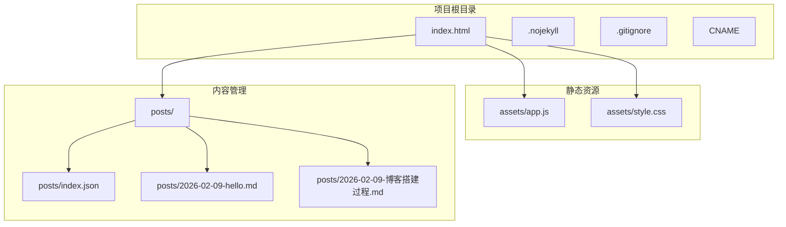
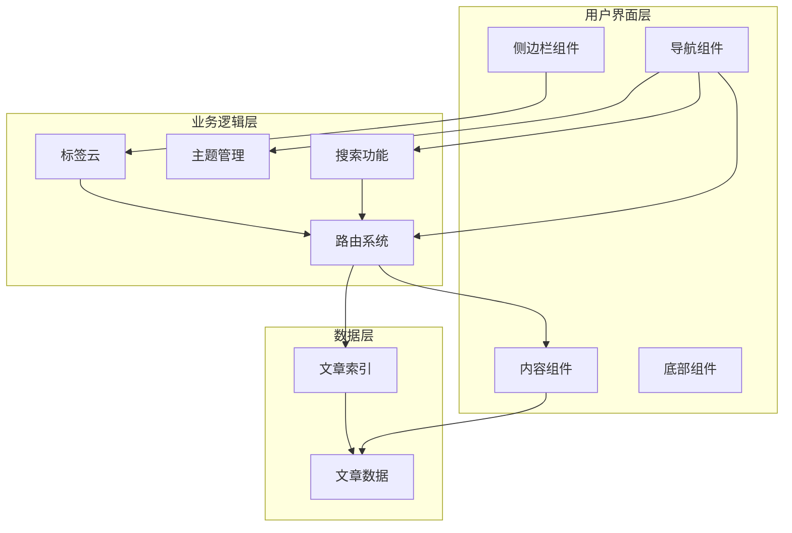
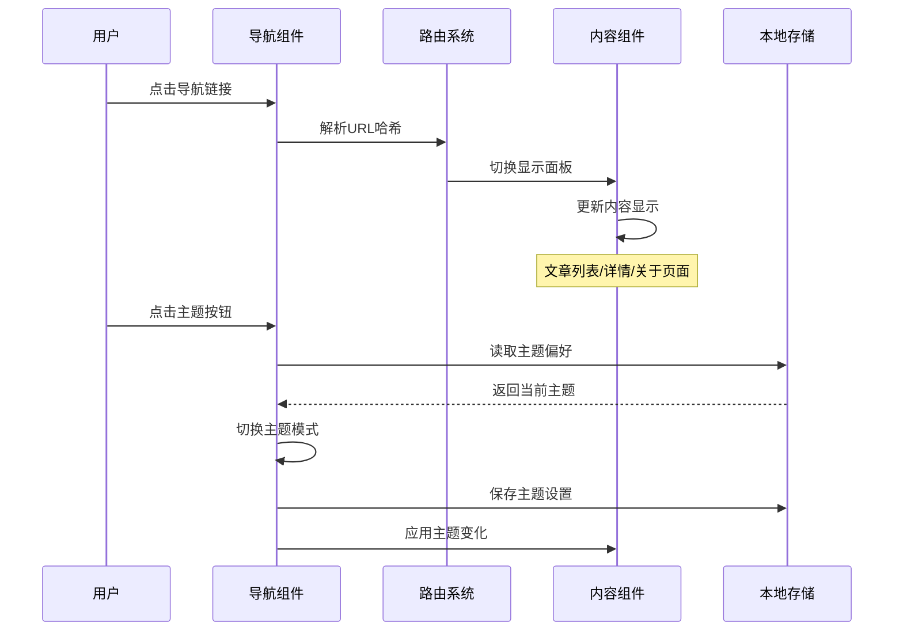
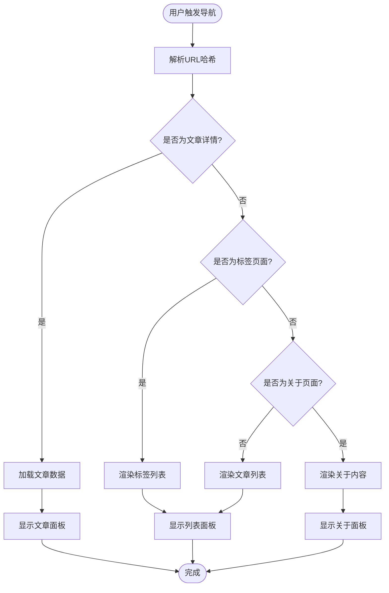
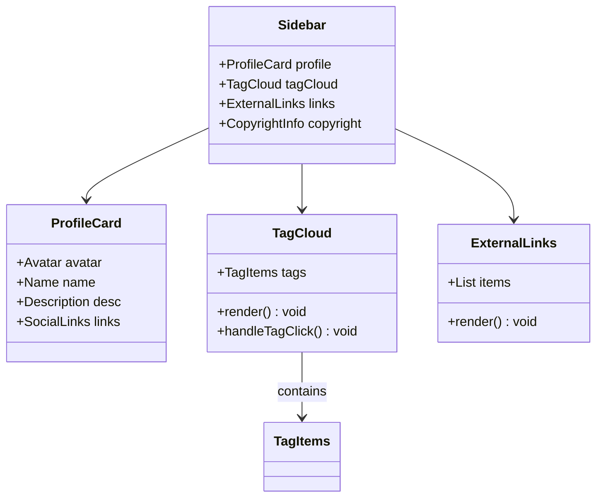
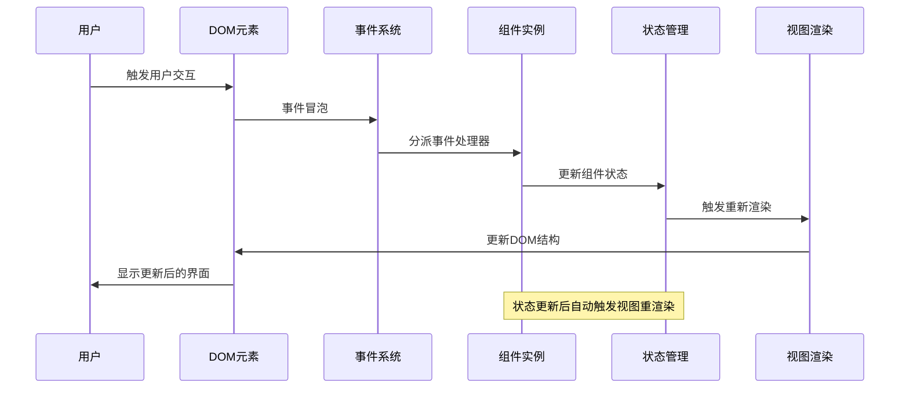
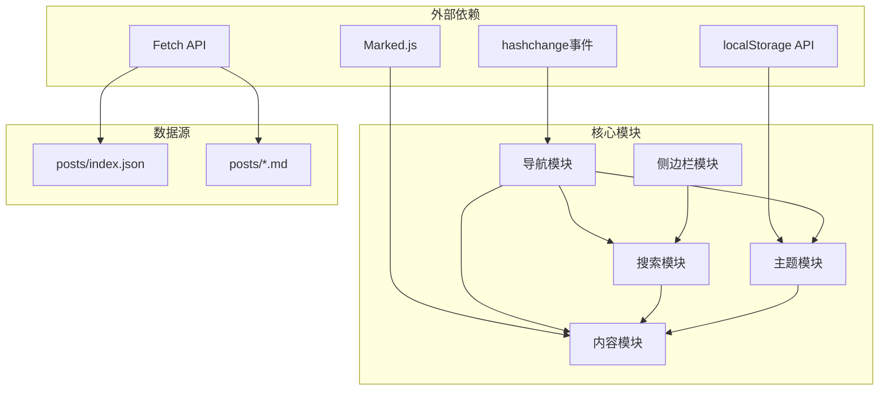

# 组件交互关系

<cite>
**本文档中引用的文件**
- [index.html](file://index.html)
- [app.js](file://assets/app.js)
- [style.css](file://assets/style.css)
- [index.json](file://posts/index.json)
- [hello.md](file://posts/2026-02-09-hello.md)
- [博客搭建过程.md](file://posts/2026-02-09-博客搭建过程.md)
</cite>

## 目录
1. [简介](#简介)
2. [项目结构](#项目结构)
3. [核心组件](#核心组件)
4. [架构概览](#架构概览)
5. [详细组件分析](#详细组件分析)
6. [依赖关系分析](#依赖关系分析)
7. [性能考虑](#性能考虑)
8. [故障排除指南](#故障排除指南)
9. [结论](#结论)

## 简介

这是一个基于纯静态文件的无编译博客系统，采用浏览器端渲染技术。该系统实现了完整的单页应用（SPA）功能，包括导航、内容展示、侧边栏、搜索、主题切换等核心组件。所有内容通过JSON索引和Markdown文件管理，无需任何构建工具或服务器端处理。

## 项目结构

该项目采用极简的文件组织结构，主要由以下几部分组成：

**图表来源**
- [index.html](file://index.html#L1-L104)
- [app.js](file://assets/app.js#L1-L313)
- [style.css](file://assets/style.css#L1-L629)

**章节来源**
- [index.html](file://index.html#L1-L104)
- [app.js](file://assets/app.js#L1-L313)
- [style.css](file://assets/style.css#L1-L629)

## 核心组件

系统包含四个主要组件，每个都承担特定的功能职责：

### 导航组件（Topbar Navigation）
- **位置**: 页面顶部，包含品牌标识、导航链接、搜索框和主题切换按钮
- **功能**: 提供全局导航、搜索入口和主题控制
- **交互**: 响应式设计，在移动端显示汉堡菜单

### 内容组件（Content Panels）
- **位置**: 主体区域右侧，包含三个独立的内容面板
- **功能**: 
  - 文章列表面板（默认显示）
  - 单篇文章面板（按文章详情）
  - 关于页面面板（静态内容）
- **状态管理**: 通过CSS类控制显示/隐藏

### 侧边栏组件（Sidebar）
- **位置**: 主体区域左侧，包含多个信息卡片
- **功能**:
  - 个人资料卡片
  - 标签云（热门标签）
  - 外链导航
  - 版权信息
- **动态交互**: 标签云支持点击筛选

### 底部组件（Footer）
- **位置**: 页面底部
- **功能**: 显示版权信息和年份
- **状态**: 动态更新当前年份

**章节来源**
- [index.html](file://index.html#L20-L100)
- [style.css](file://assets/style.css#L58-L567)

## 架构概览

系统采用事件驱动的单页应用架构，所有组件通过DOM事件进行交互：

**图表来源**
- [app.js](file://assets/app.js#L200-L313)
- [index.html](file://index.html#L20-L100)

## 详细组件分析

### 导航组件交互机制

导航组件是整个系统的控制中心，负责处理用户的所有主要交互：

**图表来源**
- [app.js](file://assets/app.js#L200-L278)
- [index.html](file://index.html#L21-L47)

导航组件的关键交互流程包括：

1. **事件监听**: 为所有导航链接绑定点击事件处理器
2. **URL解析**: 使用正则表达式解析URL哈希值
3. **状态切换**: 根据不同的URL模式切换到相应的视图
4. **内容渲染**: 加载对应的数据并渲染到内容面板

**章节来源**
- [index.html](file://index.html#L21-L47)
- [app.js](file://assets/app.js#L200-L230)

### 内容组件协作模式

内容组件采用面板切换机制，确保同一时间只有一个面板处于激活状态：

**图表来源**
- [app.js](file://assets/app.js#L200-L230)
- [app.js](file://assets/app.js#L140-L198)

内容组件的协作特点：

- **单一职责**: 每个面板负责特定类型的内容展示
- **状态隔离**: 面板之间保持独立的状态管理
- **懒加载**: 文章内容按需加载，提升性能
- **错误处理**: 具备完善的异常处理机制

**章节来源**
- [app.js](file://assets/app.js#L85-L198)

### 侧边栏组件交互机制

侧边栏组件包含多个独立的信息卡片，每个都有特定的交互行为：

**图表来源**
- [index.html](file://index.html#L50-L82)
- [app.js](file://assets/app.js#L61-L73)

侧边栏组件的交互特性：

- **标签云**: 动态生成热门标签，支持点击筛选
- **个人资料**: 展示作者信息和社交链接
- **外链导航**: 提供相关资源的快捷访问
- **响应式布局**: 根据屏幕尺寸调整显示效果

**章节来源**
- [index.html](file://index.html#L50-L82)
- [app.js](file://assets/app.js#L61-L73)

### 事件传播路径

系统中的事件传播遵循标准的DOM事件模型：

**图表来源**
- [app.js](file://assets/app.js#L265-L313)

事件传播的具体流程：

1. **用户交互**: 点击、输入、键盘操作等
2. **事件监听**: 组件注册的事件处理器捕获事件
3. **状态更新**: 事件处理器更新组件内部状态
4. **视图重渲染**: 状态变更触发自动的视图更新
5. **DOM更新**: 新的视图反映到实际的DOM结构中

**章节来源**
- [app.js](file://assets/app.js#L265-L313)

## 依赖关系分析

系统采用松耦合的设计，各组件间通过明确的接口进行通信：

**图表来源**
- [app.js](file://assets/app.js#L140-L182)
- [app.js](file://assets/app.js#L232-L278)

依赖关系的特点：

- **最小化依赖**: 仅依赖必要的浏览器API和第三方库
- **模块化设计**: 功能按模块划分，职责清晰
- **数据驱动**: 通过JSON数据驱动内容渲染
- **异步处理**: 使用Promise和async/await处理异步操作

**章节来源**
- [app.js](file://assets/app.js#L1-L313)

## 性能考虑

系统在设计时充分考虑了性能优化：

### 加载优化
- **延迟加载**: 文章内容按需加载，减少初始页面大小
- **缓存策略**: 使用`cache: "no-store"`避免缓存问题
- **CDN资源**: Marked.js通过CDN加载，提升加载速度

### 渲染优化
- **虚拟DOM**: 通过DOM操作实现高效的视图更新
- **事件委托**: 减少事件监听器数量，提升性能
- **防抖处理**: 搜索输入采用节流处理，避免频繁重渲染

### 存储优化
- **本地存储**: 主题偏好和用户设置存储在localStorage中
- **内存管理**: 及时清理事件监听器，防止内存泄漏

## 故障排除指南

### 常见问题及解决方案

**问题1: 文章无法加载**
- 检查`posts/index.json`文件格式是否正确
- 确认文章文件名与索引中的`file`字段匹配
- 验证网络连接和文件权限

**问题2: 标签云不显示**
- 确认文章具有有效的`tags`数组
- 检查标签数据是否正确编码
- 验证CSS样式是否正确应用

**问题3: 主题切换无效**
- 检查localStorage是否被禁用
- 确认CSS变量定义是否正确
- 验证主题切换函数是否正常执行

**问题4: 搜索功能异常**
- 检查输入框的事件监听器是否正常
- 确认搜索算法是否正确处理特殊字符
- 验证URL哈希变化事件是否触发

**章节来源**
- [app.js](file://assets/app.js#L140-L182)
- [app.js](file://assets/app.js#L30-L38)

## 结论

这个无编译博客系统展现了现代Web开发的最佳实践：

### 设计优势
- **极简架构**: 无需构建工具，直接部署到GitHub Pages
- **响应式设计**: 完美适配各种设备和屏幕尺寸
- **性能优化**: 通过懒加载和异步处理提升用户体验
- **易于维护**: 清晰的代码结构和模块化设计

### 技术特色
- **纯前端渲染**: 浏览器端完成所有内容处理
- **事件驱动**: 基于DOM事件的组件交互模式
- **数据驱动**: 通过JSON数据管理内容
- **主题系统**: 支持亮/暗两种主题模式

### 扩展建议
- 可以添加更多的内容类型支持
- 考虑实现离线缓存机制
- 增强SEO优化功能
- 添加评论系统集成

这个项目为静态博客的实现提供了一个优秀的参考模板，展示了如何在保持极简的同时实现丰富的功能特性。