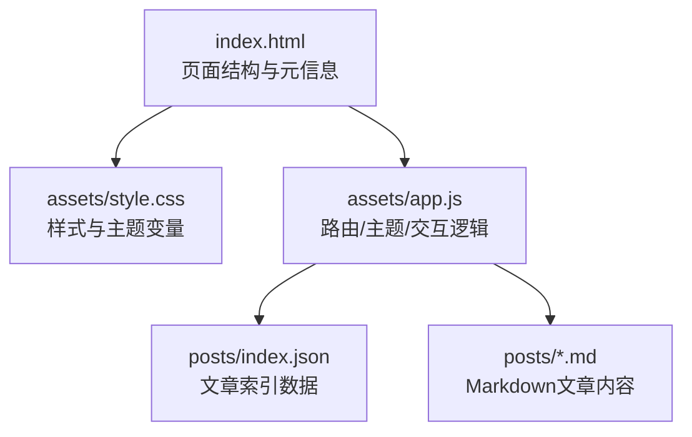
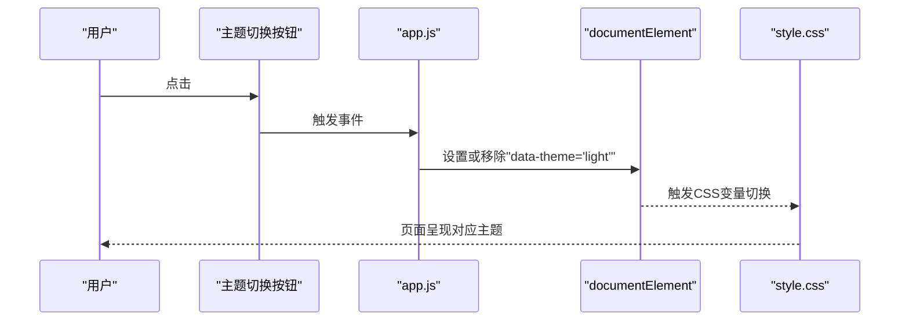
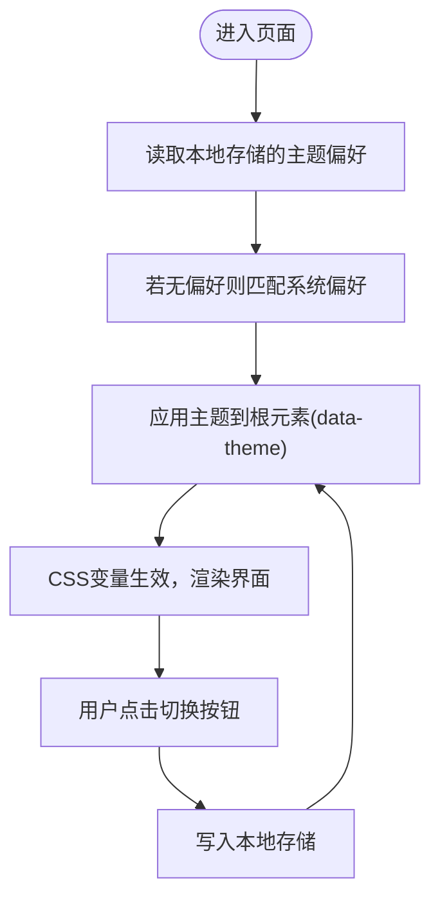
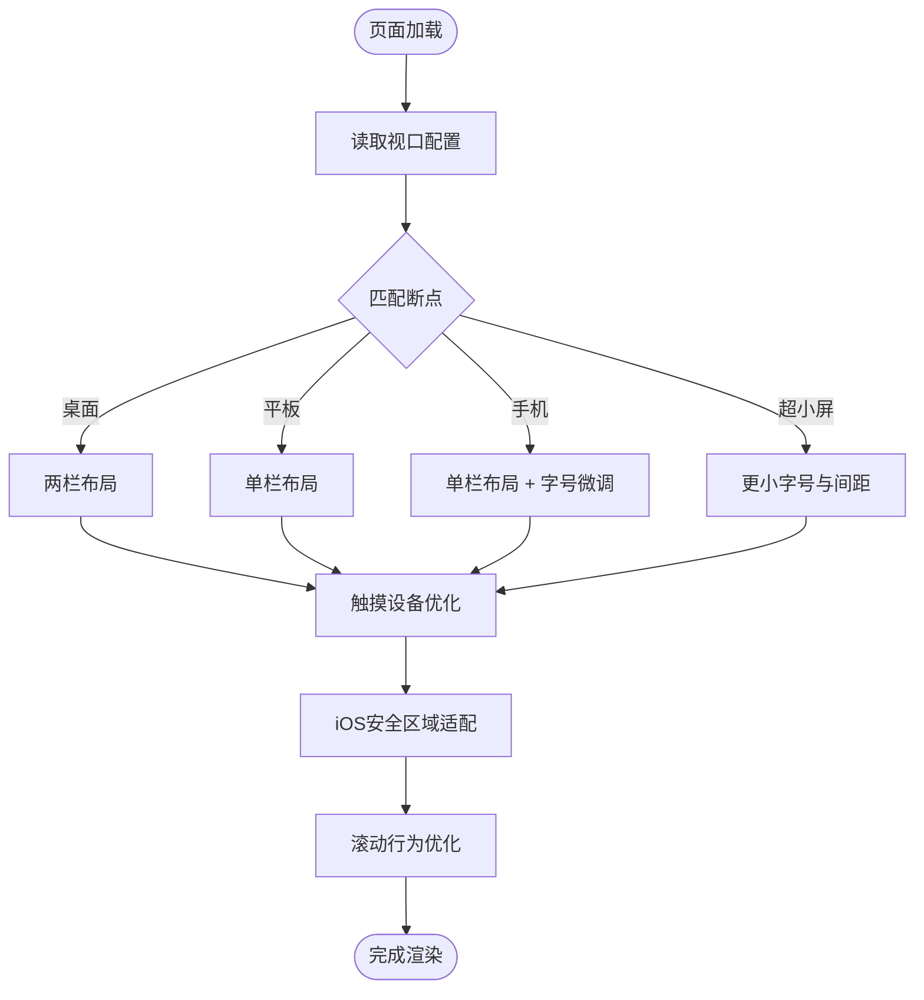
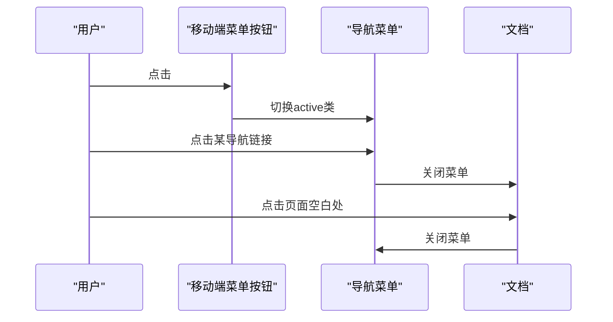
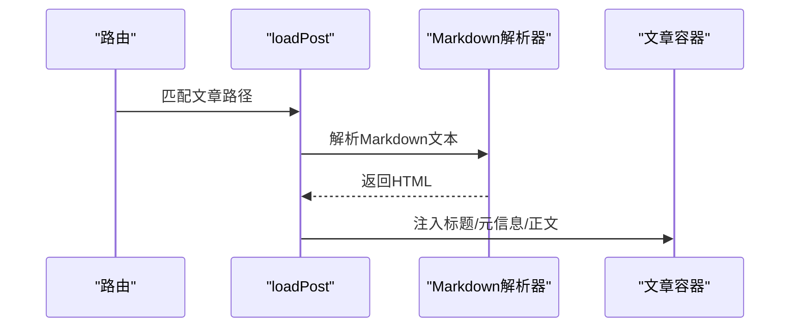
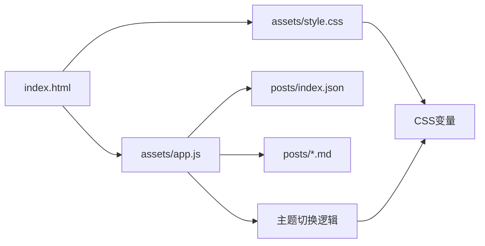

# 样式与主题

<cite>
**本文引用的文件**
- [style.css](file://assets/style.css)
- [app.js](file://assets/app.js)
- [index.html](file://index.html)
- [index.json](file://posts/index.json)
- [2026-02-09-hello.md](file://posts/2026-02-09-hello.md)
</cite>

## 目录
1. [简介](#简介)
2. [项目结构](#项目结构)
3. [核心组件](#核心组件)
4. [架构总览](#架构总览)
5. [详细组件分析](#详细组件分析)
6. [依赖关系分析](#依赖关系分析)
7. [性能考量](#性能考量)
8. [故障排查指南](#故障排查指南)
9. [结论](#结论)
10. [附录](#附录)

## 简介
本文件聚焦于该静态博客项目的样式系统与主题设计，围绕以下目标展开：
- 解释CSS变量系统的实现，包括亮色与暗色主题的变量定义与切换机制
- 说明响应式设计策略，包括断点设置、移动端适配与触摸交互优化
- 提供CSS架构设计说明，涵盖组件样式组织、命名规范与样式继承关系
- 给出自定义主题的实践指导，包括颜色方案、字体设置与布局调整的个性化定制方法

## 项目结构
该项目采用“无编译”架构，前端通过浏览器直接渲染Markdown内容，样式与脚本均以静态资源形式提供。关键文件与职责如下：
- HTML页面负责结构与元信息，引入样式与脚本，并挂载应用逻辑
- 样式文件集中管理主题变量、组件样式与响应式规则
- 应用脚本负责路由、主题切换、移动端菜单、搜索过滤与内容渲染
- 数据索引与文章内容通过JSON与Markdown文件提供

图表来源
- [index.html](file://index.html#L1-L104)
- [style.css](file://assets/style.css#L1-L629)
- [app.js](file://assets/app.js#L1-L313)
- [index.json](file://posts/index.json#L1-L16)
- [2026-02-09-hello.md](file://posts/2026-02-09-hello.md#L1-L8)

章节来源
- [index.html](file://index.html#L1-L104)
- [style.css](file://assets/style.css#L1-L629)
- [app.js](file://assets/app.js#L1-L313)
- [index.json](file://posts/index.json#L1-L16)
- [2026-02-09-hello.md](file://posts/2026-02-09-hello.md#L1-L8)

## 核心组件
- 主题变量系统：通过CSS自定义属性在根元素上定义主题变量，并使用选择器在亮/暗主题间切换
- 响应式布局：基于网格布局与多级媒体查询，针对不同屏幕尺寸进行断点适配
- 交互组件：导航栏、搜索框、主题切换按钮、移动端菜单、标签云等
- 内容渲染：Markdown解析与动态注入，配合样式保持一致的排版与视觉风格

章节来源
- [style.css](file://assets/style.css#L1-L629)
- [app.js](file://assets/app.js#L232-L258)
- [index.html](file://index.html#L20-L104)

## 架构总览
整体架构由“HTML页面 + CSS样式 + JavaScript应用”三部分组成，数据来源于posts目录下的JSON与Markdown文件。主题切换通过脚本控制根元素的data属性，从而驱动CSS变量的切换。

图表来源
- [app.js](file://assets/app.js#L250-L258)
- [style.css](file://assets/style.css#L17-L30)
- [index.html](file://index.html#L43-L45)

## 详细组件分析

### CSS变量系统与主题切换
- 变量定义：在根元素上定义基础变量，如背景、面板、文字、品牌色、阴影、代码背景等
- 主题覆盖：通过选择器为亮色主题定义覆盖变量值
- 切换机制：脚本根据用户偏好与本地存储设置根元素的data属性，从而激活对应变量集
- 本地持久化：主题状态保存在本地存储中，刷新后仍保持

图表来源
- [app.js](file://assets/app.js#L233-L258)
- [style.css](file://assets/style.css#L17-L30)
- [index.html](file://index.html#L6-L8)

章节来源
- [style.css](file://assets/style.css#L1-L30)
- [app.js](file://assets/app.js#L232-L258)
- [index.html](file://index.html#L6-L8)

### 响应式设计与断点策略
- 断点层级：
  - 默认两栏布局（桌面）
  - 中等宽度缩窄侧边栏（平板）
  - 平板单栏布局（平板）
  - 手机单栏布局与字号微调（手机）
  - 超小屏进一步微调（极窄屏）
- 触摸优化：针对触摸设备禁用悬停动画，减少不必要的过渡效果
- 安全区域：iOS安全区域适配，避免内容被系统UI遮挡
- 滚动行为：卡片与面板启用滚动限制，提升滚动体验

图表来源
- [style.css](file://assets/style.css#L383-L629)
- [index.html](file://index.html#L5)

章节来源
- [style.css](file://assets/style.css#L383-L629)
- [index.html](file://index.html#L5)

### 组件样式组织与命名规范
- 组件划分：顶部栏、导航、搜索、按钮、卡片、面板、标签云、列表项、文章内容、页脚等
- 命名策略：采用语义化类名，如“.topbar”、“.nav-link”、“.card-title”、“.md”等，便于理解与维护
- 样式继承：通过通用属性（如颜色、边框、阴影）统一继承，减少重复声明
- 变量驱动：所有颜色、边框、阴影、圆角、间距等均通过CSS变量控制，确保主题一致性

章节来源
- [style.css](file://assets/style.css#L58-L629)

### 交互与移动端适配
- 移动端菜单：在平板以下显示菜单按钮，点击展开导航；点击链接或外部区域自动收起
- 快捷键：支持Cmd/Ctrl+K聚焦搜索框
- 触摸交互：在触摸设备上禁用悬停动画，降低视觉干扰
- 搜索过滤：输入时对列表与标签页进行实时过滤

图表来源
- [app.js](file://assets/app.js#L255-L286)
- [style.css](file://assets/style.css#L105-L137)

章节来源
- [app.js](file://assets/app.js#L255-L286)
- [style.css](file://assets/style.css#L105-L137)

### 内容渲染与Markdown样式
- Markdown解析：使用第三方库进行解析，生成HTML并注入到文章容器
- 样式映射：文章内容使用“.md”选择器下的排版规则，保证标题、段落、代码块、引用等元素的一致性
- 动态注入：文章标题、日期、标签等元信息与正文一同渲染

图表来源
- [app.js](file://assets/app.js#L149-L182)
- [style.css](file://assets/style.css#L332-L358)

章节来源
- [app.js](file://assets/app.js#L149-L182)
- [style.css](file://assets/style.css#L332-L358)

## 依赖关系分析
- HTML依赖样式与脚本：页面通过<link>/<script>引入样式与应用逻辑
- 应用依赖数据：脚本通过fetch加载文章索引与具体文章内容
- 样式依赖变量：组件样式依赖CSS变量，主题切换即变量切换
- 主题依赖系统偏好：当未设置主题时，优先匹配系统偏好

图表来源
- [index.html](file://index.html#L14-L103)
- [app.js](file://assets/app.js#L140-L182)
- [style.css](file://assets/style.css#L1-L629)

章节来源
- [index.html](file://index.html#L14-L103)
- [app.js](file://assets/app.js#L140-L182)
- [style.css](file://assets/style.css#L1-L629)

## 性能考量
- 静态资源直连：无编译流程，减少构建时间与复杂度
- 按需渲染：仅在路由变化时渲染对应视图，避免全量重绘
- 变量驱动：通过CSS变量减少重复样式计算，提升主题切换流畅度
- 滚动优化：卡片与面板启用滚动限制，改善滚动性能与体验
- iOS安全区域：通过env函数处理安全区域，避免额外重排

章节来源
- [style.css](file://assets/style.css#L569-L583)
- [app.js](file://assets/app.js#L200-L230)

## 故障排查指南
- 主题不生效
  - 检查根元素是否正确设置data-theme属性
  - 确认CSS变量覆盖是否按预期生效
  - 查看本地存储中的主题记录
- 响应式异常
  - 确认视口元信息是否正确
  - 检查媒体查询断点是否符合预期
  - 在不同设备模拟器下验证
- 移动端菜单无法关闭
  - 检查事件绑定与active类切换逻辑
  - 确认点击外部区域的关闭逻辑是否触发
- 搜索功能无效
  - 确认输入事件监听与路由触发逻辑
  - 检查索引数据是否正确加载

章节来源
- [app.js](file://assets/app.js#L232-L258)
- [style.css](file://assets/style.css#L383-L629)
- [index.html](file://index.html#L5)

## 结论
该样式系统以CSS变量为核心，结合媒体查询与交互逻辑，实现了简洁而强大的主题切换与响应式布局。通过组件化的样式组织与语义化命名，提升了可维护性；通过触摸优化与滚动行为改进，增强了移动端体验。整体架构清晰、扩展性强，适合进一步定制与迭代。

## 附录

### 自定义主题指南
- 修改颜色方案
  - 在根元素变量区调整基础颜色变量
  - 在亮色主题覆盖区调整对应变量值
  - 使用颜色混合函数(color-mix)统一派生辅助色
- 修改字体设置
  - 在全局字体声明处替换字体族
  - 调整字号与行高以适配新字体
- 调整布局
  - 修改网格列宽与间距
  - 调整断点阈值与布局结构
- 保存与测试
  - 通过本地存储验证主题持久化
  - 在多设备与多系统下测试主题表现

章节来源
- [style.css](file://assets/style.css#L1-L629)
- [app.js](file://assets/app.js#L232-L258)