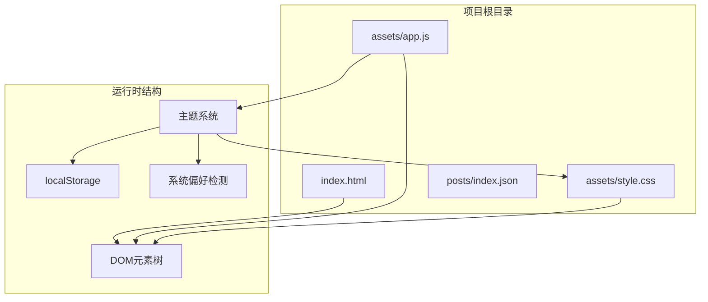
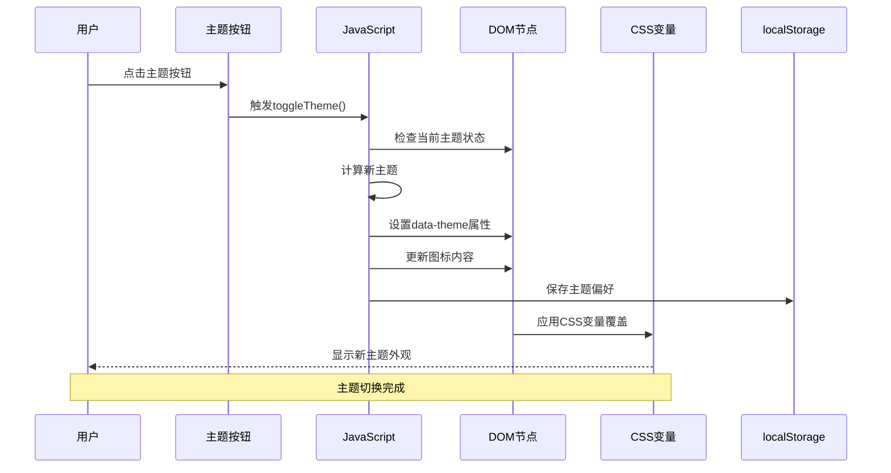
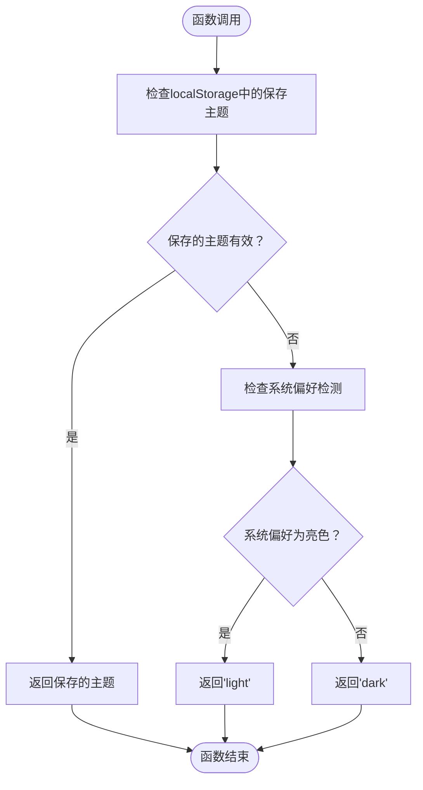
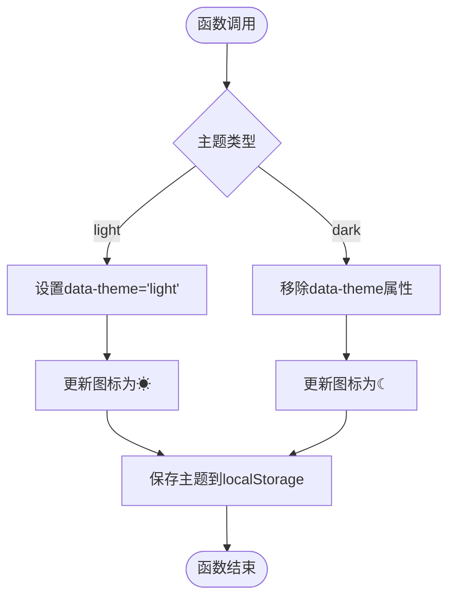
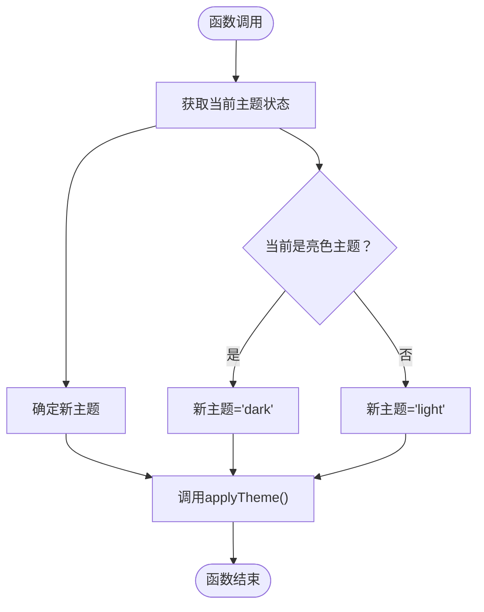
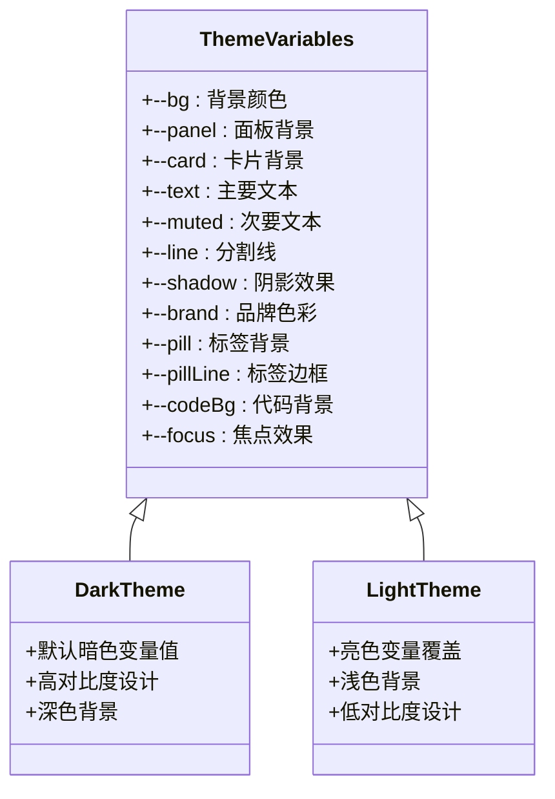
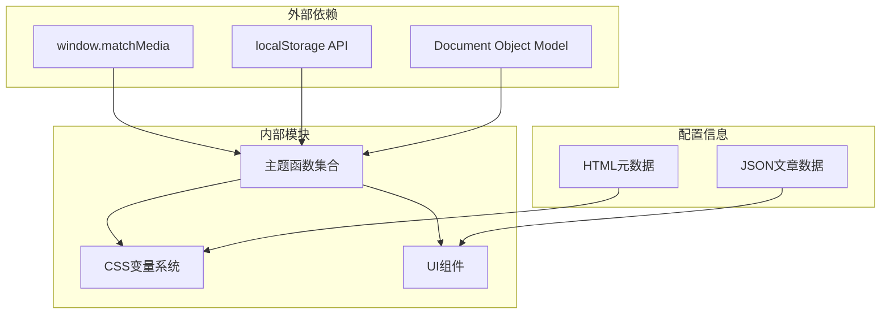

# 主题系统

<cite>
**本文档引用的文件**
- [assets/app.js](file://assets/app.js)
- [assets/style.css](file://assets/style.css)
- [index.html](file://index.html)
- [posts/index.json](file://posts/index.json)
</cite>

## 目录
1. [简介](#简介)
2. [项目结构](#项目结构)
3. [核心组件](#核心组件)
4. [架构概览](#架构概览)
5. [详细组件分析](#详细组件分析)
6. [依赖关系分析](#依赖关系分析)
7. [性能考量](#性能考量)
8. [故障排除指南](#故障排除指南)
9. [结论](#结论)
10. [附录](#附录)

## 简介

本主题系统是一个基于CSS变量的动态主题切换解决方案，支持亮色/暗色主题之间的无缝切换。该系统采用现代Web标准实现，包括CSS自定义属性、媒体查询、localStorage持久化存储以及系统偏好检测机制。

系统的核心特性包括：
- 基于CSS变量的主题变量系统
- localStorage持久化存储用户偏好
- 系统偏好检测（prefers-color-scheme）
- 实时主题切换动画效果
- 完全无编译的静态实现

## 项目结构

该项目采用极简的单页面应用架构，所有功能集中在单一HTML页面中，通过JavaScript动态控制内容渲染和主题切换。



**图表来源**
- [index.html](file://index.html#L1-L104)
- [assets/app.js](file://assets/app.js#L1-L313)
- [assets/style.css](file://assets/style.css#L1-L629)

**章节来源**
- [index.html](file://index.html#L1-L104)
- [assets/app.js](file://assets/app.js#L1-L313)
- [assets/style.css](file://assets/style.css#L1-L629)

## 核心组件

### 主题变量系统

系统使用CSS自定义属性（CSS变量）作为主题的核心数据结构，通过`:root`选择器定义默认变量值，并在`:root[data-theme="light"]`伪类中定义亮色主题的变量覆盖。

### 主题切换引擎

三个核心函数构成完整的主题切换机制：
- `getPreferredTheme()`: 检测用户偏好的主题
- `applyTheme()`: 应用指定主题到DOM
- `toggleTheme()`: 在亮/暗主题间切换

### 用户界面集成

主题切换按钮与CSS变量系统紧密集成，通过修改`data-theme`属性和图标内容实现视觉反馈。

**章节来源**
- [assets/style.css](file://assets/style.css#L1-L30)
- [assets/app.js](file://assets/app.js#L232-L253)
- [index.html](file://index.html#L43-L45)

## 架构概览

主题系统的整体架构采用分层设计，从底层的CSS变量到上层的JavaScript控制逻辑形成清晰的职责分离。



**图表来源**
- [assets/app.js](file://assets/app.js#L250-L253)
- [assets/style.css](file://assets/style.css#L17-L30)
- [index.html](file://index.html#L43-L45)

## 详细组件分析

### getPreferredTheme() 函数分析

该函数实现了多层优先级的主题偏好检测机制：



**图表来源**
- [assets/app.js](file://assets/app.js#L233-L237)

实现特点：
- **优先级策略**：本地存储 > 系统偏好 > 默认值
- **类型验证**：确保返回值只能是"light"或"dark"
- **降级处理**：当系统不支持媒体查询时回退到暗色主题

**章节来源**
- [assets/app.js](file://assets/app.js#L233-L237)

### applyTheme() 函数分析

该函数负责将主题应用到DOM结构中，实现真正的视觉变化：



**图表来源**
- [assets/app.js](file://assets/app.js#L239-L248)

关键实现细节：
- **DOM属性管理**：通过`setAttribute`和`removeAttribute`控制主题状态
- **图标同步**：实时更新主题切换按钮的显示内容
- **持久化存储**：确保用户偏好在页面刷新后仍然有效

**章节来源**
- [assets/app.js](file://assets/app.js#L239-L248)

### toggleTheme() 函数分析

该函数提供了用户友好的主题切换入口，简化了主题切换操作：



**图表来源**
- [assets/app.js](file://assets/app.js#L250-L253)

设计优势：
- **状态感知**：自动检测当前主题状态
- **原子操作**：封装完整的切换逻辑
- **简洁接口**：为事件处理器提供简单调用方式

**章节来源**
- [assets/app.js](file://assets/app.js#L250-L253)

### CSS变量主题系统

系统使用CSS自定义属性实现主题变量的集中管理：



**图表来源**
- [assets/style.css](file://assets/style.css#L1-L30)

变量系统特点：
- **统一管理**：所有颜色和样式变量集中定义
- **层次结构**：基础变量 + 主题覆盖 + 组件使用
- **响应式设计**：支持不同设备和屏幕尺寸

**章节来源**
- [assets/style.css](file://assets/style.css#L1-L30)

### 主题切换UI集成

主题按钮与CSS变量系统的无缝集成：

```mermaid
graph LR
subgraph "用户界面层"
Button[主题切换按钮]
Icon[主题图标]
end
subgraph "控制逻辑层"
Toggle[toggleTheme函数]
Apply[applyTheme函数]
Get[getPreferredTheme函数]
end
subgraph "样式层"
Root[:root选择器]
Light[:root[data-theme='light']]
Variables[CSS变量]
end
subgraph "存储层"
LocalStorage[localStorage]
end
Button --> Toggle
Toggle --> Apply
Apply --> Root
Apply --> Variables
Get --> LocalStorage
Get --> Root
```

**图表来源**
- [index.html](file://index.html#L43-L45)
- [assets/app.js](file://assets/app.js#L232-L253)
- [assets/style.css](file://assets/style.css#L17-L30)

**章节来源**
- [index.html](file://index.html#L43-L45)
- [assets/app.js](file://assets/app.js#L232-L253)
- [assets/style.css](file://assets/style.css#L17-L30)

## 依赖关系分析

主题系统的依赖关系相对简单，主要围绕CSS变量、JavaScript控制逻辑和用户存储机制：



**图表来源**
- [assets/app.js](file://assets/app.js#L233-L253)
- [assets/style.css](file://assets/style.css#L1-L30)
- [index.html](file://index.html#L6-L8)

**章节来源**
- [assets/app.js](file://assets/app.js#L233-L253)
- [assets/style.css](file://assets/style.css#L1-L30)
- [index.html](file://index.html#L6-L8)

## 性能考量

### 加载性能优化

- **无编译构建**：完全静态实现，减少构建时间
- **按需加载**：CSS和JavaScript按需加载，避免不必要的资源消耗
- **缓存友好**：使用HTTP缓存头和版本控制

### 运行时性能优化

- **最小DOM操作**：仅在必要时修改DOM属性和内容
- **事件委托**：合理使用事件监听器，避免内存泄漏
- **CSS变量优势**：通过CSS变量实现主题切换，避免重排重绘

### 内存管理

- **垃圾回收**：及时清理事件监听器和DOM引用
- **状态管理**：使用局部变量避免全局污染
- **存储优化**：只存储必要的主题偏好信息

## 故障排除指南

### 常见问题诊断

**问题1：主题切换无效**
- 检查`data-theme`属性是否正确设置
- 验证CSS变量覆盖是否生效
- 确认localStorage权限是否正常

**问题2：系统偏好检测失败**
- 检查浏览器是否支持`matchMedia` API
- 验证系统主题设置是否正确
- 确认媒体查询语法是否正确

**问题3：图标显示异常**
- 检查`themeIcon`元素是否存在
- 验证字符编码是否正确
- 确认CSS样式是否影响图标显示

### 调试技巧

1. **开发者工具**：使用浏览器开发者工具检查DOM属性和CSS变量
2. **控制台日志**：添加适当的console.log语句进行调试
3. **网络面板**：检查资源加载状态和缓存情况

**章节来源**
- [assets/app.js](file://assets/app.js#L233-L253)
- [assets/style.css](file://assets/style.css#L17-L30)

## 结论

本主题系统成功实现了现代化的动态主题切换功能，具有以下优势：

- **技术先进性**：采用CSS变量、媒体查询等现代Web标准
- **用户体验优秀**：平滑的主题切换动画和即时反馈
- **实现简洁**：代码量少但功能完整，易于维护
- **兼容性强**：支持主流浏览器和移动设备
- **可扩展性好**：基于CSS变量的架构便于主题定制

系统的核心价值在于通过最少的代码实现了最丰富的主题体验，为其他类似项目提供了优秀的参考实现。

## 附录

### 主题定制指南

#### 修改CSS变量值

要自定义主题颜色，需要修改`assets/style.css`中的变量定义：

1. **基础变量修改**：在`:root`选择器中修改颜色值
2. **主题覆盖**：在`:root[data-theme="light"]`中定义亮色主题覆盖
3. **组件适配**：确保所有组件都能正确使用新的变量值

#### 添加新主题变量

1. 在`:root`中添加新的CSS变量
2. 在`:root[data-theme="light"]`中定义对应的亮色版本
3. 在相关CSS规则中使用新变量

#### 自定义图标

主题图标由JavaScript动态设置，可以通过修改`themeIcon.textContent`来改变显示内容。

### 兼容性考虑

- **浏览器支持**：确保目标浏览器支持CSS变量和`matchMedia` API
- **降级方案**：为不支持的浏览器提供基本的主题功能
- **移动端适配**：测试在不同移动设备上的表现
- **无障碍访问**：确保主题切换对屏幕阅读器友好

### 最佳实践建议

1. **变量命名规范**：使用语义化的变量名，如`--brand`、`--text-muted`
2. **颜色对比度**：确保文本与背景有足够的对比度
3. **性能优化**：避免频繁的DOM操作和重排重绘
4. **测试覆盖**：在不同设备和浏览器上充分测试
5. **文档维护**：保持代码注释和文档的同步更新