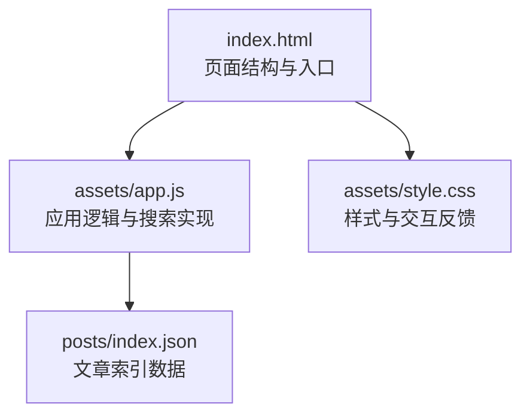
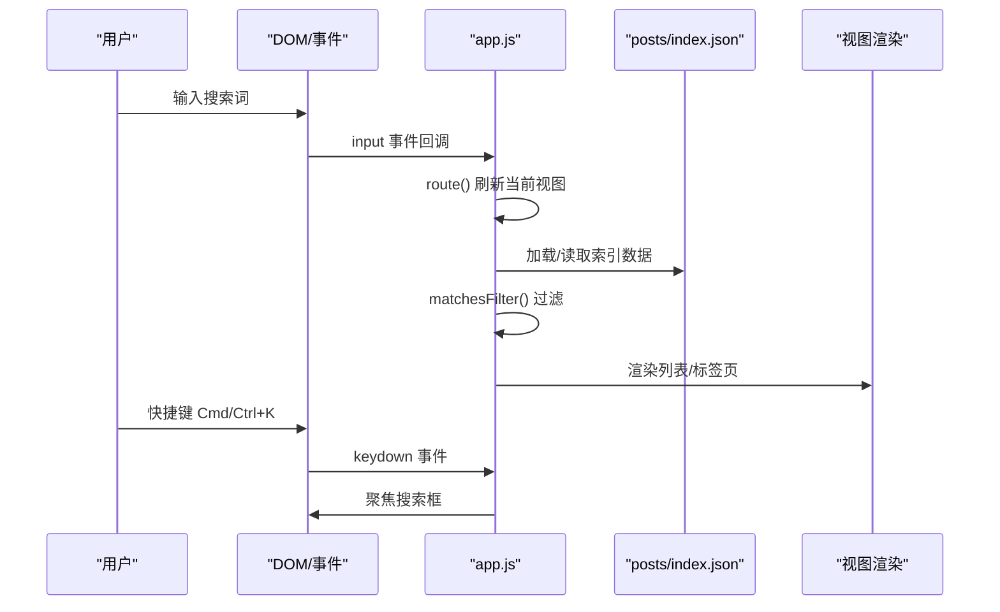
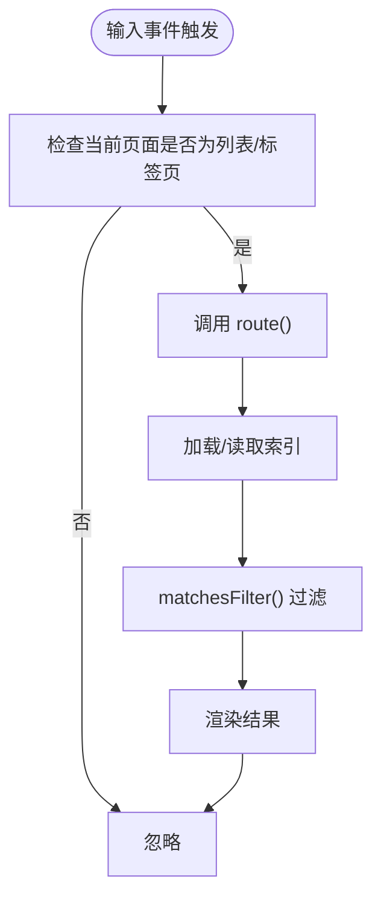
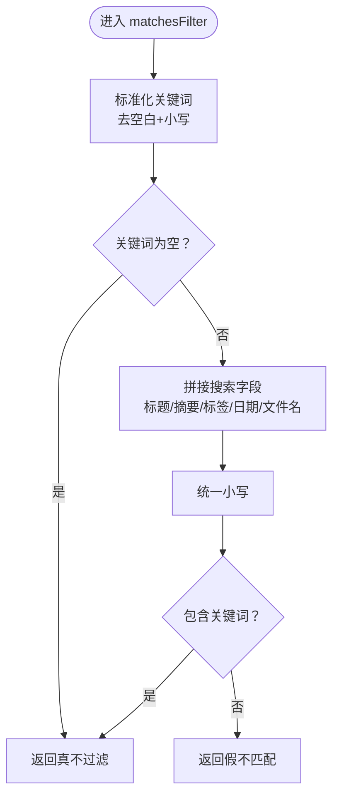
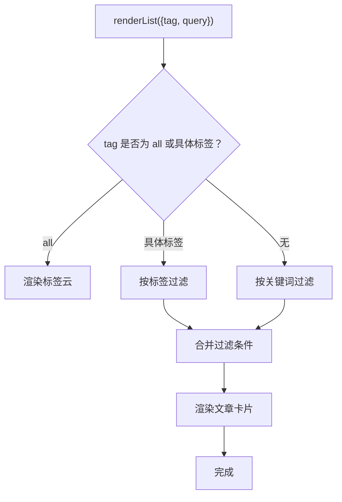
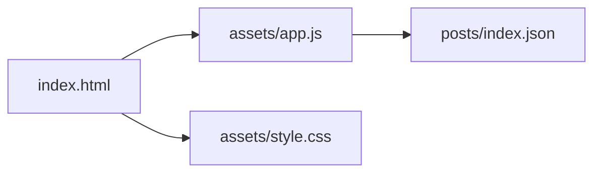

# 搜索功能

<cite>
**本文引用的文件**
- [app.js](file://assets/app.js)
- [index.html](file://index.html)
- [style.css](file://assets/style.css)
- [index.json](file://posts/index.json)
</cite>

## 目录
1. [简介](#简介)
2. [项目结构](#项目结构)
3. [核心组件](#核心组件)
4. [架构总览](#架构总览)
5. [详细组件分析](#详细组件分析)
6. [依赖关系分析](#依赖关系分析)
7. [性能考虑](#性能考虑)
8. [故障排查指南](#故障排查指南)
9. [结论](#结论)

## 简介
本文件系统性阐述该静态博客的实时搜索过滤能力，包括：
- 实时搜索过滤的实现原理与调用流程
- matchesFilter() 函数的搜索算法与关键词匹配逻辑
- 搜索范围控制（标题、摘要、标签、日期、文件名）
- 搜索输入事件处理与防抖机制说明
- 搜索快捷键支持（Cmd/Ctrl+K）的实现
- 搜索结果的高亮显示与过滤逻辑
- 性能优化建议与用户体验改进建议

## 项目结构
该博客采用“无编译”架构：前端通过浏览器直接读取 posts/index.json 生成文章索引，并在页面内进行实时过滤。搜索功能位于 assets/app.js，HTML 结构与样式分别在 index.html 与 assets/style.css 中定义。

图表来源
- [index.html](file://index.html#L1-L104)
- [app.js](file://assets/app.js#L1-L313)
- [style.css](file://assets/style.css#L1-L629)
- [index.json](file://posts/index.json#L1-L16)

章节来源
- [index.html](file://index.html#L1-L104)
- [app.js](file://assets/app.js#L1-L313)
- [style.css](file://assets/style.css#L1-L629)
- [index.json](file://posts/index.json#L1-L16)

## 核心组件
- 搜索输入控件与快捷键绑定：在页面中提供搜索框与“⌘K”提示，按下 Cmd/Ctrl+K 将焦点移动到搜索框。
- 实时过滤引擎：在用户输入时触发路由刷新，对 postsIndex 应用 matchesFilter() 进行筛选。
- 结果渲染：根据筛选结果渲染文章卡片或标签云，未命中时显示“没有匹配结果”。

章节来源
- [index.html](file://index.html#L38-L41)
- [app.js](file://assets/app.js#L288-L313)
- [app.js](file://assets/app.js#L85-L138)

## 架构总览
搜索功能的端到端流程如下：

图表来源
- [app.js](file://assets/app.js#L288-L313)
- [app.js](file://assets/app.js#L140-L147)
- [app.js](file://assets/app.js#L85-L138)
- [index.html](file://index.html#L38-L41)

## 详细组件分析

### 搜索输入与事件处理
- 搜索输入框位于页面头部，输入事件仅在列表页与标签页生效，触发 route() 重新渲染。
- 快捷键支持：检测 Cmd/Ctrl+K，聚焦搜索框，避免重复绑定导致的冲突。

图表来源
- [app.js](file://assets/app.js#L306-L313)
- [app.js](file://assets/app.js#L288-L295)

章节来源
- [index.html](file://index.html#L38-L41)
- [app.js](file://assets/app.js#L288-L313)

### matchesFilter() 搜索算法与关键词匹配逻辑
- 关键词预处理：去除首尾空白并转为小写。
- 搜索范围：标题、摘要、标签集合、日期、文件名。
- 匹配策略：将上述字段拼接为单一字符串，统一转小写后进行包含判断（子串匹配）。
- 空查询：若关键词为空则返回真，表示不过滤。

图表来源
- [app.js](file://assets/app.js#L75-L83)

章节来源
- [app.js](file://assets/app.js#L75-L83)

### 搜索范围控制
- 标题：p.title
- 摘要：p.summary
- 标签：将标签数组连接为空格分隔的字符串
- 日期：p.date
- 文件名：p.file

这些字段被拼接为单一字符串参与匹配，因此关键词可同时命中多个字段。

章节来源
- [app.js](file://assets/app.js#L78-L82)

### 搜索结果渲染与过滤逻辑
- 列表页：对 postsIndex 先按 matchesFilter() 过滤，再按标签过滤（如存在），最后渲染文章卡片。
- 标签页：渲染标签云，支持点击按标签过滤。
- 未命中：显示“没有匹配结果”。

图表来源
- [app.js](file://assets/app.js#L85-L138)

章节来源
- [app.js](file://assets/app.js#L85-L138)

### 高亮显示与视觉反馈
- 当前实现：未对关键词进行高亮标记，仅通过过滤结果展示命中项。
- 建议：可在渲染阶段对命中字段进行高亮包裹（例如使用正则替换并在 HTML 中插入标记），以提升可读性与定位效率。

章节来源
- [app.js](file://assets/app.js#L116-L131)
- [style.css](file://assets/style.css#L153-L191)

### 搜索快捷键支持（Cmd/Ctrl+K）
- 通过 keydown 事件监听组合键，区分 macOS（Meta 键）与 Windows/Linux（Ctrl 键），聚焦搜索框并阻止默认行为。

章节来源
- [app.js](file://assets/app.js#L288-L295)
- [index.html](file://index.html#L38-L41)

### 防抖机制说明
- 当前实现：未引入防抖（debounce）。每次 input 事件均会触发 route() 与过滤，可能导致频繁重渲染。
- 建议：在高频输入场景下引入防抖，例如延迟 100–200ms 再执行过滤，以减少不必要的计算与 DOM 更新。

章节来源
- [app.js](file://assets/app.js#L306-L313)

## 依赖关系分析
- app.js 依赖 posts/index.json 提供的数据结构（file、title、date、tags、summary）。
- 页面结构由 index.html 提供，搜索框与快捷键提示位于头部区域。
- 样式由 style.css 提供，包含搜索框样式与键盘提示样式。

图表来源
- [index.html](file://index.html#L1-L104)
- [app.js](file://assets/app.js#L1-L313)
- [style.css](file://assets/style.css#L1-L629)
- [index.json](file://posts/index.json#L1-L16)

章节来源
- [index.html](file://index.html#L1-L104)
- [app.js](file://assets/app.js#L1-L313)
- [style.css](file://assets/style.css#L1-L629)
- [index.json](file://posts/index.json#L1-L16)

## 性能考虑
- 数据规模：当前索引较小，过滤开销低；随着文章数量增长，应考虑：
  - 引入防抖（debounce）降低 input 事件频率
  - 使用更高效的匹配策略（如分词 + 倒排索引，适用于更大规模）
  - 对渲染进行节流（throttle）以避免频繁 DOM 更新
- 计算复杂度：当前算法为 O(N) 遍历 + 字符串拼接与包含判断，N 为文章数。关键词越长，包含判断成本越高。
- I/O 与缓存：索引加载使用 no-store，确保最新内容；在移动端或弱网环境下可考虑本地缓存策略（如 IndexedDB）以减少重复请求。

[本节为通用性能建议，不直接分析特定文件]

## 故障排查指南
- 搜索无结果
  - 检查 posts/index.json 是否正确加载与解析
  - 确认关键词大小写与拼写（当前为大小写不敏感）
  - 确认输入事件是否在列表/标签页触发
- 快捷键无效
  - 确认浏览器支持 keydown 事件
  - 确认是否在 macOS 上使用 Meta 键，Windows/Linux 使用 Ctrl 键
- 样式异常
  - 检查搜索框与键盘提示的 CSS 类是否存在
  - 确认响应式断点下的布局变化

章节来源
- [app.js](file://assets/app.js#L140-L147)
- [app.js](file://assets/app.js#L288-L295)
- [style.css](file://assets/style.css#L153-L191)

## 结论
该搜索功能以简洁的实现提供了实时过滤能力：关键词在标题、摘要、标签、日期与文件名范围内进行包含匹配，输入事件在列表/标签页触发，支持 Cmd/Ctrl+K 快捷键。当前未实现防抖与高亮显示，建议在性能与体验上进一步优化，以适配更大规模的内容与更复杂的检索需求。