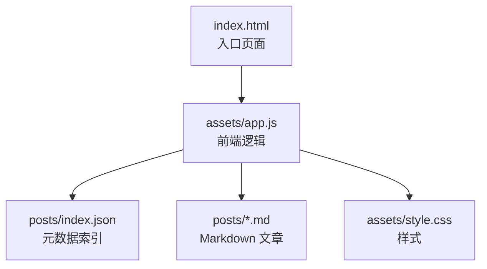
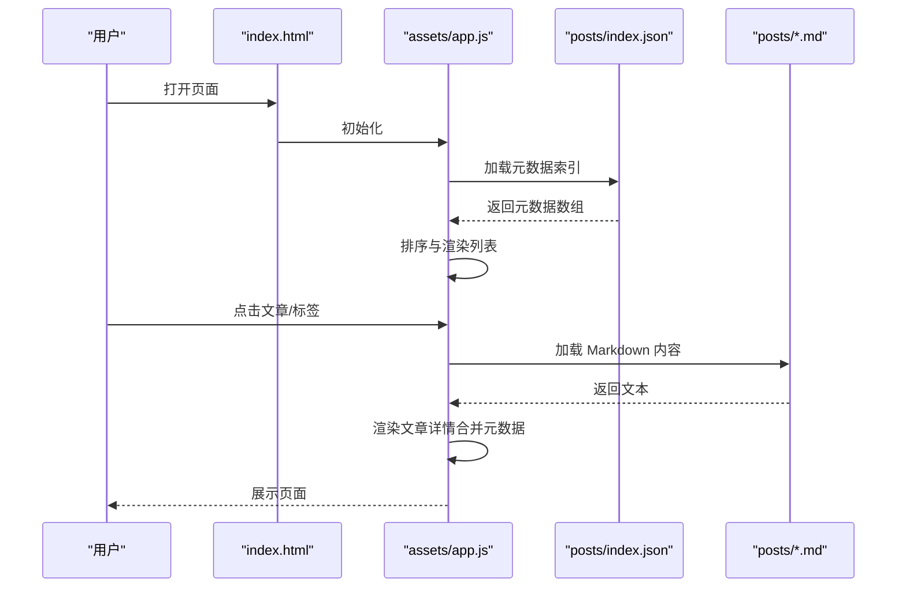
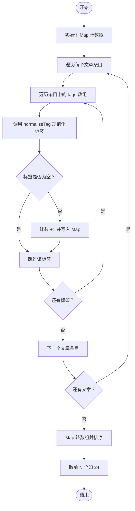
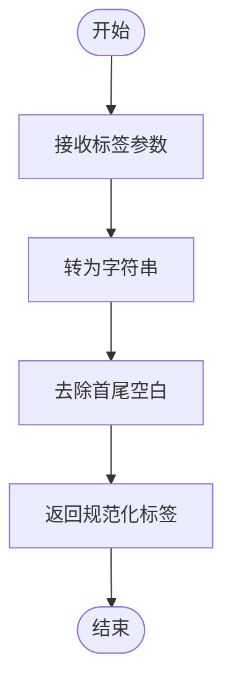
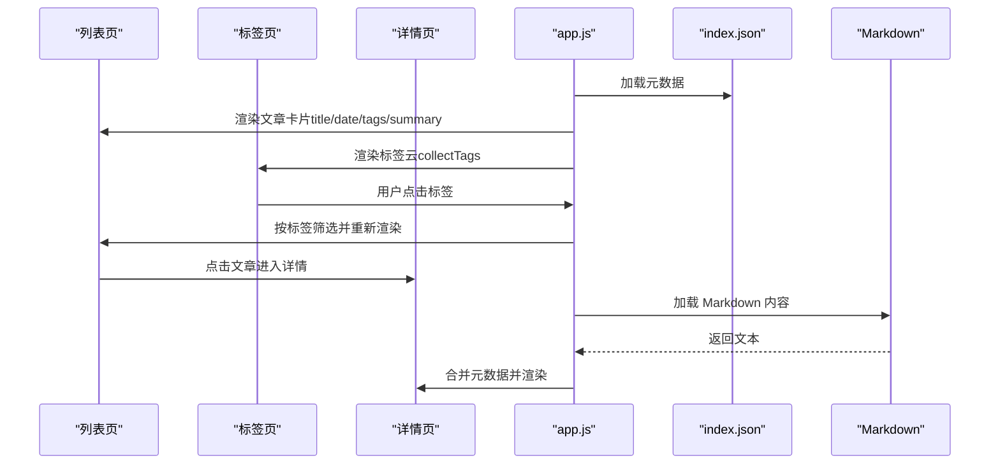
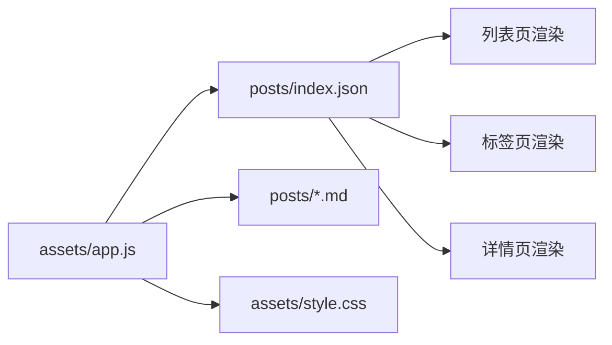

# 元数据管理

<cite>
**本文引用的文件**
- [posts/index.json](file://posts/index.json)
- [posts/2026-02-09-hello.md](file://posts/2026-02-09-hello.md)
- [posts/2026-02-09-博客搭建过程.md](file://posts/2026-02-09-博客搭建过程.md)
- [assets/app.js](file://assets/app.js)
- [assets/style.css](file://assets/style.css)
</cite>

## 目录
1. [简介](#简介)
2. [项目结构](#项目结构)
3. [核心组件](#核心组件)
4. [架构总览](#架构总览)
5. [详细组件分析](#详细组件分析)
6. [依赖关系分析](#依赖关系分析)
7. [性能考量](#性能考量)
8. [故障排查指南](#故障排查指南)
9. [结论](#结论)
10. [附录](#附录)

## 简介
本文件围绕“文章元数据”的数据结构与管理方式进行系统化说明，重点覆盖以下方面：
- posts/index.json 中每个文章条目的字段定义与用途
- 元数据的收集与统计（collectTags 函数）
- 标签规范化（normalizeTag 函数）
- 元数据在渲染中的应用（列表页、标签页、文章页）
- 元数据验证规则、缺失值处理与数据一致性保障
- 元数据格式规范与最佳实践

## 项目结构
该项目采用“静态文件 + 浏览器端渲染”的极简架构：
- posts 目录存放 Markdown 文章与元数据索引
- assets 目录存放前端脚本与样式
- index.html 作为入口页面，加载 app.js 与 style.css

图表来源
- [assets/app.js](file://assets/app.js#L1-L313)
- [posts/index.json](file://posts/index.json#L1-L16)

章节来源
- [assets/app.js](file://assets/app.js#L1-L313)
- [posts/index.json](file://posts/index.json#L1-L16)

## 核心组件
- 元数据索引文件：posts/index.json，承载所有文章的元数据
- 前端渲染引擎：assets/app.js，负责加载、解析、排序、筛选与渲染
- 样式层：assets/style.css，为元数据呈现提供视觉表现

章节来源
- [posts/index.json](file://posts/index.json#L1-L16)
- [assets/app.js](file://assets/app.js#L1-L313)
- [assets/style.css](file://assets/style.css#L1-L629)

## 架构总览
前端通过异步请求加载 posts/index.json，随后进行排序、筛选与渲染。文章详情页通过 posts/*.md 文件与元数据关联，实现标题、日期、标签、摘要等信息的统一展示。

图表来源
- [assets/app.js](file://assets/app.js#L140-L182)
- [posts/index.json](file://posts/index.json#L1-L16)

## 详细组件分析

### 元数据字段定义与用途
- file（字符串）：文章文件名，用于定位 Markdown 文件与构建详情页链接
- title（字符串）：文章标题，用于列表卡片与详情页头部显示
- date（字符串）：发布日期，用于排序与展示
- tags（字符串数组）：标签集合，用于标签云、筛选与分类
- summary（字符串）：文章摘要，用于列表卡片摘要展示

字段来源与使用位置
- 列表页渲染：标题、日期、标签、摘要
- 标签页渲染：标签云统计与按标签筛选
- 文章详情页：标题、日期、标签、正文内容

章节来源
- [posts/index.json](file://posts/index.json#L1-L16)
- [assets/app.js](file://assets/app.js#L115-L138)
- [assets/app.js](file://assets/app.js#L149-L182)

### 元数据收集与统计（collectTags）
collectTags 负责从元数据数组中提取并统计标签出现频次，返回按频率降序、名称升序排列的二维数组。

图表来源
- [assets/app.js](file://assets/app.js#L49-L59)

章节来源
- [assets/app.js](file://assets/app.js#L49-L59)

### 标签规范化（normalizeTag）
normalizeTag 对输入标签进行字符串转换与空白裁剪，确保标签在统计与渲染时的一致性。

图表来源
- [assets/app.js](file://assets/app.js#L45-L47)

章节来源
- [assets/app.js](file://assets/app.js#L45-L47)

### 元数据在渲染中的应用
- 列表页渲染：根据元数据生成文章卡片，包含标题、日期、标签与摘要
- 标签页渲染：基于 collectTags 生成标签云，支持点击筛选
- 文章详情页：根据 file 字段定位 Markdown 文件，合并元数据（标题、日期、标签）与解析后的 HTML

图表来源
- [assets/app.js](file://assets/app.js#L85-L138)
- [assets/app.js](file://assets/app.js#L149-L182)

章节来源
- [assets/app.js](file://assets/app.js#L85-L138)
- [assets/app.js](file://assets/app.js#L149-L182)

### 元数据验证规则与缺失值处理
- file 字段
  - 必填且唯一：用于定位 Markdown 文件与构建详情页链接
  - 缺失处理：详情页回退到使用文件名为标题
- title 字段
  - 建议必填：用于列表与详情页标题展示
  - 缺失处理：回退到文件名
- date 字段
  - 建议存在：用于排序与展示
  - 缺失处理：排序时回退到文件名
- tags 字段
  - 类型：数组
  - 缺失处理：视为空数组，不影响其他字段
  - 规范化：collectTags 会调用 normalizeTag，并跳过空标签
- summary 字段
  - 建议存在：用于列表摘要展示
  - 缺失处理：不渲染摘要区域

章节来源
- [assets/app.js](file://assets/app.js#L140-L147)
- [assets/app.js](file://assets/app.js#L157-L160)
- [assets/app.js](file://assets/app.js#L49-L59)

### 数据一致性保障
- 排序策略：先按 date 降序，再按 file 降序，确保稳定顺序
- 标签一致性：collectTags 使用 Map 统计，避免重复计算；normalizeTag 统一空白与大小写
- 渲染一致性：esc 转义防止 XSS；标签与标题在多处复用同一元数据源

章节来源
- [assets/app.js](file://assets/app.js#L145-L147)
- [assets/app.js](file://assets/app.js#L24-L28)
- [assets/app.js](file://assets/app.js#L45-L47)

### 元数据格式规范与最佳实践
- 文件命名
  - 建议采用“YYYY-MM-DD-标题.md”格式，便于排序与阅读
- 元数据字段
  - file：与 Markdown 文件名严格一致
  - title：简洁明确，建议不超过 60 字符
  - date：ISO 8601 风格字符串（如 2026-02-09），便于排序
  - tags：使用英文或中文均可，建议统一大小写与空白
  - summary：简明扼要，建议不超过 150 字符
- 索引维护
  - 新增文章后同步更新 posts/index.json
  - 删除文章后同步删除对应条目
- 渲染与交互
  - 列表页限制标签展示数量（如前 6 个）
  - 标签云限制展示数量（如前 24 个）

章节来源
- [posts/index.json](file://posts/index.json#L1-L16)
- [assets/app.js](file://assets/app.js#L115-L138)
- [assets/app.js](file://assets/app.js#L61-L73)

## 依赖关系分析
- assets/app.js 依赖 posts/index.json 提供元数据
- 列表页与标签页依赖 collectTags 与 normalizeTag
- 详情页依赖 file 字段定位 Markdown 文件并合并元数据
- 样式层 assets/style.css 为元数据呈现提供视觉样式

图表来源
- [assets/app.js](file://assets/app.js#L1-L313)
- [posts/index.json](file://posts/index.json#L1-L16)

章节来源
- [assets/app.js](file://assets/app.js#L1-L313)
- [posts/index.json](file://posts/index.json#L1-L16)

## 性能考量
- 异步加载：通过 fetch 异步获取 posts/index.json，避免阻塞页面渲染
- 缓存策略：请求头设置禁用缓存，确保每次加载最新元数据
- 排序复杂度：O(n log n)，其中 n 为文章数量
- 标签统计：O(n·m)，其中 m 为平均标签数
- DOM 操作：批量拼接 HTML，减少重排重绘

章节来源
- [assets/app.js](file://assets/app.js#L140-L147)
- [assets/app.js](file://assets/app.js#L49-L59)

## 故障排查指南
- 加载失败
  - 现象：初始化失败提示
  - 排查：检查 posts/index.json 是否可访问、JSON 格式是否正确
- 标签为空或异常
  - 现象：标签云为空或显示空白
  - 排查：确认 tags 字段类型为数组；检查 normalizeTag 是否被调用；确认 collectTags 是否过滤空标签
- 排序异常
  - 现象：文章顺序不符合预期
  - 排查：确认 date 字段格式；检查排序逻辑（date 优先，file 回退）
- 详情页标题显示异常
  - 现象：标题显示为文件名
  - 排查：确认 posts/index.json 中 title 字段是否存在且与 file 匹配

章节来源
- [assets/app.js](file://assets/app.js#L140-L147)
- [assets/app.js](file://assets/app.js#L157-L160)
- [assets/app.js](file://assets/app.js#L49-L59)

## 结论
本项目通过极简的元数据模型与前端渲染机制，实现了高效、可维护的静态博客系统。posts/index.json 作为单一事实来源，配合 collectTags 与 normalizeTag，确保了标签统计与渲染的一致性与稳定性。遵循本文提供的格式规范与最佳实践，可进一步提升系统的可靠性与可扩展性。

## 附录
- 示例文章与索引
  - posts/index.json：包含两个文章条目，字段齐全
  - posts/2026-02-09-hello.md：示例 Markdown 文档
  - posts/2026-02-09-博客搭建过程.md：包含元数据索引格式说明的示例文档

章节来源
- [posts/index.json](file://posts/index.json#L1-L16)
- [posts/2026-02-09-hello.md](file://posts/2026-02-09-hello.md#L1-L8)
- [posts/2026-02-09-博客搭建过程.md](file://posts/2026-02-09-博客搭建过程.md#L115-L128)