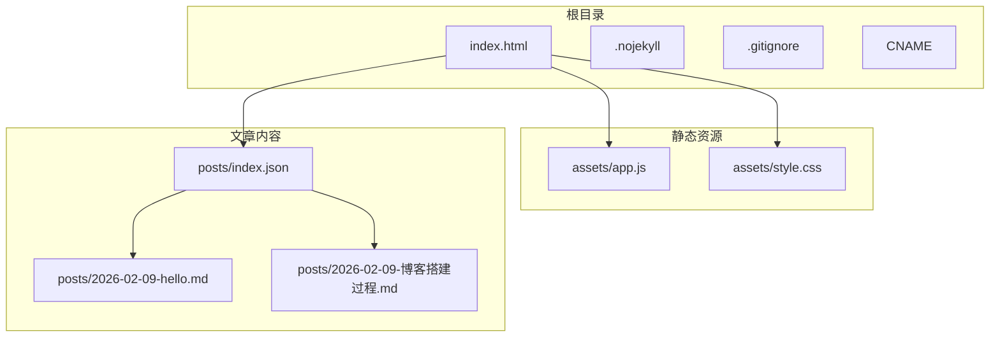
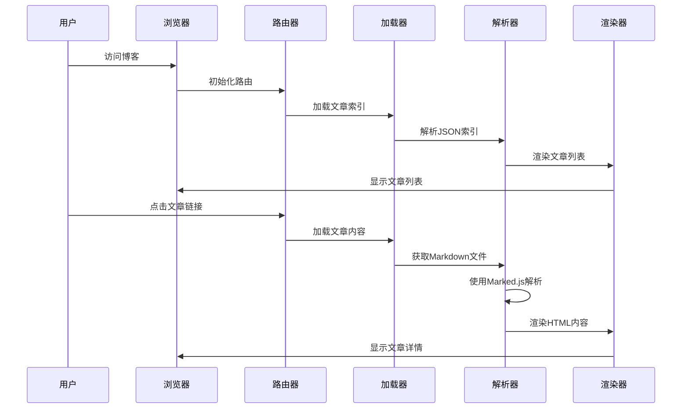
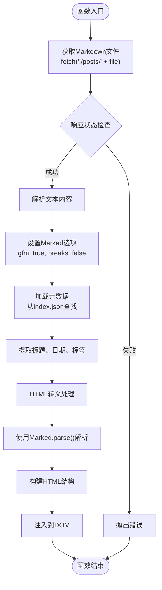
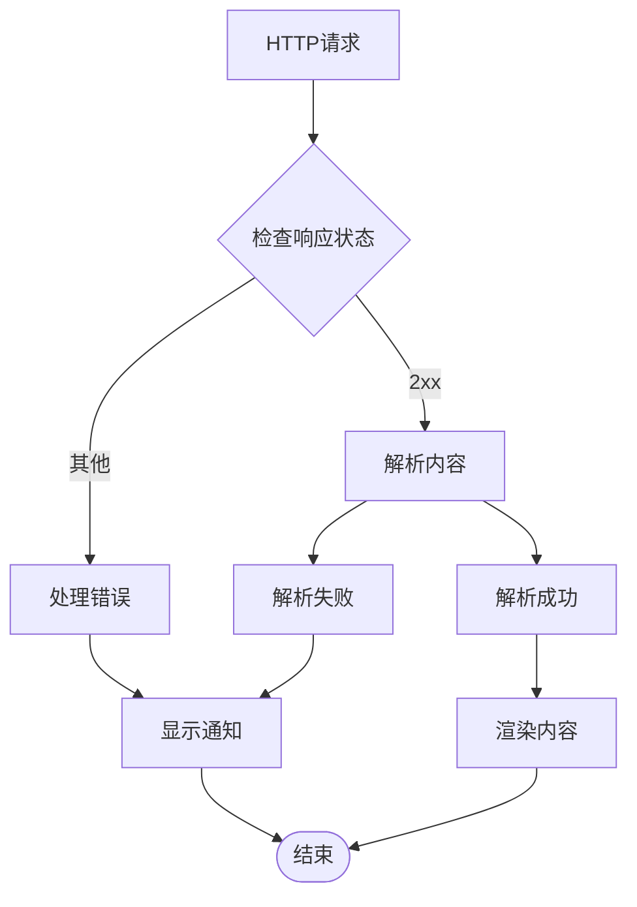
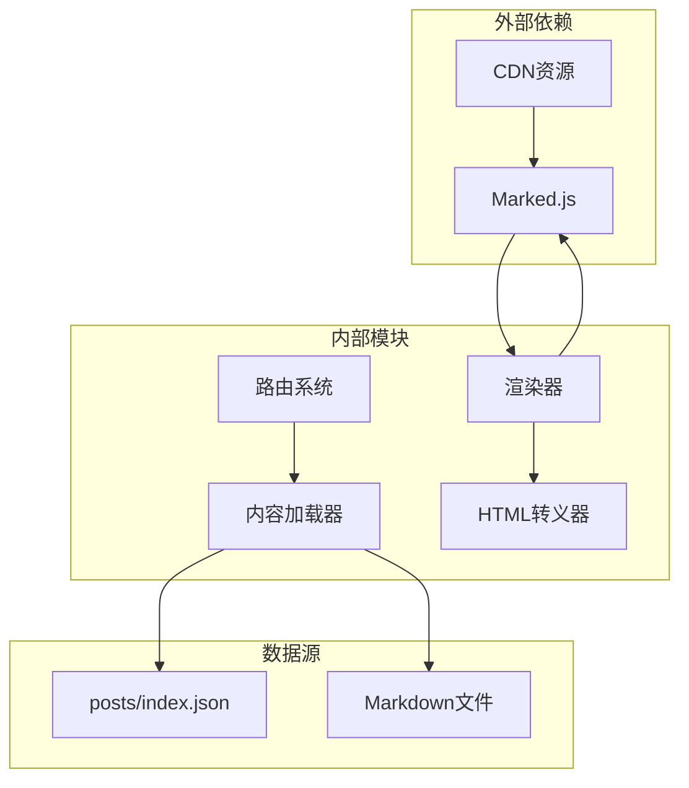

# 内容渲染系统

<cite>
**本文档引用的文件**
- [index.html](file://index.html)
- [app.js](file://assets/app.js)
- [style.css](file://assets/style.css)
- [index.json](file://posts/index.json)
- [hello.md](file://posts/2026-02-09-hello.md)
- [博客搭建过程.md](file://posts/2026-02-09-博客搭建过程.md)
</cite>

## 目录
1. [简介](#简介)
2. [项目结构](#项目结构)
3. [核心组件](#核心组件)
4. [架构概览](#架构概览)
5. [详细组件分析](#详细组件分析)
6. [依赖关系分析](#依赖关系分析)
7. [性能考虑](#性能考虑)
8. [故障排除指南](#故障排除指南)
9. [结论](#结论)
10. [附录](#附录)

## 简介

这是一个基于静态文件和浏览器端渲染的无编译Markdown博客系统。该系统采用极简架构，通过浏览器端JavaScript动态加载和渲染Markdown内容，实现了"本地AI改文件 → git push发布"的工作流程。系统的核心功能包括文章列表展示、单篇文章渲染、标签云管理和主题切换等。

## 项目结构

该项目采用扁平化的文件组织结构，主要包含以下核心文件：



**图表来源**
- [index.html](file://index.html#L1-L104)
- [app.js](file://assets/app.js#L1-L313)
- [index.json](file://posts/index.json#L1-L16)

**章节来源**
- [index.html](file://index.html#L1-L104)
- [app.js](file://assets/app.js#L1-L313)
- [index.json](file://posts/index.json#L1-L16)

## 核心组件

### Markdown渲染引擎

系统使用Marked.js作为Markdown解析器，在HTML中通过CDN引入：

```javascript
// 引入Marked.js渲染引擎
<script src="https://cdn.jsdelivr.net/npm/marked/marked.min.js"></script>
```

Marked.js提供了强大的Markdown解析能力，支持多种扩展语法和自定义选项配置。

### 内容管理系统

系统采用"Markdown文件 + JSON索引"的混合内容管理模式：

- **Markdown文件**：存储实际的文章内容
- **JSON索引**：存储文章元数据（标题、日期、标签、摘要等）

### 前端渲染引擎

核心渲染逻辑集中在`assets/app.js`文件中，包含以下关键功能模块：

- **路由系统**：基于hash的单页应用路由
- **文章加载**：异步获取并解析Markdown文件
- **搜索功能**：实时过滤文章标题、标签、摘要
- **标签系统**：标签云展示与筛选功能
- **主题切换**：支持亮/暗色模式

**章节来源**
- [app.js](file://assets/app.js#L1-L313)
- [index.json](file://posts/index.json#L1-L16)

## 架构概览

系统采用客户端渲染架构，所有内容处理都在浏览器端完成：



**图表来源**
- [app.js](file://assets/app.js#L140-L182)
- [index.html](file://index.html#L16-L17)

## 详细组件分析

### loadPost()函数深度解析

`loadPost()`函数是系统的核心渲染函数，负责处理单篇文章的加载和渲染流程：

#### 函数调用流程



**图表来源**
- [app.js](file://assets/app.js#L149-L182)

#### Markdown解析配置

系统使用Marked.js进行Markdown到HTML的转换，配置参数如下：

- **gfm: true**：启用GitHub Flavored Markdown语法支持
- **breaks: false**：禁用硬换行转换为`<br>`标签

这些配置确保了标准Markdown语法的正确解析，同时避免了意外的换行符转换。

#### 元数据提取和注入机制

系统从`posts/index.json`中提取文章元数据，并将其注入到渲染后的HTML中：

```javascript
// 元数据提取逻辑
const meta = postsIndex.find(p => p.file === file) || {};
const title = meta.title || file;
const date = meta.date || "";
const tags = (meta.tags || []).map(t => `<a class="pill" href="#/tag/${encodeURIComponent(t)}">${esc(t)}</a>`).join("");
```

#### HTML安全转义机制

系统实现了完整的HTML转义功能，防止XSS攻击：

```javascript
function esc(s) {
  return (s || "").replace(/[&<>"']/g, (c) => ({
    "&":"&amp;","<":"&lt;",">":"&gt;",'"':"&quot;","'":"&#39;"
  }[c]));
}
```

**章节来源**
- [app.js](file://assets/app.js#L149-L182)
- [app.js](file://assets/app.js#L24-L28)

### 错误处理和回退机制

系统实现了多层次的错误处理机制：



**图表来源**
- [app.js](file://assets/app.js#L149-L182)
- [app.js](file://assets/app.js#L207-L211)

**章节来源**
- [app.js](file://assets/app.js#L149-L182)
- [app.js](file://assets/app.js#L207-L211)

### 动态标题和标签生成

系统支持动态生成文章标题和标签云：

#### 标题生成逻辑

```javascript
// 标题优先级：元数据 > 文件名
const title = meta.title || file;
```

#### 标签生成机制

```javascript
// 标签云渲染
const tags = collectTags(postsIndex).slice(0, 24);
const html = tags.map(([t, n]) =>
  `<span class="tag" data-tag="${esc(t)}">${esc(t)} <span style="opacity:.65;">${n}</span></span>`
).join("");
```

**章节来源**
- [app.js](file://assets/app.js#L149-L182)
- [app.js](file://assets/app.js#L61-L73)

## 依赖关系分析

系统的主要依赖关系如下：



**图表来源**
- [index.html](file://index.html#L16-L17)
- [app.js](file://assets/app.js#L140-L182)

**章节来源**
- [index.html](file://index.html#L16-L17)
- [app.js](file://assets/app.js#L140-L182)

## 性能考虑

### 缓存策略

系统使用`cache: "no-store"`策略确保内容的实时性，避免浏览器缓存导致的内容陈旧问题。

### 渲染优化

- **按需加载**：只有在访问文章时才加载对应内容
- **DOM操作最小化**：通过模板字符串一次性构建HTML结构
- **事件委托**：使用事件冒泡减少事件监听器数量

### 内存管理

- **垃圾回收**：及时清理不再使用的DOM节点
- **内存泄漏防护**：合理管理事件监听器和定时器

## 故障排除指南

### 常见问题及解决方案

#### 文章无法加载

**症状**：访问文章页面时显示加载失败

**可能原因**：
1. Markdown文件路径不正确
2. 网络连接问题
3. CORS跨域限制

**解决方法**：
1. 检查`posts/index.json`中的文件路径是否正确
2. 确认网络连接正常
3. 配置正确的CORS头信息

#### 渲染内容异常

**症状**：文章内容显示为原始Markdown语法

**可能原因**：
1. Marked.js未正确加载
2. Markdown语法不符合规范
3. HTML转义处理错误

**解决方法**：
1. 检查CDN链接是否可用
2. 验证Markdown语法格式
3. 确认HTML转义函数正常工作

#### 标签显示问题

**症状**：标签云不显示或显示异常

**可能原因**：
1. 标签数据格式不正确
2. CSS样式冲突
3. JavaScript执行错误

**解决方法**：
1. 检查`posts/index.json`中的标签格式
2. 验证CSS样式定义
3. 查看浏览器控制台错误信息

**章节来源**
- [app.js](file://assets/app.js#L149-L182)
- [app.js](file://assets/app.js#L207-L211)

## 结论

这个无编译的静态博客系统展现了现代Web技术在极简化架构下的强大能力。通过浏览器端渲染和静态文件管理，系统实现了：

- **极简架构**：无需构建工具，直接部署
- **高效渲染**：客户端即时解析Markdown
- **灵活管理**：支持AI直接修改内容
- **良好体验**：响应式设计和主题切换

该系统为希望专注于写作而非技术维护的博主提供了一个理想的解决方案，通过简单的git操作即可完成文章发布，结合GitHub的版本控制功能，还能轻松管理文章的历史版本。

## 附录

### Markdown语法支持清单

系统支持的标准Markdown语法包括：

- **标题**：`#` 到 `######`
- **粗体**：`**文本**` 或 `__文本__`
- **斜体**：`*文本*` 或 `_文本_`
- **代码**：`` `代码` `` 和 ``` ```代码``` ```
- **列表**：`-` 无序列表，数字有序列表
- **链接**：`[描述](URL)`
- **图片**：``
- **引用**：`> 引用文本`
- **分隔线**：`---`

### 渲染效果对比示例

#### 原始Markdown
```markdown
# 标题示例

这是**粗体**和*斜体*文本。

- 列表项1
- 列表项2

[链接示例](https://example.com)

> 引用块示例
```

#### 渲染后HTML
```html
<h1>标题示例</h1>
<p>这是<strong>粗体</strong>和<em>斜体</em>文本。</p>
<ul>
  <li>列表项1</li>
  <li>列表项2</li>
</ul>
<p><a href="https://example.com">链接示例</a></p>
<blockquote>
  <p>引用块示例</p>
</blockquote>
```

### 开发最佳实践

1. **文件命名规范**：使用日期前缀和有意义的文件名
2. **元数据完整性**：确保每个文章都有完整的元数据
3. **内容组织**：保持Markdown文件结构清晰
4. **测试验证**：定期测试渲染效果和功能完整性
5. **备份策略**：定期备份重要文件和配置