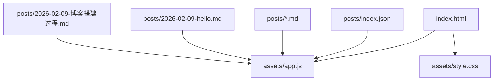
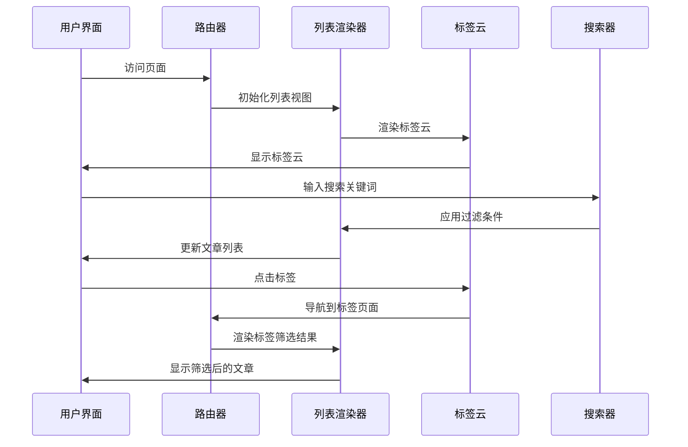
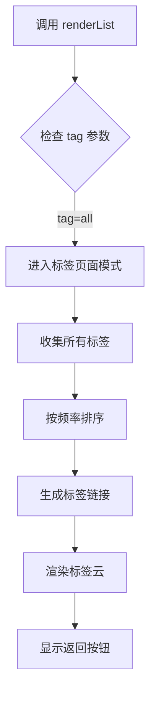
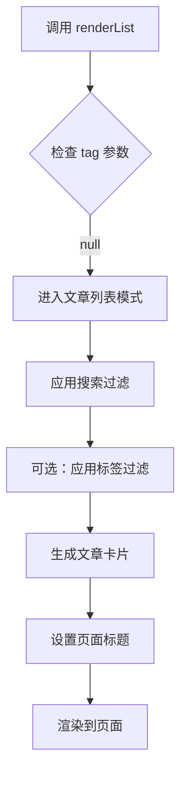
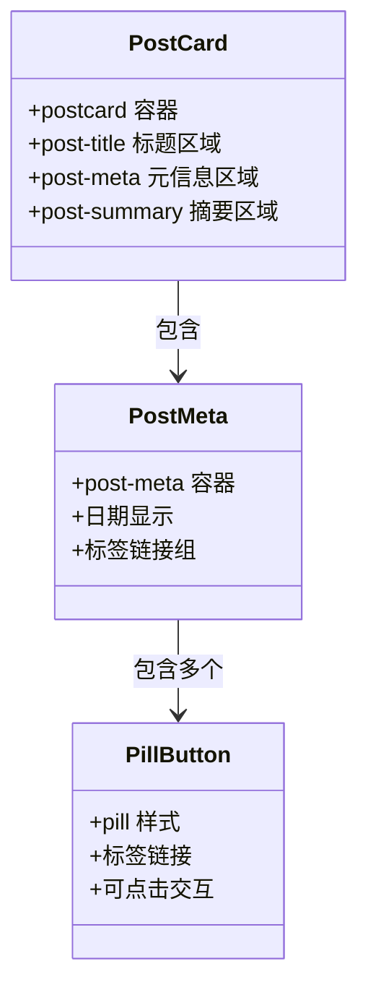
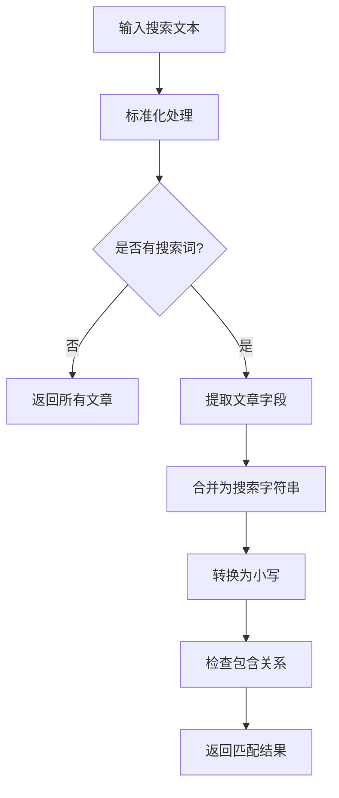
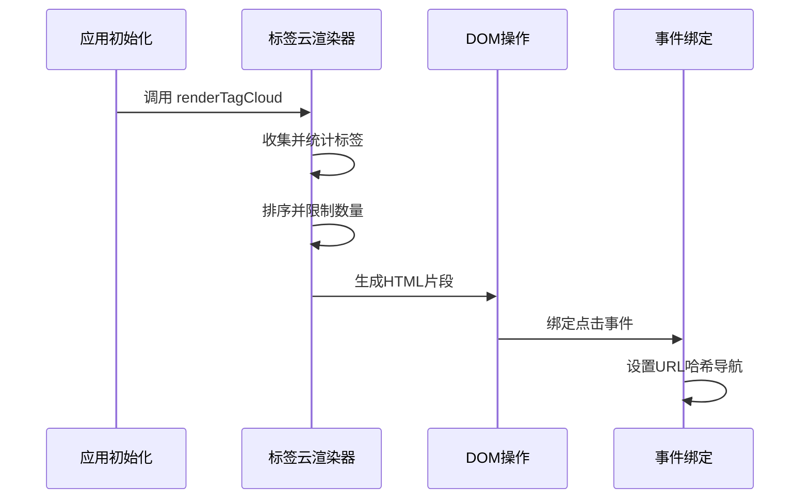
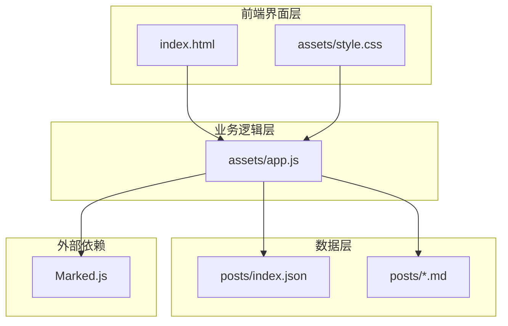

# 列表展示功能

<cite>
**本文档引用的文件**
- [index.html](file://index.html)
- [assets/app.js](file://assets/app.js)
- [assets/style.css](file://assets/style.css)
- [posts/index.json](file://posts/index.json)
</cite>

## 目录
1. [简介](#简介)
2. [项目结构](#项目结构)
3. [核心组件](#核心组件)
4. [架构概览](#架构概览)
5. [详细组件分析](#详细组件分析)
6. [依赖关系分析](#依赖关系分析)
7. [性能考虑](#性能考虑)
8. [故障排除指南](#故障排除指南)
9. [结论](#结论)

## 简介

这是一个基于纯静态文件的博客系统，采用无编译架构设计。该系统通过浏览器端JavaScript实现文章列表展示、标签云渲染、搜索过滤等功能，无需任何后端服务或构建过程。系统支持响应式设计，可在桌面和移动设备上提供良好的用户体验。

## 项目结构

该项目采用极简的文件组织方式，主要包含以下核心文件：

**图表来源**
- [index.html](file://index.html#L1-L104)
- [assets/app.js](file://assets/app.js#L1-L313)
- [posts/index.json](file://posts/index.json#L1-L16)

**章节来源**
- [index.html](file://index.html#L1-L104)
- [assets/app.js](file://assets/app.js#L1-L313)
- [assets/style.css](file://assets/style.css#L1-L629)
- [posts/index.json](file://posts/index.json#L1-L16)

## 核心组件

### 渲染引擎组件

系统的核心是`renderList()`函数，负责生成文章卡片和处理各种显示逻辑：

- **文章卡片生成**：使用`postcard`组件布局
- **标签云渲染**：动态生成标签云并支持点击筛选
- **搜索过滤**：基于`matchesFilter()`函数的全文本搜索
- **路由系统**：基于URL hash的单页应用导航

### 数据模型

系统使用JSON格式存储文章元数据，包含以下字段：
- `file`: 文章文件名
- `title`: 文章标题
- `date`: 发布日期
- `tags`: 标签数组
- `summary`: 文章摘要

**章节来源**
- [assets/app.js](file://assets/app.js#L85-L138)
- [posts/index.json](file://posts/index.json#L1-L16)

## 架构概览

系统采用客户端渲染架构，所有逻辑都在浏览器端执行：

**图表来源**
- [assets/app.js](file://assets/app.js#L200-L230)
- [assets/app.js](file://assets/app.js#L85-L138)
- [assets/app.js](file://assets/app.js#L61-L73)

## 详细组件分析

### renderList() 函数深度解析

`renderList()`函数是系统的核心渲染逻辑，负责处理三种不同的显示模式：

#### 1. 标签页面渲染 (`tag=all`)

当访问`#/tag/all`时，系统显示所有可用标签：

**图表来源**
- [assets/app.js](file://assets/app.js#L85-L113)

#### 2. 文章列表渲染

默认情况下，系统显示所有文章并支持搜索过滤：

**图表来源**
- [assets/app.js](file://assets/app.js#L85-L138)

#### 3. 文章卡片组件结构

每个文章卡片包含以下结构：

**图表来源**
- [assets/app.js](file://assets/app.js#L116-L131)
- [assets/style.css](file://assets/style.css#L310-L330)

### 搜索过滤机制

`matchesFilter()`函数实现了智能的全文本搜索：

**图表来源**
- [assets/app.js](file://assets/app.js#L75-L83)

搜索过滤涵盖以下字段：
- 文章标题 (`p.title`)
- 文章摘要 (`p.summary`) 
- 标签列表 (`p.tags.join(" ")`)
- 发布日期 (`p.date`)
- 文件名 (`p.file`)

### 标签云渲染系统

标签云功能通过`renderTagCloud()`函数实现：

**图表来源**
- [assets/app.js](file://assets/app.js#L61-L73)

标签云特性：
- 最多显示24个标签
- 按使用频率降序排列
- 支持点击跳转到标签筛选页面
- 显示标签使用次数

### 标签筛选逻辑

系统支持两种标签筛选方式：

1. **标签页面** (`#/tag/all`)：显示所有标签
2. **具体标签筛选** (`#/tag/{tagName}`)：只显示包含指定标签的文章

筛选过程：
- 解码URL中的标签名称
- 使用`Array.includes()`进行精确匹配
- 支持多标签文章的显示

**章节来源**
- [assets/app.js](file://assets/app.js#L85-L90)
- [assets/app.js](file://assets/app.js#L61-L73)

## 依赖关系分析

系统各组件之间的依赖关系如下：

**图表来源**
- [index.html](file://index.html#L14-L17)
- [assets/app.js](file://assets/app.js#L1-L8)

### 外部依赖

系统仅依赖Marked.js进行Markdown渲染，版本为最新稳定版。

**章节来源**
- [index.html](file://index.html#L17-L17)
- [assets/app.js](file://assets/app.js#L149-L162)

## 性能考虑

### 内存优化

- **延迟加载**：文章内容仅在需要时加载
- **DOM复用**：使用innerHTML批量更新而非逐个元素操作
- **事件委托**：标签云事件通过事件冒泡处理

### 网络优化

- **缓存策略**：禁用缓存确保内容实时更新
- **增量更新**：只在必要时重新渲染列表
- **资源压缩**：CSS和JavaScript均为未压缩版本便于调试

### 响应式性能

- **媒体查询**：针对不同屏幕尺寸优化布局
- **触摸优化**：移动端友好的交互设计
- **字体回退**：使用系统字体减少加载时间

## 故障排除指南

### 常见问题及解决方案

#### 1. 文章列表为空

**症状**：页面显示"没有匹配结果"

**可能原因**：
- `posts/index.json`文件格式错误
- 文章文件缺失或命名不正确
- JavaScript执行错误

**解决方法**：
1. 检查`posts/index.json`格式是否正确
2. 确认对应Markdown文件存在
3. 查看浏览器控制台错误信息

#### 2. 标签云不显示

**症状**：侧边栏标签云区域为空

**可能原因**：
- 标签数据为空
- JavaScript执行失败
- CSS样式冲突

**解决方法**：
1. 验证文章数据中包含标签信息
2. 检查JavaScript控制台错误
3. 确认CSS样式未覆盖标签云显示

#### 3. 搜索功能失效

**症状**：输入搜索词无反应

**可能原因**：
- 搜索输入框事件绑定失败
- `matchesFilter()`函数错误
- 文章数据格式问题

**解决方法**：
1. 检查输入事件监听器
2. 验证搜索函数逻辑
3. 确认文章字段完整性

**章节来源**
- [assets/app.js](file://assets/app.js#L30-L38)
- [assets/app.js](file://assets/app.js#L297-L304)

## 结论

这个无编译架构的博客系统展现了现代Web开发的最佳实践：

### 技术优势

1. **极简架构**：仅需HTML、CSS、JavaScript和JSON数据
2. **实时更新**：修改文件后立即生效
3. **离线可用**：完全静态化部署
4. **响应式设计**：适配各种设备尺寸

### 设计亮点

1. **组件化思维**：清晰的模块划分和职责分离
2. **用户体验**：流畅的单页应用体验
3. **可扩展性**：易于添加新功能和样式
4. **维护友好**：简洁的代码结构便于理解和修改

### 改进建议

1. **性能监控**：添加加载时间和内存使用监控
2. **错误边界**：增强错误处理和用户反馈
3. **SEO优化**：添加元数据和结构化数据
4. **国际化**：支持多语言内容管理

该系统为个人博客和小型内容管理提供了优雅的解决方案，展示了现代Web技术的强大能力。