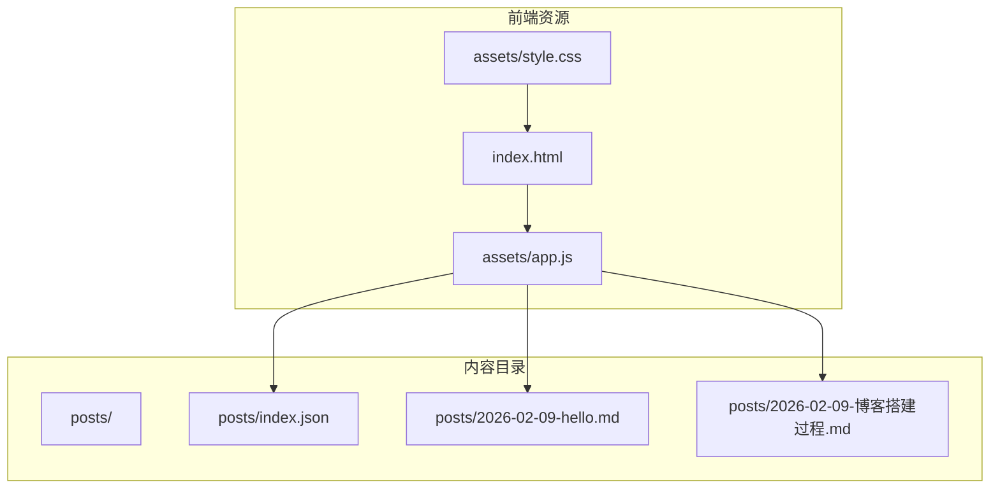
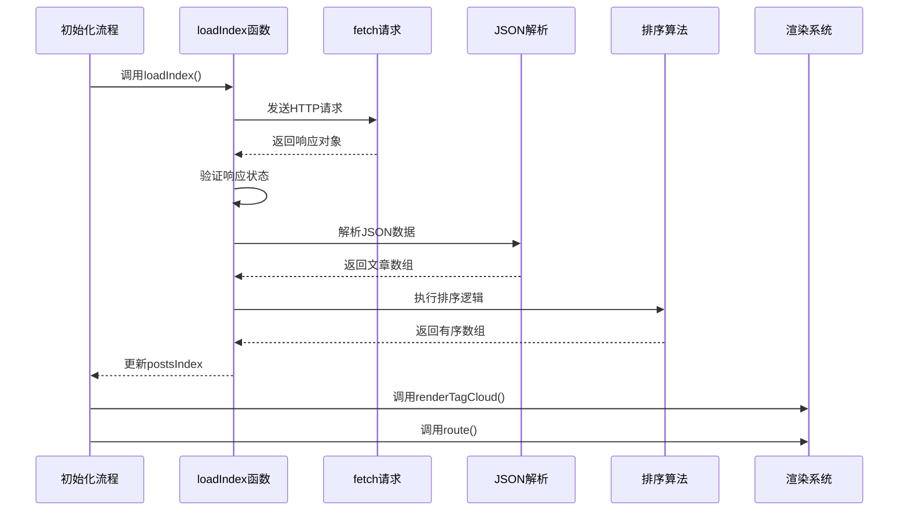
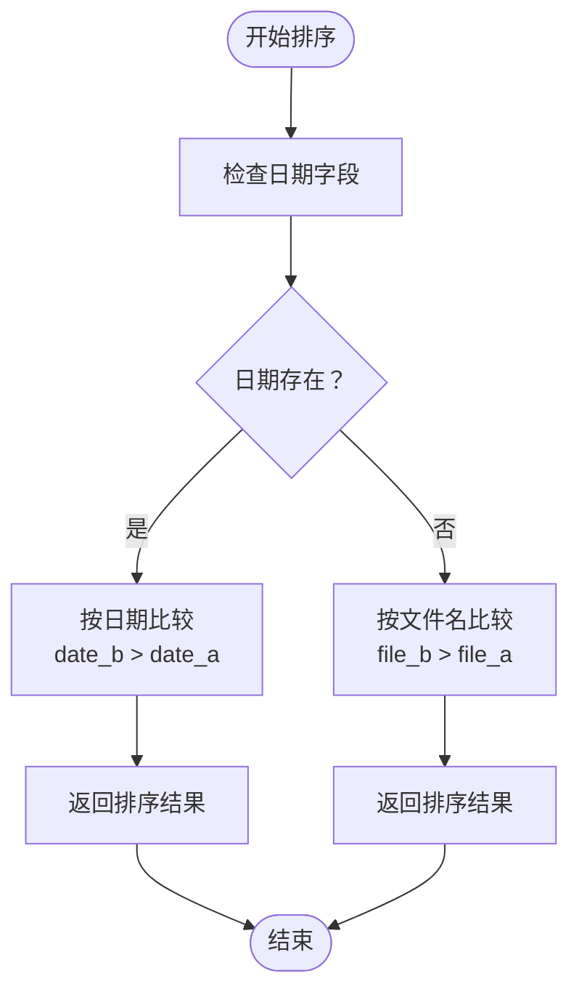
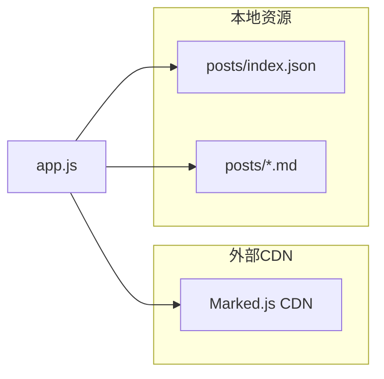
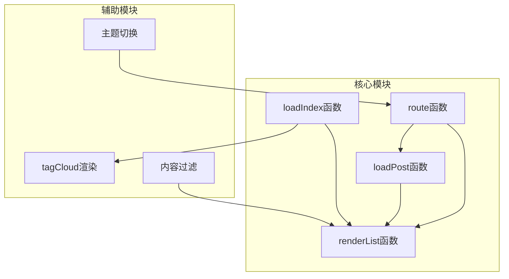

# 数据加载机制

<cite>
**本文档引用的文件**
- [app.js](file://assets/app.js)
- [index.json](file://posts/index.json)
- [index.html](file://index.html)
- [style.css](file://assets/style.css)
</cite>

## 目录
1. [简介](#简介)
2. [项目结构](#项目结构)
3. [核心组件](#核心组件)
4. [架构概览](#架构概览)
5. [详细组件分析](#详细组件分析)
6. [依赖关系分析](#依赖关系分析)
7. [性能考虑](#性能考虑)
8. [故障排除指南](#故障排除指南)
9. [结论](#结论)

## 简介

本项目是一个无编译的静态Markdown博客系统，采用纯前端技术实现。数据加载机制是整个系统的核心，负责从`posts/index.json`异步加载文章索引数据，并通过`loadIndex()`函数实现完整的数据加载、缓存控制和排序逻辑。该机制确保用户能够高效地浏览和搜索博客文章，同时提供了完善的错误处理和用户体验保障。

## 项目结构

该项目采用简洁的静态网站架构，主要由以下组件构成：



**图表来源**
- [index.html](file://index.html#L1-L104)
- [app.js](file://assets/app.js#L1-L313)
- [index.json](file://posts/index.json#L1-L16)

**章节来源**
- [index.html](file://index.html#L1-L104)
- [app.js](file://assets/app.js#L1-L313)

## 核心组件

### postsIndex 全局变量

`postsIndex`是整个博客系统的核心数据容器，定义在应用文件的第22行：

```javascript
let postsIndex = []; // from posts/index.json
```

该变量具有以下特性：
- **作用域**：全局作用域，可在整个应用中访问
- **生命周期**：应用启动时初始化为空数组，首次成功加载数据后永久保存
- **用途**：存储从`posts/index.json`加载的所有文章元数据
- **数据类型**：JavaScript数组对象

### loadIndex() 函数

这是数据加载机制的核心函数，位于应用文件的第140-147行：

```javascript
async function loadIndex() {
  const res = await fetch("./posts/index.json", { cache: "no-store" });
  if (!res.ok) throw new Error(`Failed to load posts/index.json: ${res.status}`);
  postsIndex = await res.json();

  // sort: date desc, fallback file desc
  postsIndex.sort((a, b) => (b.date || b.file).localeCompare(a.date || a.file));
}
```

**章节来源**
- [app.js](file://assets/app.js#L22-L22)
- [app.js](file://assets/app.js#L140-L147)

## 架构概览

数据加载机制采用异步架构设计，确保用户体验流畅且数据处理高效：



**图表来源**
- [app.js](file://assets/app.js#L140-L147)
- [app.js](file://assets/app.js#L297-L304)

## 详细组件分析

### 数据加载配置

#### fetch 请求配置

`loadIndex()`函数使用标准的fetch API进行数据加载，配置特点如下：

- **URL路径**：`"./posts/index.json"` - 相对当前页面的相对路径
- **缓存策略**：`{ cache: "no-store" }` - 强制绕过浏览器缓存
- **异步处理**：使用`async/await`语法确保顺序执行

#### 缓存策略分析

缓存策略选择`"no-store"`的原因：
- **实时性要求**：确保每次访问都能获取最新的文章数据
- **版本控制**：避免浏览器缓存导致的数据陈旧问题
- **开发友好**：便于开发者在修改内容后立即看到效果

### 数据排序逻辑

排序算法位于第146行，实现了双重排序规则：

```javascript
// sort: date desc, fallback file desc
postsIndex.sort((a, b) => (b.date || b.file).localeCompare(a.date || a.file));
```

排序逻辑详解：
1. **主排序键**：`date`字段（按日期降序排列）
2. **次排序键**：当日期相同时，使用`file`字段（按文件名降序排列）
3. **比较方法**：使用`localeCompare()`进行字符串比较
4. **容错处理**：如果`date`不存在，则回退到`file`字段

排序流程图：



**图表来源**
- [app.js](file://assets/app.js#L145-L146)

### 错误处理机制

系统实现了多层次的错误处理机制：

#### 网络请求错误处理

```javascript
if (!res.ok) throw new Error(`Failed to load posts/index.json: ${res.status}`);
```

错误处理特点：
- **状态码验证**：检查HTTP响应状态是否为成功状态
- **详细错误信息**：包含具体的HTTP状态码
- **异常抛出**：使用JavaScript原生Error对象

#### 初始化失败处理

在应用初始化过程中，使用try-catch块捕获所有初始化错误：

```javascript
try {
  await loadIndex();
  renderTagCloud();
  route();
} catch (e) {
  showOnly(listView);
  setNotice(`初始化失败：${e.message}`, true);
}
```

#### 运行时错误处理

对于单篇文章加载失败的情况：

```javascript
loadPost(file).catch(err => setNotice(`文章加载失败：${err.message}`, true));
```

### 数据格式验证

系统对从`posts/index.json`加载的数据进行了严格的格式验证：

#### JSON数据结构

标准的JSON数据结构包含以下必需字段：

| 字段名 | 类型 | 必需 | 描述 |
|--------|------|------|------|
| `file` | string | 是 | Markdown文件的完整文件名 |
| `title` | string | 是 | 文章标题 |
| `date` | string | 否 | 文章发布日期（YYYY-MM-DD格式） |
| `tags` | array | 否 | 文章标签数组 |
| `summary` | string | 否 | 文章摘要 |

#### 数据验证示例

有效的JSON数据示例：

```json
[
  {
    "file": "2026-02-09-hello.md",
    "title": "Hello, GitHub Pages",
    "date": "2026-02-09",
    "tags": ["blog", "markdown"],
    "summary": "纯静态 + Markdown，无需编译。"
  }
]
```

### 本地存储兼容性

虽然`loadIndex()`函数本身不直接使用本地存储，但系统整体具备良好的本地存储兼容性：

#### 主题偏好设置

```javascript
function getPreferredTheme() {
  const saved = localStorage.getItem("theme");
  if (saved === "light" || saved === "dark") return saved;
  return window.matchMedia && window.matchMedia("(prefers-color-scheme: light)").matches ? "light" : "dark";
}
```

#### 本地存储功能

- **主题持久化**：用户偏好的主题设置会保存在localStorage中
- **跨会话保持**：即使刷新页面或重新打开浏览器，主题设置仍然有效
- **浏览器兼容**：使用标准的localStorage API，兼容主流现代浏览器

**章节来源**
- [app.js](file://assets/app.js#L140-L147)
- [app.js](file://assets/app.js#L297-L304)
- [app.js](file://assets/app.js#L233-L248)

## 依赖关系分析

### 外部依赖

系统对外部依赖的管理：



**图表来源**
- [index.html](file://index.html#L17-L17)
- [app.js](file://assets/app.js#L149-L162)

### 内部模块依赖



**图表来源**
- [app.js](file://assets/app.js#L140-L147)
- [app.js](file://assets/app.js#L149-L182)
- [app.js](file://assets/app.js#L85-L138)

**章节来源**
- [app.js](file://assets/app.js#L1-L313)

## 性能考虑

### 缓存策略优化

- **强制刷新**：使用`cache: "no-store"`确保数据实时性
- **内存管理**：文章内容仅在需要时加载，避免不必要的内存占用
- **排序效率**：使用原生Array.sort()方法，时间复杂度O(n log n)

### 网络优化

- **异步加载**：使用Promise和async/await避免阻塞UI线程
- **错误快速反馈**：网络错误时立即显示错误信息
- **CDN加速**：Marked.js通过CDN加载，提升Markdown渲染性能

### 内存使用优化

- **数据结构**：使用简单数组存储文章元数据，减少内存开销
- **DOM操作**：批量更新DOM，避免频繁的重排重绘
- **事件监听**：合理管理事件监听器，防止内存泄漏

## 故障排除指南

### 常见问题及解决方案

#### 1. 数据加载失败

**症状**：页面显示"初始化失败"提示

**可能原因**：
- `posts/index.json`文件不存在或路径错误
- JSON格式不正确
- 服务器配置问题导致跨域限制

**解决步骤**：
1. 验证`posts/index.json`文件是否存在
2. 使用在线JSON验证工具检查格式
3. 检查服务器的CORS配置

#### 2. 文章排序异常

**症状**：文章列表显示顺序不符合预期

**可能原因**：
- `date`字段格式不正确（非YYYY-MM-DD格式）
- `file`字段缺失或格式异常
- 特殊字符影响排序结果

**解决步骤**：
1. 检查所有文章的`date`字段格式
2. 确保`file`字段包含完整的文件名
3. 验证日期字符串的字典序

#### 3. 主题切换失效

**症状**：主题切换后设置未保存

**可能原因**：
- 浏览器禁用了localStorage
- 浏览器隐私模式限制存储
- JavaScript执行错误

**解决步骤**：
1. 检查浏览器控制台是否有错误信息
2. 验证localStorage功能是否正常
3. 尝试清除浏览器缓存后重试

### 调试技巧

#### 1. 开发者工具使用

```javascript
// 在浏览器控制台中检查数据
console.log('postsIndex:', postsIndex);
console.log('数据长度:', postsIndex.length);
console.log('第一条数据:', postsIndex[0]);
```

#### 2. 网络请求监控

使用浏览器开发者工具的Network面板：
- 查看`posts/index.json`的请求状态
- 检查响应头中的缓存控制
- 验证JSON响应的有效性

#### 3. 错误日志记录

在生产环境中添加更详细的错误日志：

```javascript
try {
  await loadIndex();
} catch (error) {
  console.error('数据加载失败:', {
    message: error.message,
    timestamp: new Date(),
    url: './posts/index.json'
  });
  // 显示用户友好的错误信息
  setNotice('数据加载失败，请稍后重试', true);
}
```

**章节来源**
- [app.js](file://assets/app.js#L297-L304)
- [app.js](file://assets/app.js#L207-L210)

## 结论

本数据加载机制通过精心设计的架构实现了高效、可靠的静态博客内容管理。`loadIndex()`函数作为核心组件，不仅完成了基础的数据加载功能，还实现了智能的缓存控制、健壮的错误处理和高效的排序逻辑。

系统的主要优势包括：
- **实时性保证**：通过强制缓存绕过确保数据最新
- **用户体验**：异步加载避免界面卡顿
- **错误处理**：多层次的错误捕获和用户提示
- **扩展性**：清晰的架构便于后续功能扩展

该机制为无编译静态博客提供了一个坚实的技术基础，使得内容维护和展示都变得简单高效。通过合理的错误处理和调试支持，开发者可以轻松地定位和解决问题，确保博客系统的稳定运行。