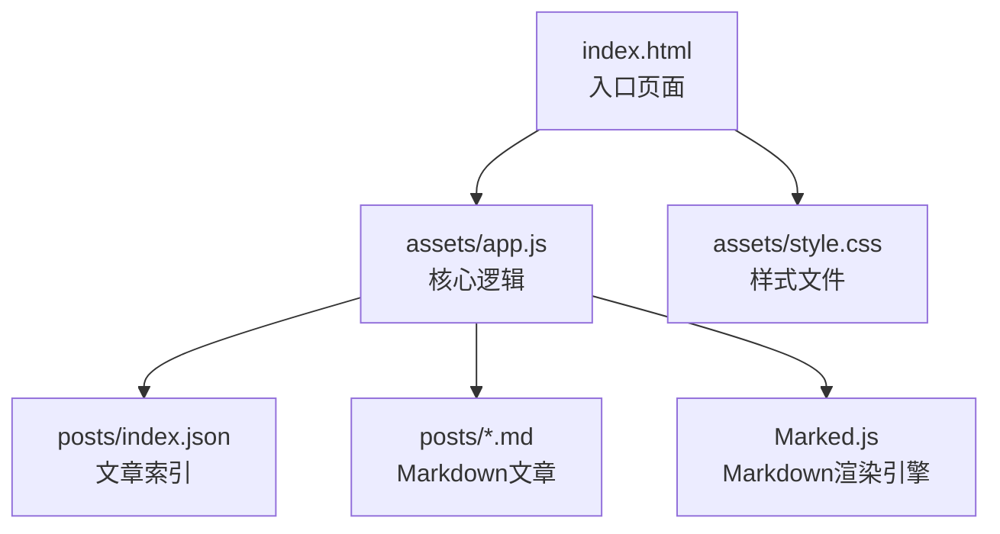
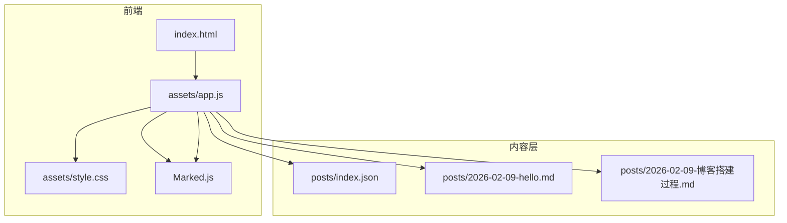
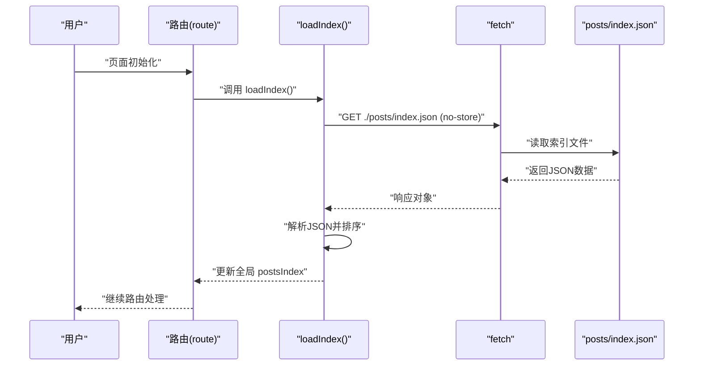
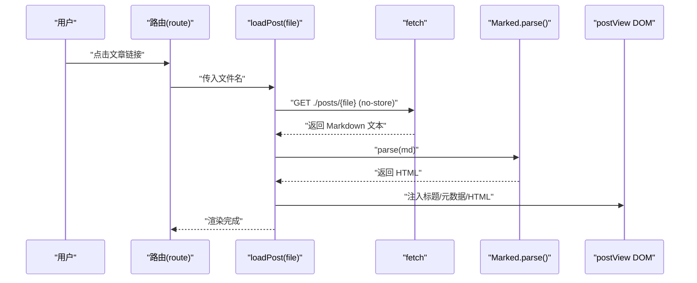
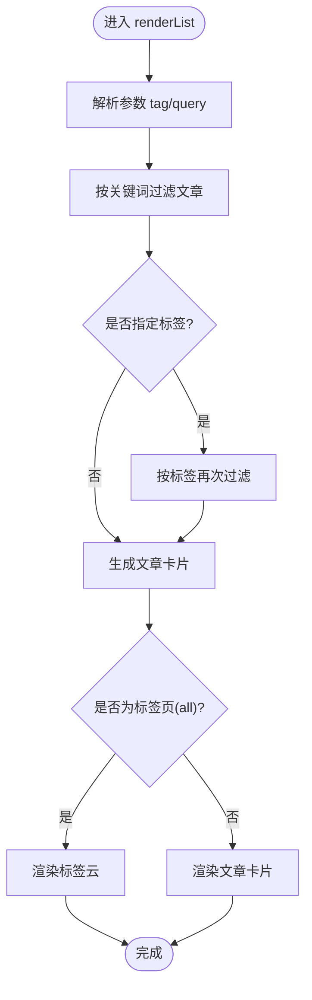
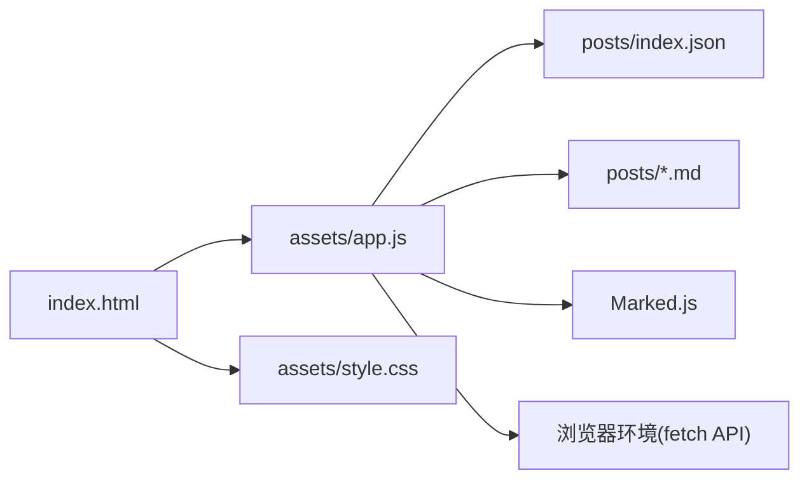

# 文章管理系统

<cite>
**本文档引用的文件**
- [index.html](file://index.html)
- [app.js](file://assets/app.js)
- [style.css](file://assets/style.css)
- [index.json](file://posts/index.json)
- [hello.md](file://posts/2026-02-09-hello.md)
- [博客搭建过程.md](file://posts/2026-02-09-博客搭建过程.md)
</cite>

## 目录
1. [简介](#简介)
2. [项目结构](#项目结构)
3. [核心组件](#核心组件)
4. [架构总览](#架构总览)
5. [详细组件分析](#详细组件分析)
6. [依赖关系分析](#依赖关系分析)
7. [性能考虑](#性能考虑)
8. [故障排除指南](#故障排除指南)
9. [结论](#结论)
10. [附录](#附录)

## 简介
本项目是一个“无编译”的静态博客系统，采用纯前端渲染架构：文章以 Markdown 文件维护，通过浏览器端的 Marked.js 解析渲染为 HTML。系统通过 posts/index.json 提供文章元数据索引，实现文章列表展示、按标签筛选、全文搜索以及单篇文章详情页的完整功能。该架构支持 GitHub Pages 部署，实现“本地维护 Markdown + JSON 元数据 + git push 即发布”的高效工作流。

## 项目结构
项目采用极简的静态文件组织方式：
- 根目录包含入口页面 index.html 和静态资源 assets/
- posts/ 目录存放文章 Markdown 文件和索引文件 posts/index.json
- .nojekyll、.gitignore、CNAME 等用于 GitHub Pages 配置

**图表来源**
- [index.html](file://index.html#L1-L104)
- [app.js](file://assets/app.js#L1-L313)
- [style.css](file://assets/style.css#L1-L629)
- [index.json](file://posts/index.json#L1-L16)

**章节来源**
- [index.html](file://index.html#L1-L104)
- [app.js](file://assets/app.js#L1-L313)

## 核心组件
系统的核心由以下组件构成：
- 应用入口与路由：index.html 定义页面结构，app.js 处理路由、视图切换与业务逻辑
- 文章索引加载：loadIndex() 异步加载 posts/index.json，进行排序并缓存到内存
- Markdown 渲染：loadPost() 使用 Marked.js 解析 Markdown，生成 HTML 并注入详情页
- 列表展示：renderList() 生成文章卡片，支持搜索过滤与标签筛选
- 标签云：collectTags() 统计标签频率，renderTagCloud() 展示热门标签
- 错误处理：统一的通知提示与降级显示

**章节来源**
- [app.js](file://assets/app.js#L140-L182)
- [app.js](file://assets/app.js#L85-L138)
- [app.js](file://assets/app.js#L61-L73)

## 架构总览
系统采用“前端渲染 + 静态文件 + GitHub Pages”的架构模式：
- 前端：index.html + app.js + style.css
- 内容：posts/*.md + posts/index.json
- 渲染：Marked.js 在浏览器端解析 Markdown
- 部署：GitHub Pages 自动发布静态文件

**图表来源**
- [index.html](file://index.html#L1-L104)
- [app.js](file://assets/app.js#L1-L313)
- [index.json](file://posts/index.json#L1-L16)
- [hello.md](file://posts/2026-02-09-hello.md#L1-L8)
- [博客搭建过程.md](file://posts/2026-02-09-博客搭建过程.md#L1-L196)

## 详细组件分析

### 文章索引加载与排序（loadIndex）
loadIndex() 函数负责：
- 从 posts/index.json 加载文章元数据数组
- 使用 no-store 缓存策略强制刷新，确保每次进入页面都获取最新索引
- 对文章进行排序：优先按日期降序，日期相同时按文件名降序
- 将排序后的数组保存到全局变量 postsIndex，供后续渲染使用

**图表来源**
- [app.js](file://assets/app.js#L140-L147)
- [index.json](file://posts/index.json#L1-L16)

**章节来源**
- [app.js](file://assets/app.js#L140-L147)

### Markdown 解析与 HTML 渲染（loadPost）
loadPost() 函数负责：
- 根据传入的文件名拼接 Markdown 文件路径并请求
- 使用 no-store 强制刷新，避免缓存导致的旧内容
- 通过 postsIndex 查找对应文章的元数据（标题、日期、标签），若缺失则回退默认值
- 设置 Marked.js 选项（启用 GFM，禁用硬换行），解析 Markdown 为 HTML
- 将标题、元数据、HTML 内容组合为完整的文章详情页结构并注入 DOM

**图表来源**
- [app.js](file://assets/app.js#L149-L182)

**章节来源**
- [app.js](file://assets/app.js#L149-L182)

### 文章列表渲染（renderList）
renderList() 函数负责：
- 接收可选参数 tag 与 query，分别用于标签筛选与全文搜索
- 先根据 query 进行关键词过滤，再按标签进一步筛选
- 标签页“all”时展示所有标签及其出现次数，支持点击跳转到对应标签页
- 列表页生成文章卡片，包含标题、日期、标签、摘要等信息
- 标题使用链接跳转到文章详情页，标签使用链接跳转到标签筛选页

**图表来源**
- [app.js](file://assets/app.js#L85-L138)

**章节来源**
- [app.js](file://assets/app.js#L85-L138)

### 标签云与统计（collectTags/renderTagCloud）
collectTags() 统计每个标签的出现次数，按频率降序、名称升序排列，取前 24 个标签用于展示。renderTagCloud() 将标签云渲染到 sidebar 区域，点击标签会更新 URL hash 并触发路由切换到对应标签页。

**章节来源**
- [app.js](file://assets/app.js#L49-L73)

### 路由与视图切换（route）
route() 函数根据 URL hash 决定当前视图：
- `#/post/<file>`：显示文章详情页，调用 loadPost(file)
- `#/tag/<tag>`：显示标签筛选页，调用 renderList({ tag })
- `#/about`：显示关于页面
- 默认：显示文章列表页，调用 renderList()

同时监听 hashchange 事件与搜索输入事件，实现实时过滤与导航。

**章节来源**
- [app.js](file://assets/app.js#L200-L230)

### Marked.js 集成
系统通过 CDN 引入 Marked.js，在浏览器端进行 Markdown 解析。loadPost() 中设置 Marked 的选项以启用 GitHub 风格的表格与列表等特性，确保渲染效果符合预期。

**章节来源**
- [index.html](file://index.html#L16-L17)
- [app.js](file://assets/app.js#L155-L162)

### 缓存策略
- 索引加载：使用 fetch 的 { cache: "no-store" } 强制不使用缓存，确保每次进入页面都能获取最新文章列表
- 文章加载：同样使用 no-store，避免浏览器缓存导致的旧 Markdown 内容
- 本地存储：主题偏好通过 localStorage 存储，提升用户体验

**章节来源**
- [app.js](file://assets/app.js#L141-L151)
- [app.js](file://assets/app.js#L233-L253)

### 错误处理机制
- 初始化失败：在 init() 中捕获异常，显示通知并回退到列表页
- 文章加载失败：在 route() 中捕获异常，显示错误通知
- 通用通知：setNotice() 提供统一的错误提示 UI，支持隐藏与显示

**章节来源**
- [app.js](file://assets/app.js#L297-L304)
- [app.js](file://assets/app.js#L210-L211)
- [app.js](file://assets/app.js#L30-L38)

## 依赖关系分析
系统主要依赖关系如下：
- index.html 依赖 assets/app.js 与 assets/style.css
- app.js 依赖 posts/index.json 与 posts/*.md
- app.js 依赖 Marked.js 进行 Markdown 渲染
- 浏览器环境提供 fetch API 用于网络请求

**图表来源**
- [index.html](file://index.html#L1-L104)
- [app.js](file://assets/app.js#L1-L313)

**章节来源**
- [index.html](file://index.html#L1-L104)
- [app.js](file://assets/app.js#L1-L313)

## 性能考虑
- 静态文件：所有资源均为静态文件，加载速度快，适合 GitHub Pages
- 前端渲染：在浏览器端解析 Markdown，减少服务器端压力
- 缓存策略：索引与文章均使用 no-store，确保内容新鲜度
- 响应式设计：移动端与桌面端均有良好体验
- 代码分割：功能模块化，便于维护与扩展

## 故障排除指南
- 文章列表为空：检查 posts/index.json 是否存在且格式正确
- 文章详情页空白：确认 posts/*.md 文件是否存在且与 index.json 中的 file 字段一致
- Markdown 渲染异常：检查 Marked.js 是否成功加载，确认文章内容格式规范
- 主题切换无效：检查 localStorage 是否可用，确认 CSS 变量定义正确
- 搜索无结果：确认搜索关键词与文章标题、摘要、标签匹配

**章节来源**
- [app.js](file://assets/app.js#L140-L182)
- [app.js](file://assets/app.js#L297-L304)

## 结论
该文章管理系统通过极简的架构实现了完整的博客功能：文章索引加载、Markdown 渲染、列表展示与详情页显示。系统采用“无编译”的前端渲染模式，结合 GitHub Pages 实现快速部署，适合注重写作效率与维护成本的个人博客。通过合理的缓存策略、错误处理与响应式设计，系统在可用性与性能方面表现良好。

## 附录

### 文章元数据结构说明
- file：文章文件名，用于定位 Markdown 文件
- title：文章标题
- date：文章日期（YYYY-MM-DD）
- tags：标签数组
- summary：文章摘要

**章节来源**
- [index.json](file://posts/index.json#L1-L16)

### Markdown 内容格式规范
- 标题：使用 #、##、### 等层级标题
- 列表：支持有序与无序列表
- 链接：使用标准 Markdown 链接语法
- 代码：使用反引号包裹行内代码，使用代码块包裹多行代码
- 引用：使用 > 开头的引用块
- 表格：使用 | 分隔的标准表格语法

**章节来源**
- [hello.md](file://posts/2026-02-09-hello.md#L1-L8)
- [博客搭建过程.md](file://posts/2026-02-09-博客搭建过程.md#L1-L196)

### 最佳实践指导
- 文件命名：建议使用 YYYY-MM-DD-标题.md 的格式，便于排序与识别
- 标签管理：保持标签简洁统一，避免过多重复标签
- 摘要撰写：在 index.json 中提供准确的摘要，提升搜索体验
- 内容组织：Markdown 文件中使用清晰的标题层级，便于阅读
- 版本控制：通过 git 管理文章变更，利用 GitHub Pages 自动发布