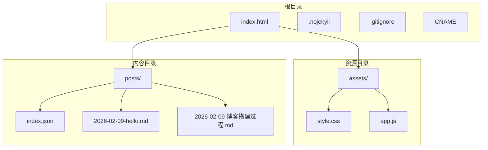
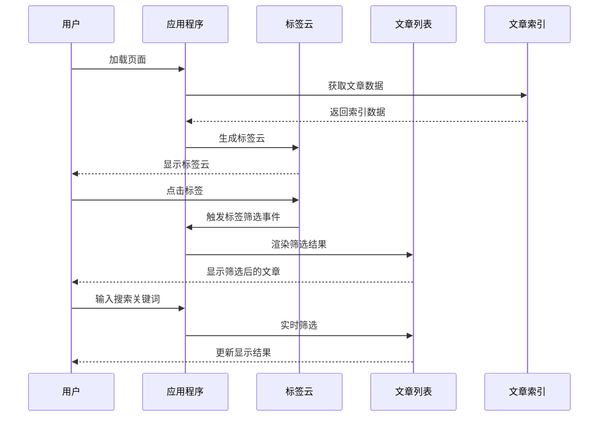
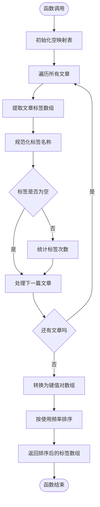
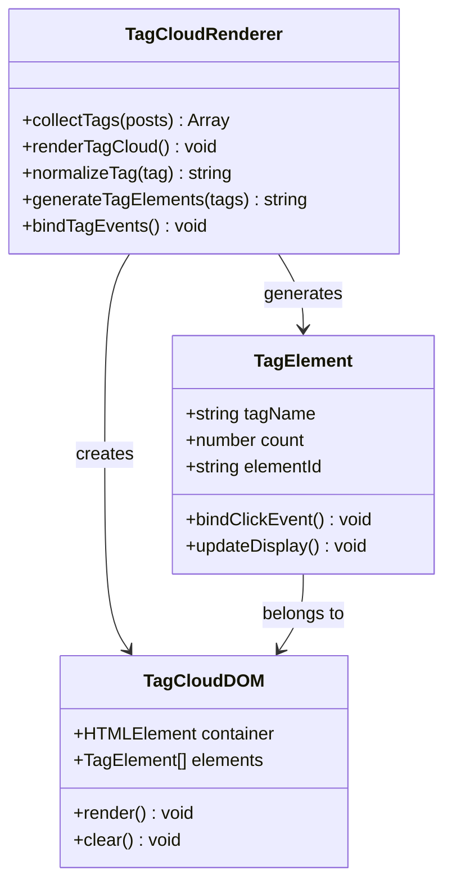
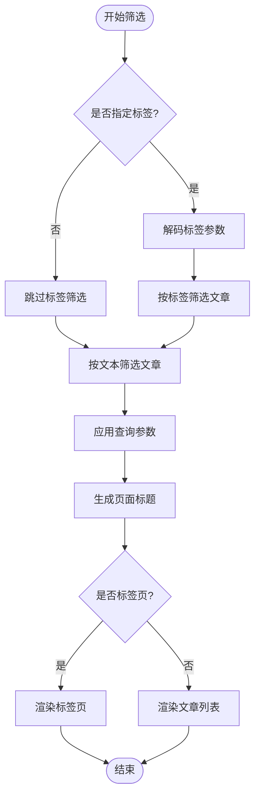
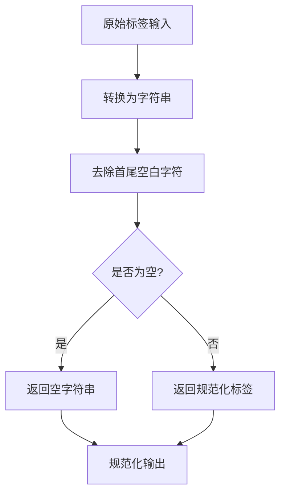
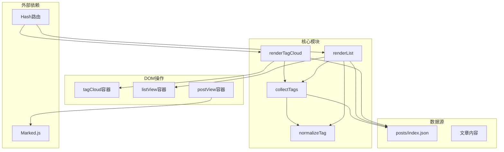

# 标签系统

<cite>
**本文档引用的文件**
- [app.js](file://assets/app.js)
- [index.html](file://index.html)
- [style.css](file://assets/style.css)
- [index.json](file://posts/index.json)
- [2026-02-09-hello.md](file://posts/2026-02-09-hello.md)
- [2026-02-09-博客搭建过程.md](file://posts/2026-02-09-博客搭建过程.md)
</cite>

## 目录
1. [简介](#简介)
2. [项目结构](#项目结构)
3. [核心组件](#核心组件)
4. [架构概览](#架构概览)
5. [详细组件分析](#详细组件分析)
6. [依赖分析](#依赖分析)
7. [性能考虑](#性能考虑)
8. [故障排除指南](#故障排除指南)
9. [结论](#结论)

## 简介

本项目实现了一个完整的无编译静态博客标签系统，采用纯前端技术栈，无需构建工具即可实现标签云生成、标签筛选和标签统计功能。系统基于Hash路由的单页应用架构，通过JavaScript动态渲染标签云和文章列表，实现了流畅的用户体验。

标签系统的核心特点包括：
- **实时标签统计**：自动统计每个标签的文章数量
- **智能标签云**：根据使用频率生成可视化标签云
- **多维筛选**：支持按标签和全文搜索进行双重筛选
- **响应式设计**：适配桌面和移动端设备
- **无编译架构**：纯静态文件 + JavaScript运行时渲染

## 项目结构

项目采用极简的静态博客架构，主要文件组织如下：

**图表来源**
- [index.html](file://index.html#L1-L104)
- [app.js](file://assets/app.js#L1-L313)
- [style.css](file://assets/style.css#L1-L629)

**章节来源**
- [index.html](file://index.html#L1-L104)
- [app.js](file://assets/app.js#L1-L313)

## 核心组件

标签系统由以下核心组件构成：

### 1. 标签收集器 (collectTags)
负责从文章索引中提取和统计标签信息，实现标签去重和计数功能。

### 2. 标签云渲染器 (renderTagCloud)
将统计结果转换为可视化的标签云界面元素。

### 3. 标签筛选器 (renderList)
根据标签参数对文章进行筛选和显示。

### 4. 标签规范化处理器
确保标签数据的一致性和准确性。

**章节来源**
- [app.js](file://assets/app.js#L49-L59)
- [app.js](file://assets/app.js#L61-L73)
- [app.js](file://assets/app.js#L85-L138)

## 架构概览

标签系统采用模块化设计，各组件职责明确，通过事件驱动的方式协同工作：

**图表来源**
- [app.js](file://assets/app.js#L297-L313)
- [app.js](file://assets/app.js#L61-L73)
- [app.js](file://assets/app.js#L85-L138)

## 详细组件分析

### 标签收集器 (collectTags)

#### 功能实现
collectTags函数负责从文章索引中提取所有标签并进行统计：

**图表来源**
- [app.js](file://assets/app.js#L49-L59)

#### 数据处理流程
1. **输入验证**：检查文章对象的tags属性是否存在
2. **标签规范化**：使用normalizeTag函数清理标签文本
3. **去重统计**：使用Map数据结构自动去重并统计频次
4. **排序算法**：优先按使用频率降序排列，频率相同时按字母顺序排列

#### 复杂度分析
- **时间复杂度**：O(n*m + k*log(k))
  - n：文章总数
  - m：平均每篇文章的标签数量
  - k：唯一标签总数
- **空间复杂度**：O(k)

**章节来源**
- [app.js](file://assets/app.js#L49-L59)

### 标签云渲染器 (renderTagCloud)

#### 渲染机制
renderTagCloud函数负责将标签统计数据转换为可视化的标签云：

**图表来源**
- [app.js](file://assets/app.js#L61-L73)
- [style.css](file://assets/style.css#L281-L294)

#### 渲染流程
1. **数据准备**：调用collectTags获取标签统计数据
2. **截取处理**：限制显示前24个最常用的标签
3. **模板生成**：使用模板字符串生成HTML元素
4. **事件绑定**：为每个标签元素绑定点击事件
5. **URL更新**：点击标签时更新浏览器URL

#### 样式设计
标签云采用现代化的设计风格：
- **圆角胶囊形状**：使用`border-radius: 999px`
- **渐变背景**：使用`background: color-mix()`实现主题适配
- **悬停效果**：鼠标悬停时改变颜色和边框
- **响应式布局**：自动换行适应不同屏幕尺寸

**章节来源**
- [app.js](file://assets/app.js#L61-L73)
- [style.css](file://assets/style.css#L281-L294)

### 标签筛选器 (renderList)

#### 筛选逻辑
renderList函数实现多维筛选功能：

**图表来源**
- [app.js](file://assets/app.js#L85-L138)

#### 筛选算法
1. **全文搜索**：支持在标题、摘要、标签、日期、文件名中搜索
2. **标签筛选**：精确匹配标签名称
3. **组合筛选**：同时应用文本搜索和标签筛选
4. **排序规则**：按日期降序排列，日期相同时按文件名排序

#### 页面类型
系统支持三种页面类型：
- **默认列表页**：显示所有文章
- **标签详情页**：显示特定标签的所有文章
- **标签汇总页**：显示所有可用标签

**章节来源**
- [app.js](file://assets/app.js#L85-L138)

### 标签规范化处理器

#### 规范化策略
normalizeTag函数确保标签数据的一致性：

**图表来源**
- [app.js](file://assets/app.js#L45-L47)

#### 处理规则
- **类型转换**：确保所有输入都转换为字符串
- **空白处理**：去除标签前后的空格和换行符
- **空值过滤**：跳过空标签，避免统计错误
- **大小写保持**：保留原始大小写，便于用户识别

**章节来源**
- [app.js](file://assets/app.js#L45-L47)

## 依赖分析

标签系统各组件之间的依赖关系如下：

**图表来源**
- [app.js](file://assets/app.js#L22-L28)
- [app.js](file://assets/app.js#L140-L147)
- [index.html](file://index.html#L67-L68)

### 组件耦合度
- **高内聚**：标签相关功能集中在app.js中
- **低耦合**：各函数职责单一，相互独立
- **数据流向**：单向数据流，从数据源到视图层

### 外部依赖
- **Marked.js**：用于Markdown渲染
- **浏览器API**：使用fetch API获取数据，hashchange事件监听路由变化

**章节来源**
- [app.js](file://assets/app.js#L1-L313)
- [index.html](file://index.html#L1-L104)

## 性能考虑

### 1. 数据加载优化
- **缓存策略**：使用`cache: "no-store"`确保数据最新
- **异步加载**：避免阻塞页面渲染
- **错误处理**：完善的异常捕获和用户提示

### 2. 渲染性能
- **虚拟DOM**：使用innerHTML批量更新，减少DOM操作
- **事件委托**：为动态生成的标签元素绑定事件
- **延迟渲染**：标签云在数据加载完成后才渲染

### 3. 内存管理
- **垃圾回收**：及时清理事件监听器
- **数据结构**：使用Map进行高效查找和统计
- **DOM复用**：复用现有DOM元素而非频繁创建销毁

### 4. 网络优化
- **CDN加速**：使用jsDelivr CDN加载Marked.js
- **最小化请求**：合并多个标签元素的渲染为一次操作

## 故障排除指南

### 常见问题及解决方案

#### 1. 标签不显示或显示异常
**症状**：标签云为空或显示乱码
**可能原因**：
- posts/index.json格式错误
- 标签数据为空或格式不正确
- 字符编码问题

**解决方法**：
1. 检查index.json文件格式是否正确
2. 确认tags字段为数组格式
3. 验证标签名称不包含特殊字符

#### 2. 标签筛选无效
**症状**：点击标签后页面不更新
**可能原因**：
- URL哈希变化未被监听
- 标签名称编码/解码问题
- DOM元素未正确绑定事件

**解决方法**：
1. 检查hashchange事件监听器
2. 验证标签名称的URL编码/解码
3. 确认DOM元素存在且可访问

#### 3. 性能问题
**症状**：页面加载缓慢或内存占用过高
**可能原因**：
- 文章数量过多导致计算耗时
- DOM元素过多影响渲染性能
- 重复渲染造成资源浪费

**解决方法**：
1. 限制标签云显示数量（当前为24个）
2. 使用虚拟滚动或分页加载
3. 优化事件处理和DOM操作

**章节来源**
- [app.js](file://assets/app.js#L300-L304)
- [app.js](file://assets/app.js#L200-L230)

## 结论

本标签系统实现了完整的静态博客标签功能，具有以下优势：

### 技术优势
- **无编译架构**：纯前端实现，部署简单
- **实时交互**：标签云和筛选功能响应迅速
- **主题适配**：支持亮/暗两种主题模式
- **响应式设计**：适配各种设备尺寸

### 功能完整性
- **标签统计**：准确统计每个标签的使用频率
- **标签云**：直观展示标签重要性
- **多维筛选**：支持标签和全文双重筛选
- **实时更新**：搜索和筛选结果即时反馈

### 扩展性
系统采用模块化设计，易于扩展新功能：
- 可添加标签权重计算
- 可实现标签推荐算法
- 可增加标签管理界面
- 可支持标签层级结构

该标签系统为静态博客提供了一个轻量级、高性能的解决方案，特别适合个人博客和知识管理场景。