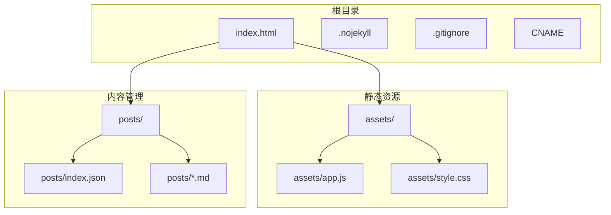
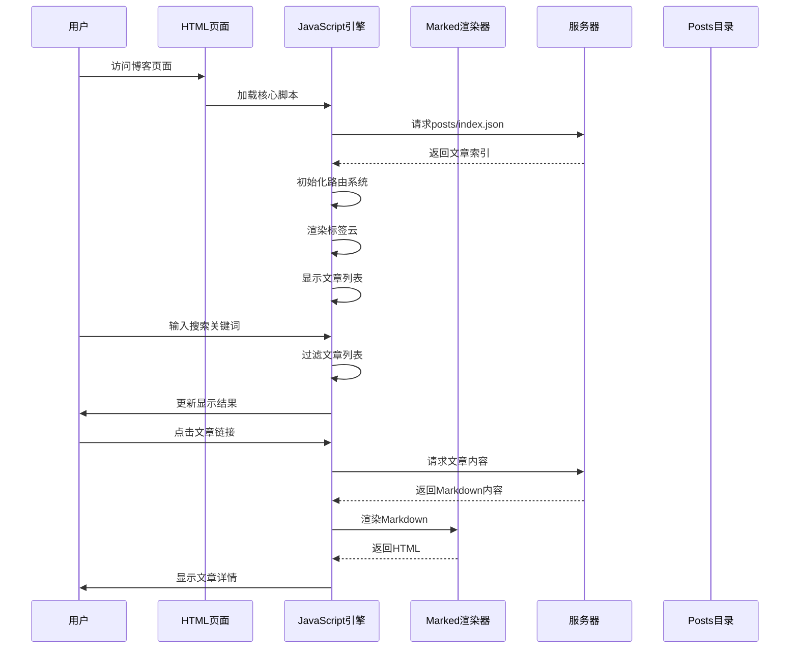
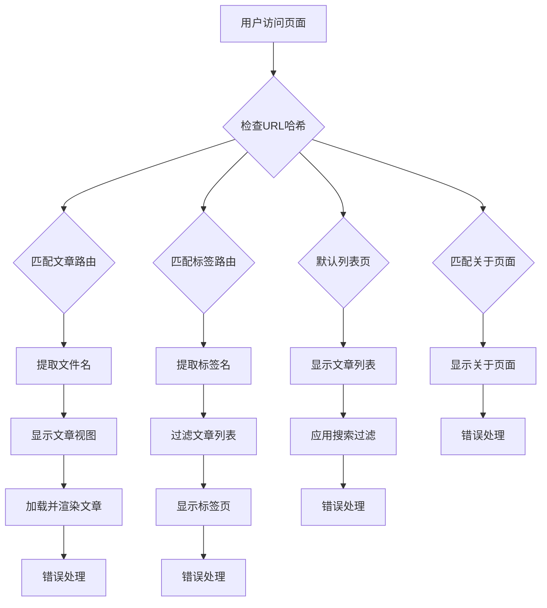
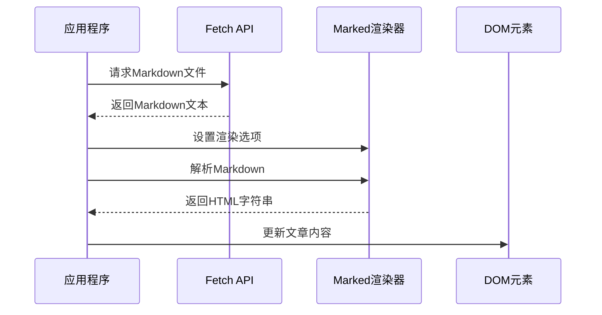
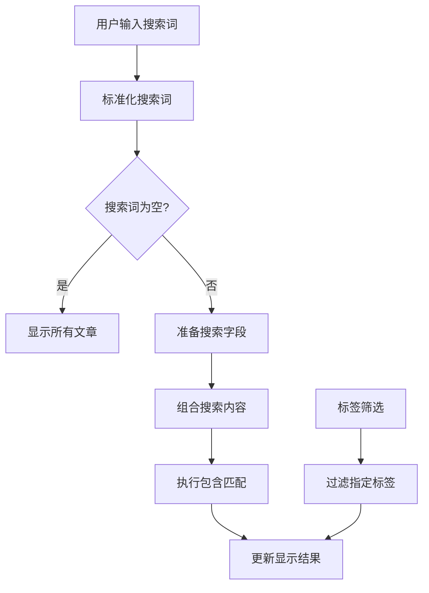
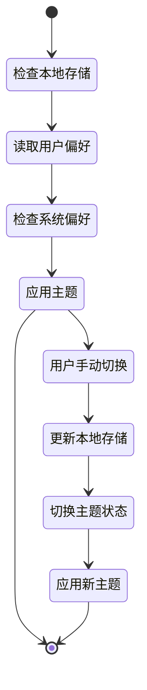
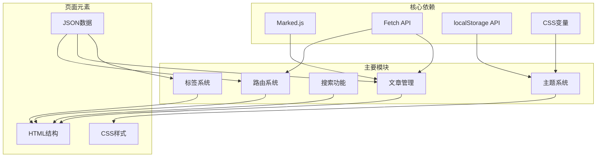

# 核心功能模块

<cite>
**本文档中引用的文件**
- [index.html](file://index.html)
- [app.js](file://assets/app.js)
- [style.css](file://assets/style.css)
- [index.json](file://posts/index.json)
- [hello.md](file://posts/2026-02-09-hello.md)
- [博客搭建过程.md](file://posts/2026-02-09-博客搭建过程.md)
</cite>

## 目录
1. [简介](#简介)
2. [项目结构](#项目结构)
3. [核心组件](#核心组件)
4. [架构概览](#架构概览)
5. [详细组件分析](#详细组件分析)
6. [依赖关系分析](#依赖关系分析)
7. [性能考虑](#性能考虑)
8. [故障排除指南](#故障排除指南)
9. [结论](#结论)

## 简介

这是一个基于纯静态文件和浏览器端渲染的无编译博客系统。该系统采用Hash路由实现单页应用体验，使用Marked.js进行Markdown渲染，提供实时搜索、标签云管理和主题切换等功能。整个系统无需构建工具，通过GitHub Pages即可实现一键发布。

## 项目结构

该项目采用极简的静态网站架构，主要包含以下文件结构：



**图表来源**
- [index.html](file://index.html#L1-L104)
- [app.js](file://assets/app.js#L1-L313)
- [style.css](file://assets/style.css#L1-L629)

**章节来源**
- [index.html](file://index.html#L1-L104)
- [app.js](file://assets/app.js#L1-L313)
- [style.css](file://assets/style.css#L1-L629)

## 核心组件

### Hash路由系统

Hash路由系统实现了基于URL哈希值的单页应用导航，支持四种主要路由：

- `#/` - 文章列表页
- `#/post/<file>` - 单篇文章页
- `#/tag/<tag>` - 标签筛选页
- `#/about` - 关于页面

路由系统通过监听`hashchange`事件实现页面切换，确保用户体验流畅且无需页面刷新。

**章节来源**
- [app.js](file://assets/app.js#L200-L230)

### 文章管理系统

文章管理系统负责从`posts/index.json`加载文章元数据，并通过异步请求获取对应的Markdown文件进行渲染。系统支持：

- 异步文章加载
- Markdown到HTML的实时转换
- 文章元数据展示（标题、日期、标签）
- 错误处理和通知机制

**章节来源**
- [app.js](file://assets/app.js#L140-L182)
- [index.json](file://posts/index.json#L1-L16)

### 搜索功能

搜索功能提供实时过滤机制，支持对文章标题、摘要、标签和文件名进行搜索：

- 实时搜索过滤（输入时自动触发）
- 多字段搜索（标题、摘要、标签、日期、文件名）
- 快捷键支持（Cmd/Ctrl+K聚焦搜索框）
- 搜索状态指示

**章节来源**
- [app.js](file://assets/app.js#L75-L83)
- [app.js](file://assets/app.js#L307-L312)

### 标签系统

标签系统实现了标签云生成功能，提供标签统计和筛选：

- 标签频率统计
- 标签云动态生成
- 标签点击跳转
- 标签页展示所有标签

**章节来源**
- [app.js](file://assets/app.js#L49-L73)
- [app.js](file://assets/app.js#L85-L138)

### 主题系统

主题系统支持亮/暗两种颜色模式的无缝切换：

- 自动检测系统偏好设置
- 手动主题切换
- 本地存储用户偏好
- CSS变量驱动的主题切换

**章节来源**
- [app.js](file://assets/app.js#L232-L253)
- [style.css](file://assets/style.css#L1-L31)

## 架构概览

系统采用前后端分离的静态架构，所有逻辑在浏览器端执行：



**图表来源**
- [index.html](file://index.html#L16-L17)
- [app.js](file://assets/app.js#L140-L182)
- [app.js](file://assets/app.js#L297-L312)

## 详细组件分析

### 路由系统实现

路由系统通过正则表达式匹配不同的URL模式，实现精确的页面导航：



**图表来源**
- [app.js](file://assets/app.js#L200-L230)

**章节来源**
- [app.js](file://assets/app.js#L200-L230)

### Markdown渲染流程

Markdown渲染采用Marked.js库，实现从源码到HTML的转换：



**图表来源**
- [app.js](file://assets/app.js#L149-L182)

**章节来源**
- [app.js](file://assets/app.js#L149-L182)

### 标签云生成算法

标签云生成算法包含数据收集、统计和渲染三个阶段：

```mermaid
flowchart TD
A[加载文章索引] --> B[遍历所有文章]
B --> C[提取标签列表]
C --> D[统计标签频率]
D --> E[排序标签频率]
E --> F[限制标签数量(前24个)]
F --> G[生成标签云HTML]
G --> H[绑定点击事件]
H --> I[导航到标签页面]
```

**图表来源**
- [app.js](file://assets/app.js#L49-L73)

**章节来源**
- [app.js](file://assets/app.js#L49-L73)

### 搜索过滤机制

搜索过滤机制支持多字段实时过滤：



**图表来源**
- [app.js](file://assets/app.js#L75-L83)

**章节来源**
- [app.js](file://assets/app.js#L75-L83)

### 主题切换系统

主题切换系统实现亮/暗模式的无缝切换：



**图表来源**
- [app.js](file://assets/app.js#L232-L253)

**章节来源**
- [app.js](file://assets/app.js#L232-L253)

## 依赖关系分析

系统各组件之间的依赖关系如下：



**图表来源**
- [index.html](file://index.html#L16-L17)
- [app.js](file://assets/app.js#L1-L313)
- [style.css](file://assets/style.css#L1-L629)

**章节来源**
- [index.html](file://index.html#L1-L104)
- [app.js](file://assets/app.js#L1-L313)
- [style.css](file://assets/style.css#L1-L629)

## 性能考虑

### 加载优化

- **缓存策略**：使用`cache: "no-store"`确保获取最新内容
- **按需加载**：仅在需要时加载文章内容
- **异步处理**：避免阻塞主线程

### 渲染优化

- **虚拟DOM**：通过innerHTML更新减少重绘
- **事件委托**：标签云点击事件使用事件委托
- **防抖处理**：搜索输入防抖处理

### 网络优化

- **CDN使用**：Marked.js通过CDN加载
- **最小化请求**：合并多个功能在一个页面中

## 故障排除指南

### 常见问题及解决方案

**文章无法加载**
- 检查`posts/index.json`格式是否正确
- 确认Markdown文件路径与索引中的文件名一致
- 查看浏览器开发者工具的网络面板

**搜索功能异常**
- 确认搜索输入框的ID为`q`
- 检查`input`事件绑定是否正常
- 验证`matchesFilter`函数逻辑

**主题切换失效**
- 检查`localStorage`是否可用
- 确认CSS变量定义完整
- 验证`data-theme`属性设置

**标签云不显示**
- 确认文章索引中包含标签数据
- 检查`collectTags`函数执行情况
- 验证标签云容器的ID为`tagCloud`

**章节来源**
- [app.js](file://assets/app.js#L30-L38)
- [app.js](file://assets/app.js#L297-L304)

## 结论

这个无编译博客系统展现了现代Web技术的强大能力，通过极简的架构实现了丰富的功能特性。系统的主要优势包括：

- **极简架构**：无需构建工具，直接部署
- **快速加载**：静态文件，响应迅速
- **功能完整**：路由、搜索、标签、主题等核心功能齐全
- **易于维护**：代码结构清晰，便于扩展

该系统为内容创作者提供了一个高效、可靠的博客解决方案，特别适合注重写作体验而非技术复杂度的用户群体。