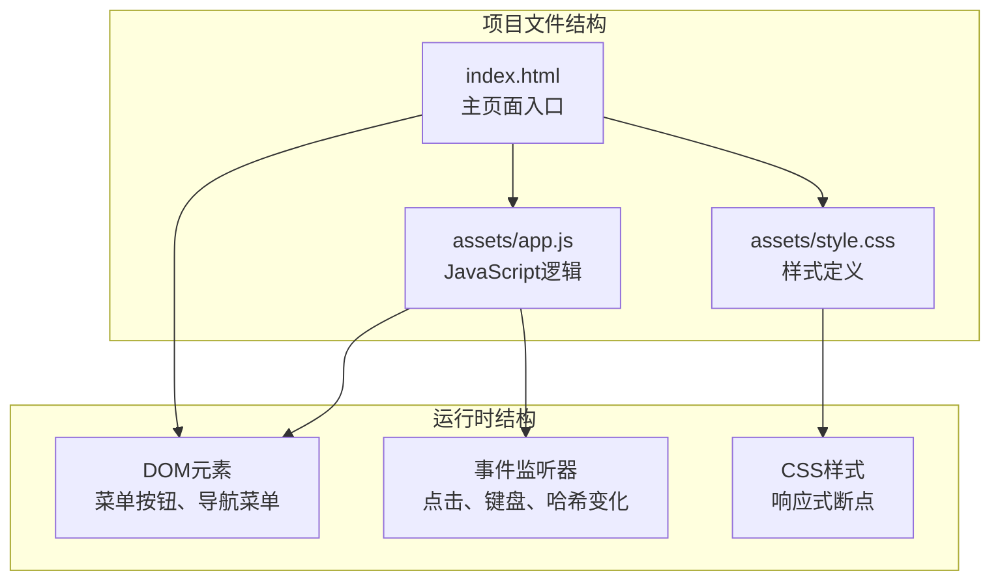
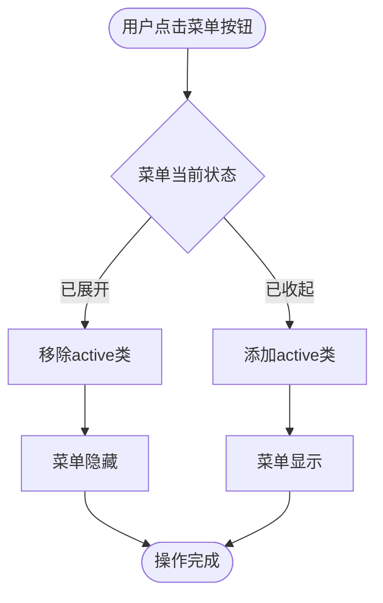
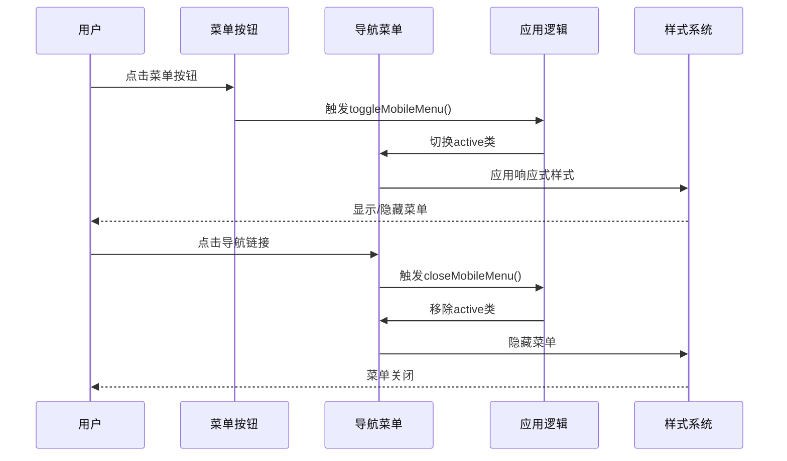
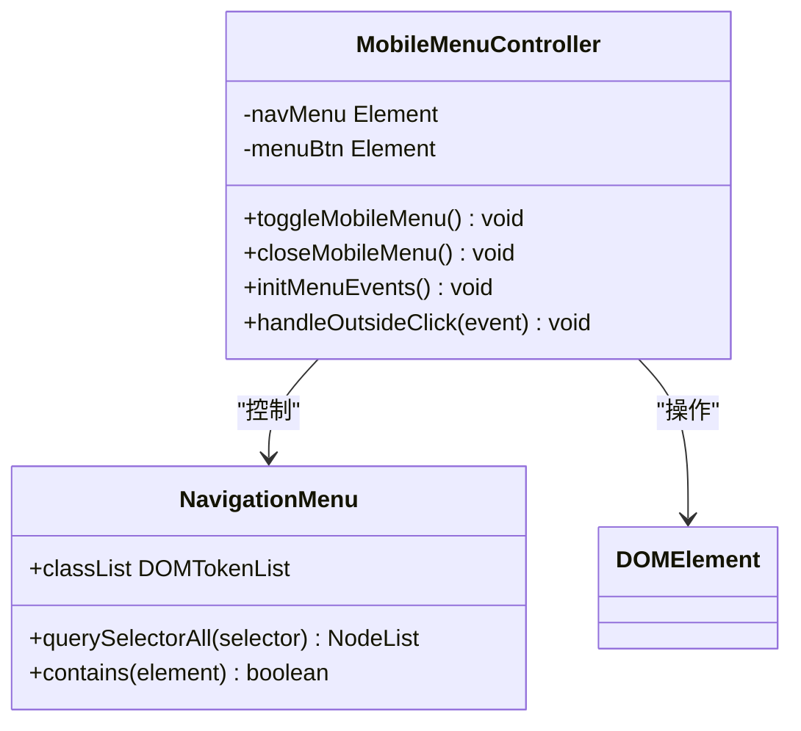
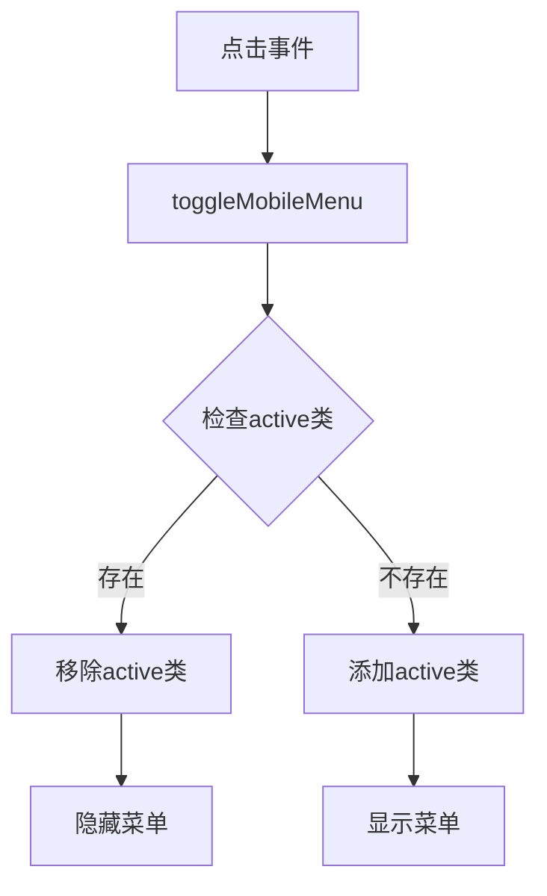
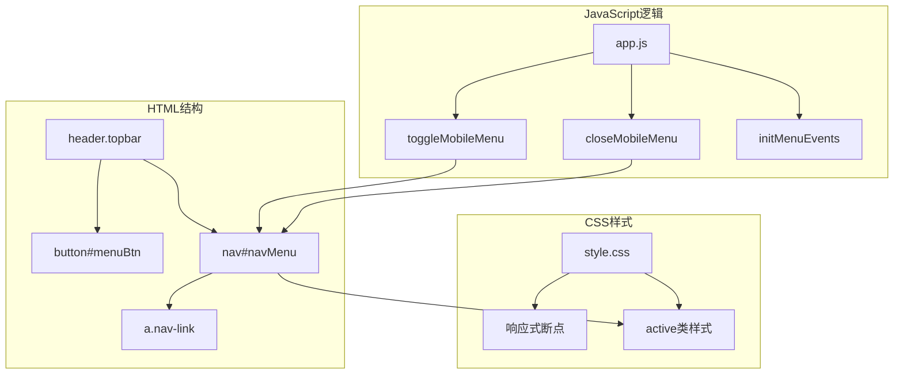

# 移动端导航

<cite>
**本文档引用的文件**
- [app.js](file://assets/app.js)
- [style.css](file://assets/style.css)
- [index.html](file://index.html)
</cite>

## 目录
1. [简介](#简介)
2. [项目结构](#项目结构)
3. [核心组件](#核心组件)
4. [架构概览](#架构概览)
5. [详细组件分析](#详细组件分析)
6. [依赖关系分析](#依赖关系分析)
7. [性能考虑](#性能考虑)
8. [故障排除指南](#故障排除指南)
9. [结论](#结论)

## 简介

本项目是一个无编译的静态博客系统，采用纯前端技术实现，包含完整的移动端导航功能。该系统实现了响应式导航设计，支持移动端触摸优化和手势支持，提供了流畅的跨平台用户体验。

系统的核心特性包括：
- 响应式导航布局，自动适配不同屏幕尺寸
- 移动端专用的汉堡菜单实现
- 智能的菜单自动关闭机制
- 触摸优化和手势支持
- 桌面端与移动端导航的统一设计原则

## 项目结构

该项目采用极简的单页面应用架构，主要由三个核心文件组成：



**图表来源**
- [index.html](file://index.html#L1-L104)
- [app.js](file://assets/app.js#L1-L313)
- [style.css](file://assets/style.css#L1-L629)

**章节来源**
- [index.html](file://index.html#L1-L104)
- [app.js](file://assets/app.js#L1-L313)
- [style.css](file://assets/style.css#L1-L629)

## 核心组件

### 导航菜单系统

系统实现了完整的移动端导航菜单，包含以下核心组件：

1. **菜单按钮** (`#menuBtn`) - 触发菜单显示/隐藏
2. **导航菜单** (`#navMenu`) - 包含所有导航链接
3. **导航链接** (`.nav-link`) - Posts、Tags、About 页面链接
4. **响应式断点** - 在768px以下自动切换到移动端模式

### 移动端菜单控制逻辑



**图表来源**
- [app.js](file://assets/app.js#L255-L262)

**章节来源**
- [app.js](file://assets/app.js#L18-L21)
- [app.js](file://assets/app.js#L255-L262)
- [style.css](file://assets/style.css#L105-L137)

## 架构概览

系统采用事件驱动的架构模式，通过DOM事件监听器实现交互逻辑：



**图表来源**
- [app.js](file://assets/app.js#L271-L286)
- [index.html](file://index.html#L27-L35)

## 详细组件分析

### 移动端菜单控制函数

#### toggleMobileMenu() 函数分析

该函数是移动端菜单的核心控制逻辑：



**图表来源**
- [app.js](file://assets/app.js#L255-L286)

**函数实现要点**：
- 使用 `classList.toggle("active")` 实现菜单状态切换
- 通过 CSS 类名控制菜单的显示/隐藏
- 支持键盘快捷键触发菜单（Cmd/Ctrl + K）

#### closeMobileMenu() 函数分析

该函数负责智能关闭菜单：

**实现特点**：
- 直接移除 `active` 类名
- 自动关闭所有打开的菜单
- 与 `toggleMobileMenu()` 形成互补

**章节来源**
- [app.js](file://assets/app.js#L255-L262)

### 事件处理机制

#### 菜单按钮事件处理



**图表来源**
- [app.js](file://assets/app.js#L271-L278)

#### 外部点击检测机制

系统实现了智能的外部点击检测，当用户点击菜单外部区域时自动关闭菜单：

**检测逻辑**：
- 监听整个文档的点击事件
- 检查点击目标是否在菜单或按钮区域内
- 如果不在区域内则调用 `closeMobileMenu()`

**章节来源**
- [app.js](file://assets/app.js#L271-L286)

### 响应式设计实现

#### 移动端断点配置

系统使用768px作为移动端断点，这是现代Web开发的标准实践：

```mermaid
graph LR
Desktop[桌面端 > 768px] --> ShowDesktop[显示完整导航]
Tablet[平板 768px以下] --> ShowMobile[显示汉堡菜单]
Phone[手机 480px以下] --> MobileOptimization[移动端优化]
subgraph "样式规则"
Breakpoint768px[@media (max-width: 768px)]
Breakpoint480px[@media (max-width: 480px)]
end
Breakpoint768px --> ShowMobile
Breakpoint480px --> MobileOptimization
```

**图表来源**
- [style.css](file://assets/style.css#L105-L137)
- [style.css](file://assets/style.css#L394-L440)

#### 移动端菜单样式设计

**关键样式特性**：
- 固定定位菜单，覆盖主要内容区域
- 毛玻璃效果背景，提升视觉层次
- 圆角设计和阴影效果
- 垂直排列的导航项，便于触摸操作

**章节来源**
- [style.css](file://assets/style.css#L105-L137)

### 触摸优化和手势支持

#### 触摸设备优化

系统针对触摸设备进行了专门优化：

**优化措施**：
- `touch-action: manipulation` - 优化触摸操作响应
- `webkit-tap-highlight-color: transparent` - 移除点击高亮效果
- 针对 `(hover: none) and (pointer: coarse)` 的媒体查询
- 放大按钮的视觉反馈和动画效果

#### 触摸交互设计

**交互特性**：
- 大尺寸点击区域（最小40x40px）
- 触摸友好的间距和布局
- 响应式字体大小调整
- 无障碍访问支持（aria-label属性）

**章节来源**
- [style.css](file://assets/style.css#L40-L48)
- [style.css](file://assets/style.css#L215-L226)
- [index.html](file://index.html#L27-L29)

### 导航链接处理

#### 链接点击处理机制

系统为所有导航链接实现了智能的点击处理：

```mermaid
sequenceDiagram
participant User as 用户
participant Link as 导航链接
participant AppJS as 应用逻辑
participant Router as 路由系统
participant Menu as 菜单系统
User->>Link : 点击导航链接
Link->>AppJS : 触发click事件
AppJS->>Menu : 调用closeMobileMenu()
Menu->>Menu : 移除active类
AppJS->>Router : 更新URL哈希
Router-->>User : 加载对应页面内容
```

**图表来源**
- [app.js](file://assets/app.js#L275-L278)

**处理流程**：
1. 用户点击导航链接
2. 触发 `closeMobileMenu()` 函数
3. 自动关闭移动端菜单
4. 正常执行页面路由跳转

**章节来源**
- [app.js](file://assets/app.js#L275-L278)

## 依赖关系分析

### 组件间依赖关系



**图表来源**
- [index.html](file://index.html#L20-L47)
- [app.js](file://assets/app.js#L18-L21)
- [style.css](file://assets/style.css#L105-L137)

### 外部依赖

系统使用了以下外部资源：

**Marked Markdown渲染器**：
- 版本：`marked.min.js`
- 功能：客户端Markdown解析和渲染
- 用途：文章内容的实时渲染

**CDN来源**：`https://cdn.jsdelivr.net/npm/marked/marked.min.js`

**章节来源**
- [index.html](file://index.html#L17)
- [app.js](file://assets/app.js#L149-L182)

## 性能考虑

### 优化策略

#### 内存管理
- 使用事件委托减少内存占用
- 及时清理事件监听器
- 避免不必要的DOM操作

#### 渲染性能
- CSS类切换比直接修改样式属性更高效
- 使用 `transform` 和 `opacity` 属性进行动画
- 避免强制同步布局

#### 网络优化
- 单页面应用减少页面跳转开销
- CDN加速外部资源加载
- 缓存策略优化（`cache: "no-store"`）

### 性能监控建议

**推荐的监控指标**：
- 首屏渲染时间
- 交互延迟
- 内存使用情况
- 电池消耗

## 故障排除指南

### 常见问题及解决方案

#### 菜单无法正常显示

**可能原因**：
- JavaScript未正确加载
- DOM元素ID不匹配
- CSS样式冲突

**解决步骤**：
1. 检查浏览器控制台是否有JavaScript错误
2. 验证HTML中元素ID是否正确
3. 确认CSS文件正确加载
4. 检查是否有其他CSS规则覆盖样式

#### 点击无效问题

**可能原因**：
- 事件监听器未正确绑定
- CSS `z-index` 层级问题
- 触摸事件被阻止

**排查方法**：
1. 使用浏览器开发者工具检查事件监听器
2. 验证元素的 `position` 和 `z-index` 设置
3. 检查是否有 `preventDefault()` 或 `stopPropagation()` 调用

#### 响应式问题

**常见症状**：
- 菜单在桌面端显示异常
- 移动端断点不生效
- 字体大小不符合预期

**解决方案**：
1. 检查 `viewport` 元标签配置
2. 验证媒体查询断点设置
3. 确认CSS优先级正确

**章节来源**
- [app.js](file://assets/app.js#L271-L286)
- [style.css](file://assets/style.css#L105-L137)

## 结论

本移动端导航系统展现了现代Web开发的最佳实践，通过简洁而高效的代码实现了完整的响应式导航功能。系统的主要优势包括：

### 技术亮点

1. **简洁的实现**：仅使用原生JavaScript和CSS，无需构建工具
2. **优秀的用户体验**：针对触摸设备的专门优化
3. **响应式设计**：智能适配各种屏幕尺寸
4. **可维护性**：清晰的代码结构和注释

### 设计原则

1. **渐进增强**：基础功能在所有设备上可用
2. **性能优先**：最小化资源加载和DOM操作
3. **无障碍访问**：支持键盘导航和屏幕阅读器
4. **一致性**：桌面端和移动端体验统一

### 改进建议

1. **手势支持**：可以考虑添加滑动手势支持
2. **动画优化**：使用CSS动画替代JavaScript动画
3. **离线支持**：添加Service Worker实现离线缓存
4. **SEO优化**：考虑服务端渲染以改善SEO表现

该系统为类似项目提供了优秀的参考模板，展示了如何在保持代码简洁的同时实现复杂的交互功能。