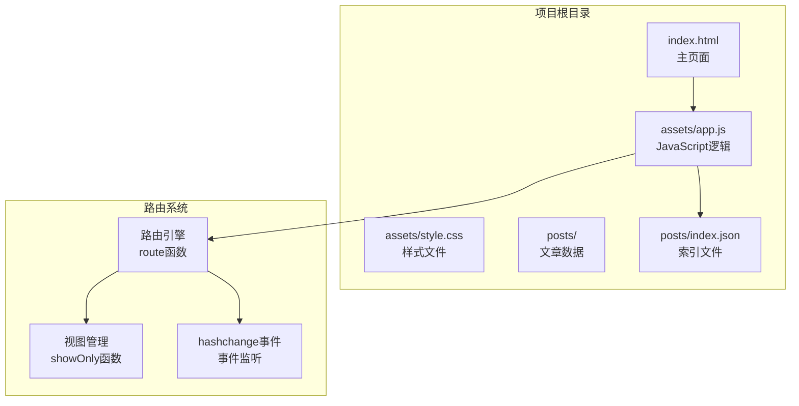
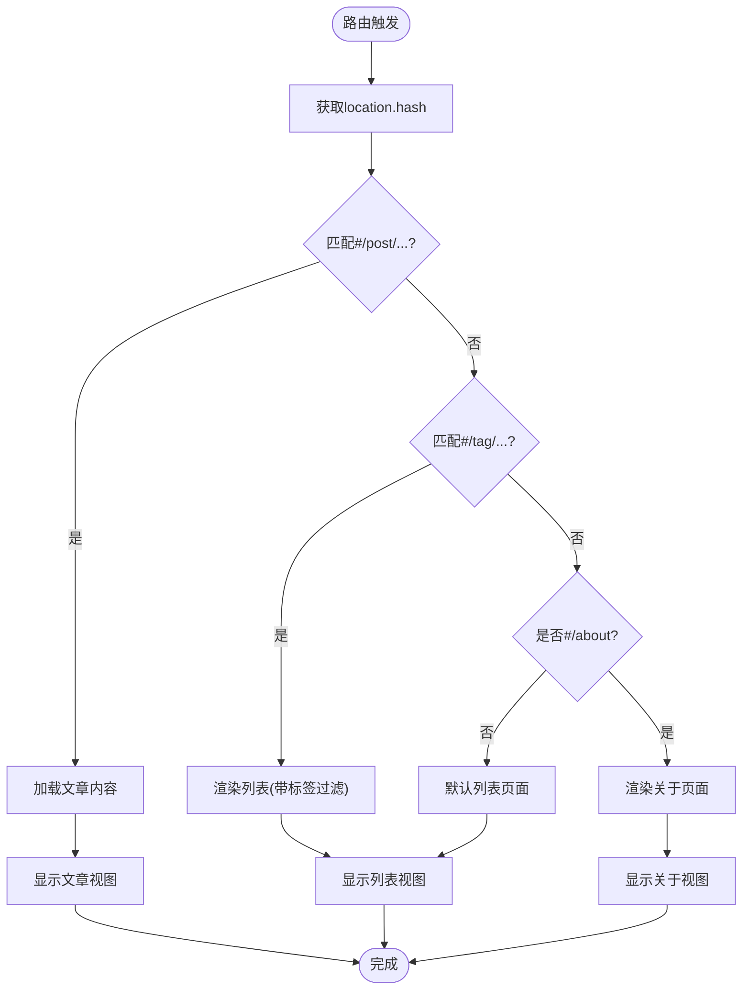
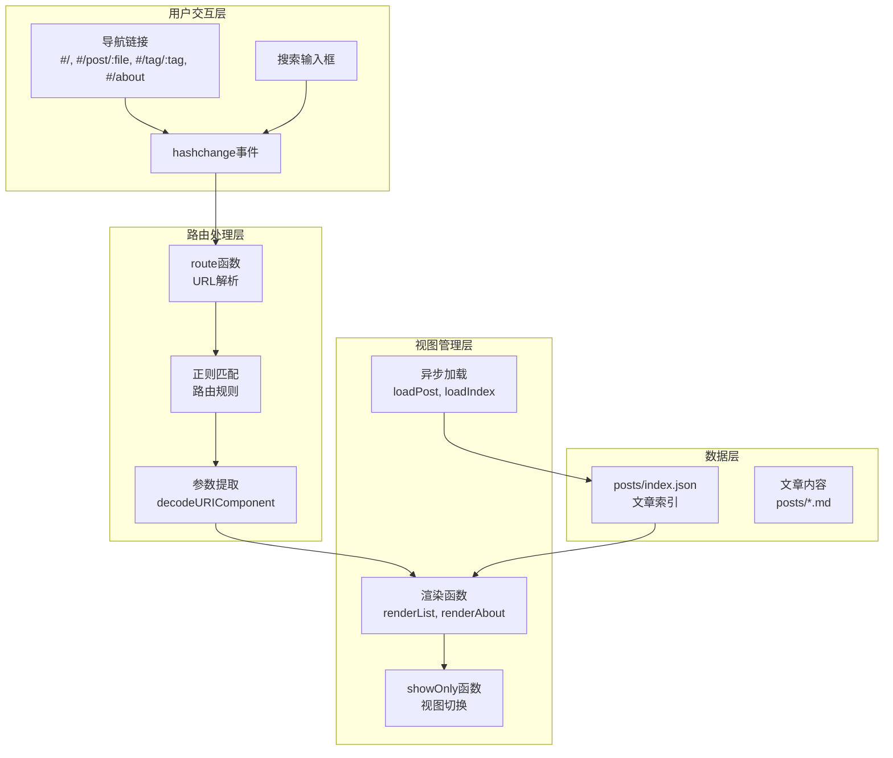
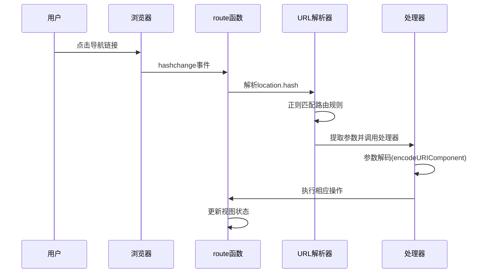
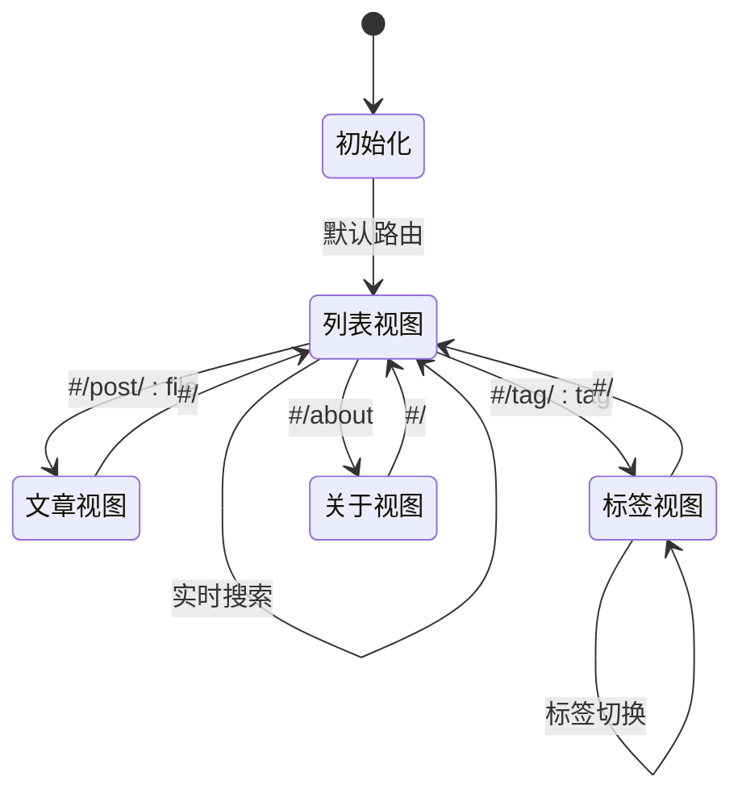
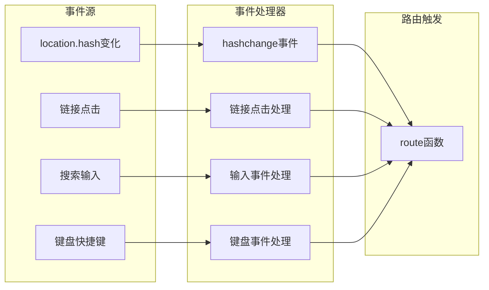
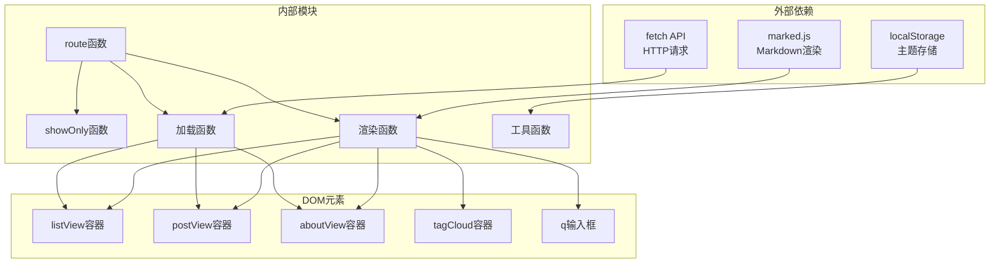

# 路由系统

<cite>
**本文档引用的文件**
- [app.js](file://assets/app.js)
- [index.html](file://index.html)
- [style.css](file://assets/style.css)
- [index.json](file://posts/index.json)
</cite>

## 目录
1. [简介](#简介)
2. [项目结构](#项目结构)
3. [核心组件](#核心组件)
4. [架构概览](#架构概览)
5. [详细组件分析](#详细组件分析)
6. [依赖关系分析](#依赖关系分析)
7. [性能考虑](#性能考虑)
8. [故障排除指南](#故障排除指南)
9. [结论](#结论)

## 简介

这是一个基于Hash的单页应用路由系统，专为静态Markdown博客设计。该系统实现了无编译的前端路由，通过URL哈希值(#/...)来控制页面内容的切换，提供了文章列表、文章详情、标签云和关于页面等功能。

路由系统的核心特点：
- 基于浏览器原生的hashchange事件
- 支持四种路由规则：#/(默认列表)、#/post/:file(文章详情)、#/tag/:tag(标签过滤)、#/about(关于页面)
- 完整的参数编码/解码机制
- 响应式页面切换和状态管理

## 项目结构

该项目采用极简的单页应用架构，主要文件组织如下：

**图表来源**
- [index.html](file://index.html#L1-L104)
- [app.js](file://assets/app.js#L1-L313)

**章节来源**
- [index.html](file://index.html#L1-L104)
- [app.js](file://assets/app.js#L1-L313)

## 核心组件

### 路由引擎 (route函数)

路由系统的核心是`route()`函数，它负责解析URL哈希并执行相应的页面切换逻辑：

**图表来源**
- [app.js](file://assets/app.js#L200-L230)

### 视图管理系统

系统使用三个主要视图容器：
- `listView`: 文章列表和标签云视图
- `postView`: 文章详情视图  
- `aboutView`: 关于页面视图

视图切换通过`showOnly()`函数实现，确保同一时间只显示一个视图。

**章节来源**
- [app.js](file://assets/app.js#L10-L21)
- [app.js](file://assets/app.js#L40-L43)
- [app.js](file://assets/app.js#L200-L230)

## 架构概览

路由系统采用事件驱动的架构模式，通过以下关键组件协同工作：

**图表来源**
- [app.js](file://assets/app.js#L200-L230)
- [app.js](file://assets/app.js#L265-L313)

## 详细组件分析

### 路由规则定义

系统支持四种标准路由规则：

| 路由规则 | URL格式 | 功能描述 | 参数类型 |
|---------|---------|----------|----------|
| 默认列表 | `#/` | 显示所有文章列表 | 无 |
| 文章详情 | `#/post/:file` | 显示指定文章内容 | 文件名参数 |
| 标签过滤 | `#/tag/:tag` | 显示按标签过滤的文章 | 标签名参数 |
| 关于页面 | `#/about` | 显示关于信息 | 无 |

### URL解析机制

路由解析通过正则表达式实现精确匹配：

**图表来源**
- [app.js](file://assets/app.js#L200-L230)

### 页面切换逻辑

页面切换通过CSS类控制实现，使用`hidden`类来显示/隐藏视图：

**图表来源**
- [app.js](file://assets/app.js#L40-L43)

### 事件处理机制

系统监听多个事件源来触发路由处理：

**图表来源**
- [app.js](file://assets/app.js#L306-L313)

**章节来源**
- [app.js](file://assets/app.js#L200-L230)
- [app.js](file://assets/app.js#L306-L313)

## 依赖关系分析

路由系统的主要依赖关系如下：

**图表来源**
- [app.js](file://assets/app.js#L140-L182)
- [app.js](file://assets/app.js#L265-L313)

**章节来源**
- [app.js](file://assets/app.js#L140-L182)
- [app.js](file://assets/app.js#L265-L313)

## 性能考虑

### 缓存策略
- 使用`cache: "no-store"`强制绕过缓存，确保内容实时性
- 文章内容按需加载，避免一次性加载所有资源

### 内存管理
- 使用`hidden`类而非DOM删除来切换视图，减少DOM操作开销
- 合理的事件监听器管理，避免内存泄漏

### 渲染优化
- 搜索功能仅在相关页面启用，减少不必要的重渲染
- 标签云预渲染，提高用户体验

## 故障排除指南

### 常见问题及解决方案

| 问题类型 | 症状 | 可能原因 | 解决方案 |
|---------|------|----------|----------|
| 路由不生效 | 点击链接无反应 | hashchange事件未正确绑定 | 检查`window.addEventListener("hashchange", route)` |
| 文章加载失败 | 显示"文章加载失败"错误 | 网络请求或文件路径错误 | 验证`posts/index.json`中的文件路径 |
| 标签过滤无效 | 标签筛选无结果 | 标签名编码/解码问题 | 检查`decodeURIComponent`和`encodeURIComponent`使用 |
| 主题切换异常 | 主题切换不持久 | localStorage访问失败 | 验证浏览器localStorage权限 |

### 调试技巧

1. **检查路由状态**：在浏览器开发者工具中监控`location.hash`的变化
2. **验证数据结构**：确认`posts/index.json`的JSON格式正确
3. **测试参数编码**：验证特殊字符在URL中的编码和解码
4. **监控事件流**：使用断点调试hashchange事件的触发流程

**章节来源**
- [app.js](file://assets/app.js#L30-L38)
- [app.js](file://assets/app.js#L200-L230)

## 结论

这个基于Hash的单页应用路由系统展现了现代前端开发的最佳实践：

### 技术优势
- **轻量级架构**：无需构建步骤，直接运行在浏览器中
- **响应式设计**：完美适配各种设备尺寸
- **用户体验**：平滑的页面切换和实时搜索功能
- **可扩展性**：清晰的模块化设计便于功能扩展

### 核心特性总结
- 完整的四路由规则支持
- 健壮的参数处理机制
- 优雅的错误处理和通知系统
- 丰富的交互功能（主题切换、移动端菜单、键盘快捷键）

### 扩展建议
如需添加新路由规则，可以按照以下模式扩展：

1. 在`route()`函数中添加新的正则匹配逻辑
2. 创建对应的渲染函数
3. 在HTML中添加导航链接
4. 确保参数的正确编码/解码
5. 添加适当的错误处理

该路由系统为静态博客提供了一个高效、可靠且用户友好的导航解决方案。