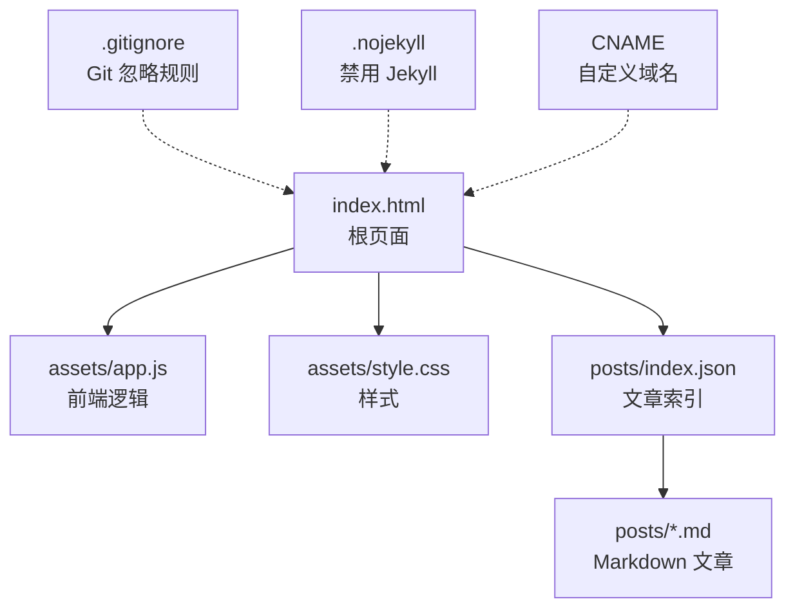
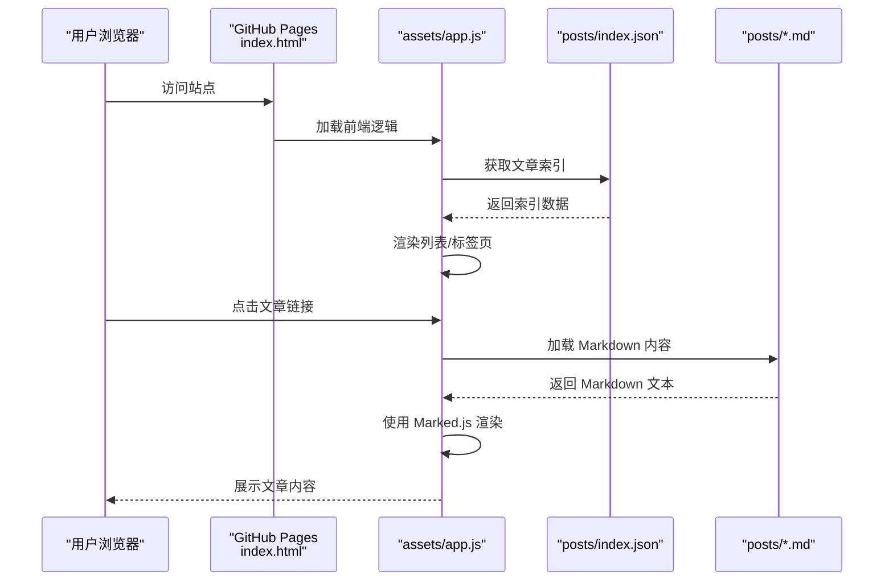
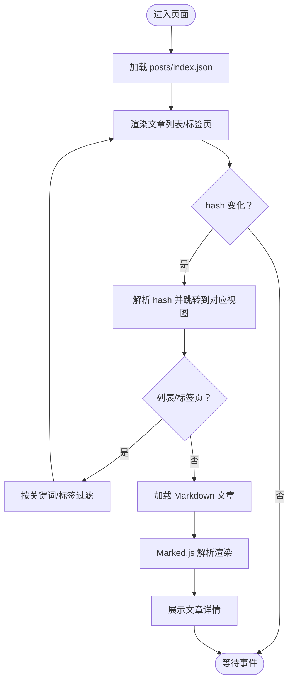
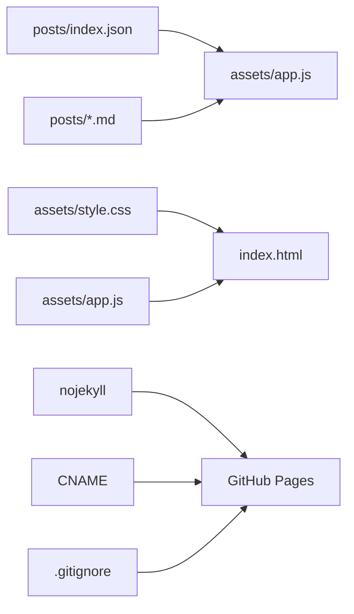

# 部署与配置

<cite>
**本文档引用的文件**
- [index.html](file://index.html)
- [.gitignore](file://.gitignore)
- [.nojekyll](file://.nojekyll)
- [CNAME](file://CNAME)
- [posts/index.json](file://posts/index.json)
- [assets/app.js](file://assets/app.js)
- [assets/style.css](file://assets/style.css)
- [posts/2026-02-09-hello.md](file://posts/2026-02-09-hello.md)
- [posts/2026-02-09-博客搭建过程.md](file://posts/2026-02-09-博客搭建过程.md)
</cite>

## 目录
1. [简介](#简介)
2. [项目结构](#项目结构)
3. [核心组件](#核心组件)
4. [架构总览](#架构总览)
5. [详细组件分析](#详细组件分析)
6. [依赖关系分析](#依赖关系分析)
7. [性能考虑](#性能考虑)
8. [故障排除指南](#故障排除指南)
9. [结论](#结论)
10. [附录](#附录)

## 简介
本指南面向希望使用 GitHub Pages 部署静态博客的开发者，围绕当前仓库的无编译架构进行部署与配置说明。该博客采用纯静态 HTML/CSS/JS，通过浏览器端 Markdown 解析与动态路由实现内容渲染，配合 posts 目录下的 Markdown 文件与索引 JSON 实现内容管理。部署目标为 GitHub Pages，支持自定义域名与基础 SEO 优化。

## 项目结构
仓库采用扁平化的静态站点结构，核心文件与目录如下：
- 根目录入口：index.html
- 配置文件：.gitignore、.nojekyll、CNAME
- 内容索引：posts/index.json
- 文章目录：posts/*.md
- 静态资源：assets/app.js、assets/style.css
- 示例文章与搭建说明：posts/2026-02-09-hello.md、posts/2026-02-09-博客搭建过程.md

图表来源
- [index.html](file://index.html#L1-L104)
- [assets/app.js](file://assets/app.js#L1-L313)
- [assets/style.css](file://assets/style.css#L1-L629)
- [posts/index.json](file://posts/index.json#L1-L16)
- [.gitignore](file://.gitignore#L1-L2)
- [.nojekyll](file://.nojekyll#L1-L1)
- [CNAME](file://CNAME#L1-L1)

章节来源
- [index.html](file://index.html#L1-L104)
- [posts/index.json](file://posts/index.json#L1-L16)
- [.gitignore](file://.gitignore#L1-L2)
- [.nojekyll](file://.nojekyll#L1-L1)
- [CNAME](file://CNAME#L1-L1)

## 核心组件
- 根页面 index.html：定义页面结构、引入样式与脚本、提供导航与内容区域。
- 前端逻辑 assets/app.js：负责路由、文章加载与渲染、搜索、标签云、主题切换、移动端菜单等。
- 样式 assets/style.css：提供深浅主题、响应式布局、UI 组件样式与 Markdown 渲染样式。
- 内容索引 posts/index.json：记录文章元数据（文件名、标题、日期、标签、摘要）。
- 文章 posts/*.md：Markdown 文章内容，按约定命名与组织。
- 配置文件：.gitignore 控制提交忽略；.nojekyll 允许使用下划线前缀目录；CNAME 绑定自定义域名。

章节来源
- [index.html](file://index.html#L1-L104)
- [assets/app.js](file://assets/app.js#L1-L313)
- [assets/style.css](file://assets/style.css#L1-L629)
- [posts/index.json](file://posts/index.json#L1-L16)
- [posts/2026-02-09-hello.md](file://posts/2026-02-09-hello.md#L1-L8)

## 架构总览
该博客采用“静态文件 + 浏览器端渲染”的无编译架构：
- GitHub Pages 作为托管平台，直接发布根目录静态文件。
- 前端通过 app.js 异步加载 posts/index.json 与具体 Markdown 文件，使用 Marked.js 渲染 Markdown。
- 路由基于 URL hash 实现 SPA 导航，支持文章列表、文章详情、标签筛选、关于页面。
- 自定义域名通过 CNAME 文件启用，.nojekyll 确保 GitHub Pages 不对下划线前缀目录进行特殊处理。

图表来源
- [index.html](file://index.html#L1-L104)
- [assets/app.js](file://assets/app.js#L140-L182)
- [posts/index.json](file://posts/index.json#L1-L16)

## 详细组件分析

### 根页面与前端逻辑
- 根页面 index.html 定义了头部导航、侧边栏、内容区与页脚，并引入样式与脚本。
- 前端逻辑 app.js 实现：
  - 路由系统：根据 hash 切换到列表、文章详情、标签页或关于页。
  - 文章加载：异步请求 posts/index.json 与对应 Markdown 文件，使用 Marked.js 渲染。
  - 搜索与过滤：基于标题、摘要、标签、日期、文件名进行实时过滤。
  - 标签云：统计标签频次并渲染交互式标签云。
  - 主题切换：支持亮/暗主题，优先使用系统偏好并在本地存储用户选择。
  - 移动端菜单：响应式菜单与点击外部关闭逻辑。
  - 错误提示：网络或解析失败时显示通知。

图表来源
- [assets/app.js](file://assets/app.js#L200-L230)
- [assets/app.js](file://assets/app.js#L140-L182)
- [assets/app.js](file://assets/app.js#L75-L83)

章节来源
- [index.html](file://index.html#L1-L104)
- [assets/app.js](file://assets/app.js#L1-L313)

### 样式与响应式设计
- 样式文件提供深浅主题变量，通过 :root 与 [data-theme="light"] 控制主题切换。
- 响应式布局在桌面端采用双栏，在平板与手机端切换为单栏，并针对触摸设备优化交互。
- Markdown 渲染样式覆盖标题、段落、代码块、引用块等元素，确保阅读体验一致。

章节来源
- [assets/style.css](file://assets/style.css#L1-L629)

### 内容索引与文章管理
- posts/index.json 以数组形式记录每篇文章的元数据，前端据此渲染列表与标签页。
- 文章文件按约定命名（例如：YYYY-MM-DD-title.md），与索引中的 file 字段一一对应。
- 新增文章时，需同步更新索引文件并提交到仓库。

章节来源
- [posts/index.json](file://posts/index.json#L1-L16)
- [posts/2026-02-09-hello.md](file://posts/2026-02-09-hello.md#L1-L8)

### 配置文件与部署要点
- .gitignore：忽略系统临时文件，避免无关文件进入仓库。
- .nojekyll：空文件，用于禁用 GitHub Pages 的 Jekyll 构建，允许使用下划线前缀目录。
- CNAME：写入自定义域名，GitHub Pages 会自动启用该域名。

章节来源
- [.gitignore](file://.gitignore#L1-L2)
- [.nojekyll](file://.nojekyll#L1-L1)
- [CNAME](file://CNAME#L1-L1)

## 依赖关系分析
- index.html 依赖 assets/style.css 与 assets/app.js。
- app.js 依赖 posts/index.json 与 posts/*.md。
- GitHub Pages 依赖 .nojekyll 与 CNAME（若使用自定义域名）。
- .gitignore 影响仓库提交内容，间接影响部署产物。

图表来源
- [assets/app.js](file://assets/app.js#L140-L182)
- [posts/index.json](file://posts/index.json#L1-L16)
- [CNAME](file://CNAME#L1-L1)
- [.nojekyll](file://.nojekyll#L1-L1)
- [.gitignore](file://.gitignore#L1-L2)

章节来源
- [assets/app.js](file://assets/app.js#L1-L313)
- [posts/index.json](file://posts/index.json#L1-L16)
- [CNAME](file://CNAME#L1-L1)
- [.nojekyll](file://.nojekyll#L1-L1)
- [.gitignore](file://.gitignore#L1-L2)

## 性能考虑
- 静态资源缓存：浏览器默认缓存静态文件，建议通过 CDN 或 GitHub Pages 的缓存策略提升访问速度。
- 资源体积控制：减少不必要的样式与脚本，合并与压缩静态资源可进一步优化加载时间。
- 渲染策略：前端一次性加载索引与文章，建议控制文章数量与大小，避免过长渲染时间。
- 图片优化：如需图片资源，建议使用现代格式（WebP）与合适的尺寸，减少带宽占用。
- 预渲染与懒加载：对于大量文章，可考虑服务端预渲染或按需懒加载，降低首屏压力。

## 故障排除指南
- 页面空白或报错
  - 检查 posts/index.json 是否存在且格式正确。
  - 确认文章文件路径与索引中的 file 字段一致。
  - 查看浏览器控制台是否存在网络错误或脚本异常。
- Markdown 未渲染
  - 确认 Marked.js 脚本已正确加载。
  - 检查文章内容是否包含语法错误。
- 主题切换无效
  - 检查 data-theme 属性与本地存储是否被意外修改。
  - 确认 :root 与 [data-theme="light"] 的主题变量定义正常。
- 自定义域名不生效
  - 确认 CNAME 文件内容为有效域名。
  - 检查 DNS 解析与 GitHub Pages 的自定义域名设置。
- GitHub Pages 无法识别
  - 确认 .nojekyll 文件存在且为空。
  - 检查仓库设置中 Pages 的分支与目录配置。

章节来源
- [assets/app.js](file://assets/app.js#L300-L304)
- [assets/app.js](file://assets/app.js#L232-L253)
- [CNAME](file://CNAME#L1-L1)
- [.nojekyll](file://.nojekyll#L1-L1)

## 结论
本仓库采用无编译的静态博客架构，通过 GitHub Pages 实现一键发布与自定义域名绑定。借助 posts/index.json 与 Markdown 文件的约定式管理，配合前端路由与渲染逻辑，可快速迭代内容。建议在生产环境中关注资源体积、渲染性能与域名配置，以获得更佳的用户体验。

## 附录

### GitHub Pages 部署步骤
- 仓库设置
  - 在 GitHub 上创建仓库，启用 Pages（Settings → Pages）。
  - 选择分支（通常为 main）与目录（根目录或 docs）。
- 分支与目录
  - 若使用根目录发布，确保根目录包含 index.html 与相关资源。
  - 若使用 docs 目录，将构建产物放入 docs。
- 自定义域名绑定
  - 在仓库根目录创建 CNAME 文件，写入自定义域名。
  - 在域名提供商处配置 CNAME 记录指向 github.io。
- .nojekyll 作用
  - 空文件，用于禁用 Jekyll 构建，允许使用下划线前缀目录。
- .gitignore 配置
  - 忽略系统临时文件与 IDE 生成文件，避免污染仓库。

章节来源
- [CNAME](file://CNAME#L1-L1)
- [.nojekyll](file://.nojekyll#L1-L1)
- [.gitignore](file://.gitignore#L1-L2)

### CI/CD 流程建议（概念性）
- 自动化部署
  - 推送至 main 分支后，GitHub Actions 可触发构建与部署（如需构建流程）。
  - 对于纯静态站点，可直接使用 Pages 自动发布。
- 构建触发器
  - 基于分支推送、PR 合并或手动触发。
- 版本管理
  - 使用标签标记发布版本，便于回滚与审计。
- 高级配置（概念性）
  - 域名与 SSL：GitHub Pages 默认启用 HTTPS，自定义域名需正确配置 CNAME。
  - SEO 优化：在 HTML 头部添加描述、关键词与 Open Graph 标签（需自行扩展）。
  - 性能优化：CDN 加速、资源压缩、缓存策略与图片优化。

[本节为通用实践说明，不直接分析具体文件，故无章节来源]