# 项目概述

<cite>
**本文档中引用的文件**
- [index.html](file://index.html)
- [app.js](file://assets/app.js)
- [style.css](file://assets/style.css)
- [index.json](file://posts/index.json)
- [hello.md](file://posts/2026-02-09-hello.md)
- [博客搭建过程.md](file://posts/2026-02-09-博客搭建过程.md)
- [.nojekyll](file://.nojekyll)
- [CNAME](file://CNAME)
</cite>

## 目录
1. [项目简介](#项目简介)
2. [核心价值主张](#核心价值主张)
3. [技术架构概览](#技术架构概览)
4. [项目结构分析](#项目结构分析)
5. [核心功能特性](#核心功能特性)
6. [目标用户群体](#目标用户群体)
7. [使用场景](#使用场景)
8. [部署与托管](#部署与托管)
9. [性能与优化](#性能与优化)
10. [总结](#总结)

## 项目简介

这是一个基于纯前端技术构建的静态博客系统，采用"无编译"架构设计，实现了从内容创作到发布的完整自动化流程。该项目的核心理念是让创作者专注于内容本身，而将技术细节完全交给浏览器和GitHub Pages处理。

该博客系统通过浏览器端的JavaScript引擎，在客户端完成Markdown文件的解析和渲染，配合GitHub Pages的自动部署功能，实现了真正的"写完即发布"工作流。整个系统不依赖任何服务端渲染或构建工具，所有内容都以静态文件的形式存在，确保了最佳的加载性能和可靠性。

## 核心价值主张

### 1. 无需编译的Markdown博客系统
- **纯前端渲染**：使用Marked.js在浏览器端解析和渲染Markdown内容
- **即时预览**：修改内容后无需重新构建，直接刷新即可看到效果
- **AI友好**：支持AI工具直接编辑Markdown文件，实现智能化内容创作

### 2. GitHub Pages托管优势
- **零配置部署**：通过GitHub Pages自动托管和发布
- **全球CDN加速**：享受GitHub Pages提供的全球内容分发网络
- **版本控制集成**：与Git版本控制系统无缝集成，便于内容管理和回溯

### 3. 简洁高效的开发体验
- **极简架构**：仅包含HTML、CSS、JavaScript和Markdown文件
- **快速迭代**：支持热更新和实时预览
- **低维护成本**：无需服务器维护和依赖管理

## 技术架构概览

### 整体架构设计

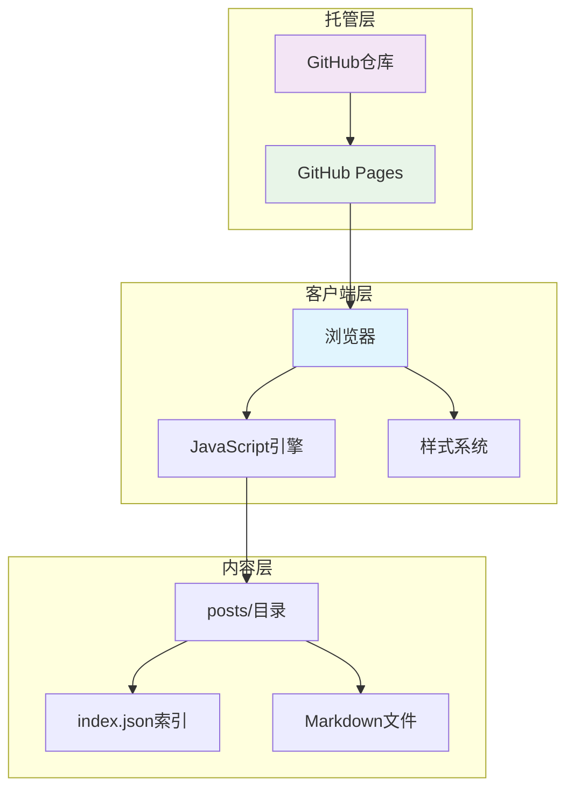

**图表来源**
- [index.html](file://index.html#L1-L104)
- [app.js](file://assets/app.js#L1-L313)
- [style.css](file://assets/style.css#L1-L629)

### 单页应用架构

该系统采用单页应用(SPA)设计，通过Hash路由实现页面切换，避免了传统多页面应用的刷新问题：

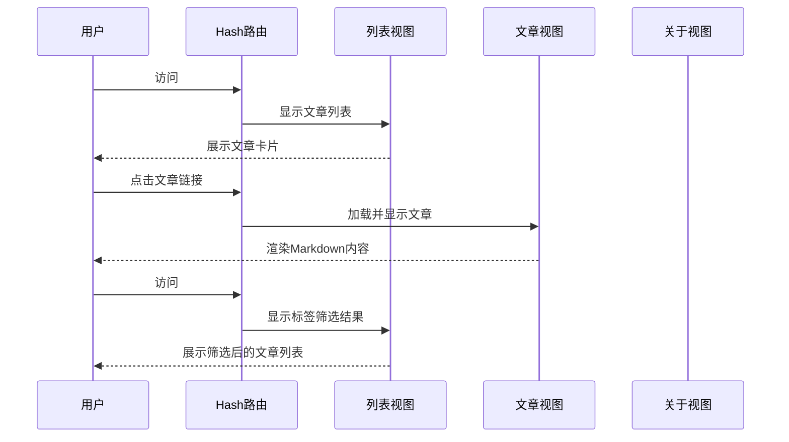

**图表来源**
- [app.js](file://assets/app.js#L200-L230)

### Markdown渲染机制

系统采用客户端Markdown渲染策略，通过Marked.js库实现高质量的Markdown解析：

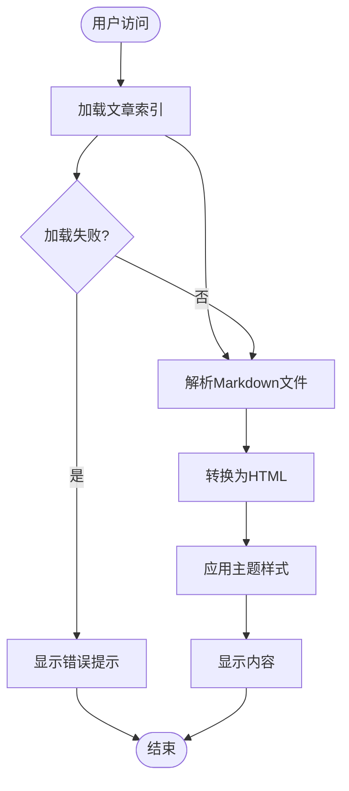

**图表来源**
- [app.js](file://assets/app.js#L140-L182)
- [index.html](file://index.html#L16-L17)

## 项目结构分析

### 文件组织结构

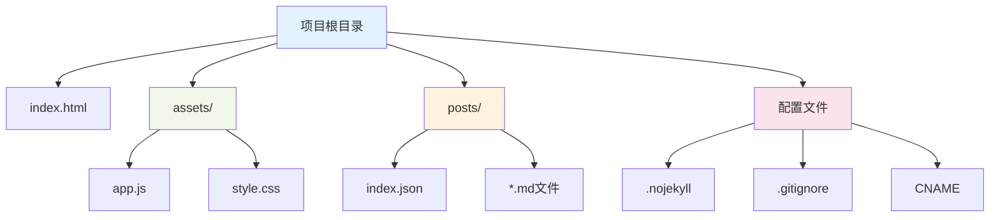

**图表来源**
- [index.html](file://index.html#L1-L104)
- [app.js](file://assets/app.js#L1-L313)
- [style.css](file://assets/style.css#L1-L629)
- [index.json](file://posts/index.json#L1-L16)

### 核心文件职责

| 文件 | 类型 | 主要职责 | 关键特性 |
|------|------|----------|----------|
| index.html | HTML模板 | 页面结构和基础配置 | Hash路由、主题配置、移动端优化 |
| assets/app.js | JavaScript | 核心业务逻辑 | 路由系统、Markdown渲染、搜索功能 |
| assets/style.css | CSS样式 | 视觉设计和响应式布局 | 暗色主题、动画效果、移动端适配 |
| posts/index.json | 数据索引 | 文章元数据管理 | 结构化数据、排序规则 |
| posts/*.md | Markdown内容 | 文章内容存储 | 纯文本格式、易于编辑 |

**章节来源**
- [index.html](file://index.html#L1-L104)
- [app.js](file://assets/app.js#L1-L313)
- [style.css](file://assets/style.css#L1-L629)
- [index.json](file://posts/index.json#L1-L16)

## 核心功能特性

### 1. 智能路由系统

系统实现了基于Hash的单页应用路由，支持四种主要页面类型：

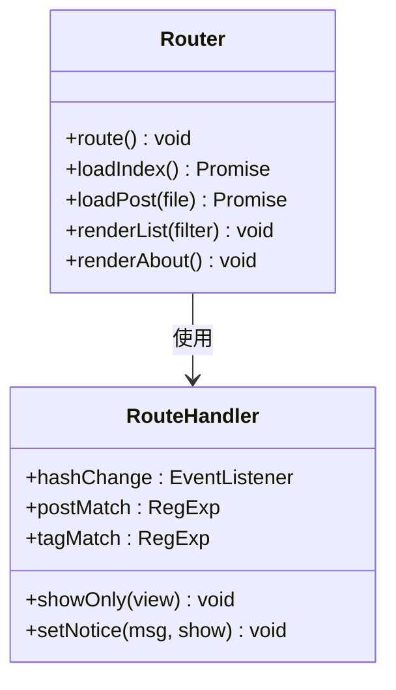

**图表来源**
- [app.js](file://assets/app.js#L200-L230)

### 2. 实时搜索与过滤

系统提供了强大的全文搜索功能，支持按标题、标签、摘要进行实时过滤：

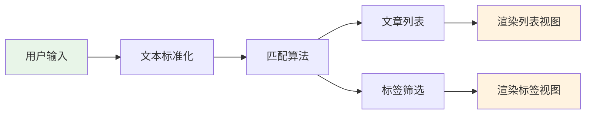

**图表来源**
- [app.js](file://assets/app.js#L75-L83)

### 3. 标签云系统

标签云功能提供了直观的标签浏览和筛选体验：

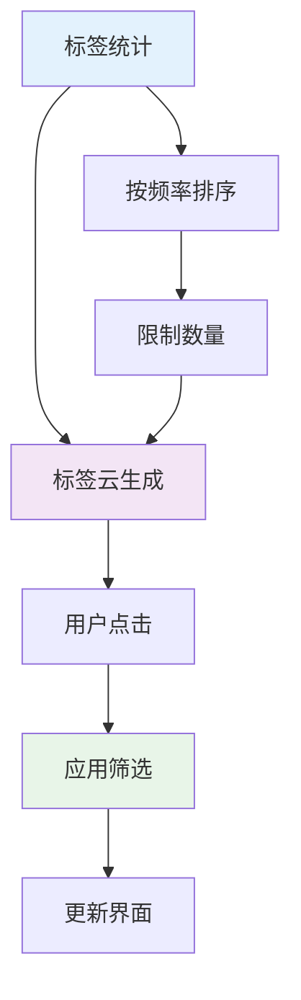

**图表来源**
- [app.js](file://assets/app.js#L49-L73)

### 4. 主题切换机制

系统支持亮/暗两种主题模式，具备自动检测和手动切换功能：

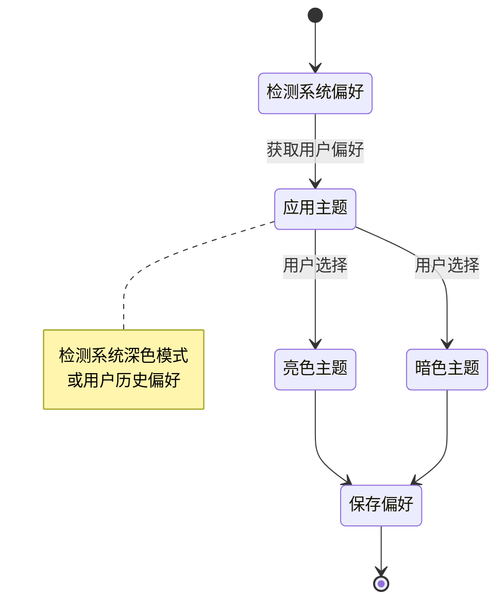

**图表来源**
- [app.js](file://assets/app.js#L232-L253)

**章节来源**
- [app.js](file://assets/app.js#L1-L313)
- [style.css](file://assets/style.css#L1-L629)

## 目标用户群体

### 主要用户画像

| 用户类型 | 特征描述 | 需求痛点 | 解决方案 |
|----------|----------|----------|----------|
| **独立开发者** | 技术背景强，追求效率 | 希望专注编码而非运维 | 无编译架构，降低维护成本 |
| **内容创作者** | 需要快速发布文章 | 传统博客平台复杂难用 | 简洁界面，AI友好编辑 |
| **技术博客作者** | 需要展示代码和文档 | 传统CMS学习成本高 | Markdown原生支持 |
| **学生研究者** | 需要学术写作和笔记 | Word等工具不够灵活 | 纯文本编辑，版本控制 |
| **开源贡献者** | 需要技术文档展示 | 传统文档工具复杂 | GitHub Pages托管 |

### 使用场景

1. **个人技术博客**：分享编程经验和学习心得
2. **产品文档**：维护API文档和使用指南
3. **学术研究**：记录研究过程和成果
4. **团队知识库**：建立内部文档和规范
5. **项目展示**：展示作品集和技术能力

## 使用场景

### 日常写作流程

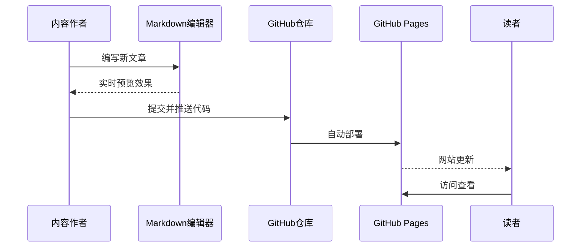

### AI辅助创作

系统特别优化了与AI工具的协作：

1. **直接编辑支持**：AI可以直接修改Markdown文件
2. **元数据管理**：通过index.json集中管理文章元数据
3. **版本控制集成**：利用Git记录每次修改历史
4. **自动化发布**：提交后自动触发部署流程

## 部署与托管

### GitHub Pages配置

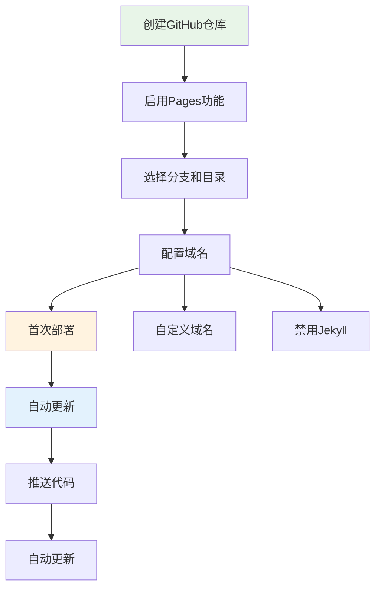

**图表来源**
- [CNAME](file://CNAME#L1-L1)
- [index.html](file://index.html#L1-L104)

### 配置文件说明

| 文件 | 用途 | 配置内容 |
|------|------|----------|
| .nojekyll | 禁用Jekyll | 允许使用下划线开头的文件夹 |
| .gitignore | Git忽略 | 忽略node_modules、临时文件等 |
| CNAME | 自定义域名 | 指定自定义域名地址 |
| index.html | 页面入口 | 包含基础HTML结构和脚本引用 |

**章节来源**
- [CNAME](file://CNAME#L1-L1)
- [.nojekyll](file://.nojekyll#L1-L1)

## 性能与优化

### 加载性能优化

系统在多个层面进行了性能优化：

1. **静态资源缓存**：所有静态文件都可被浏览器有效缓存
2. **按需加载**：文章内容按需异步加载，减少初始加载时间
3. **CDN加速**：通过GitHub Pages的全球CDN分发静态资源
4. **代码分割**：JavaScript按功能模块化，避免重复加载

### 移动端优化

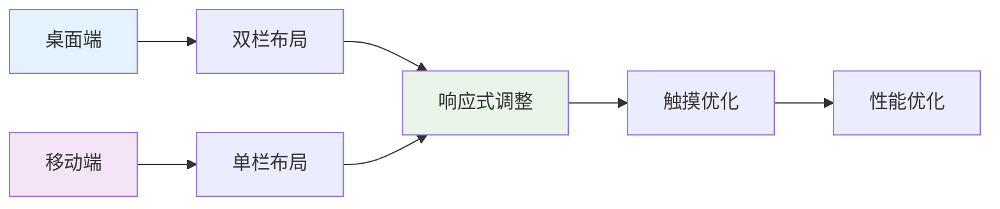

**图表来源**
- [style.css](file://assets/style.css#L384-L440)

### SEO友好设计

- **语义化HTML**：使用正确的HTML标签结构
- **元数据管理**：通过index.json集中管理SEO相关信息
- **结构化数据**：支持搜索引擎更好地理解内容
- **快速加载**：静态文件加载速度优于动态网站

## 总结

这个基于纯前端的静态博客系统代表了现代Web技术发展的新方向。它通过极简的架构设计，成功地解决了传统博客系统的复杂性和维护成本问题。

### 核心优势

1. **技术优势**：无编译、无服务器、纯静态，技术栈简单可靠
2. **用户体验**：快速加载、流畅交互、跨平台兼容
3. **开发效率**：AI友好、版本控制、自动化部署
4. **成本效益**：零服务器成本、零维护成本、无限扩展性

### 适用前景

随着Web技术的不断发展和AI工具的普及，这种"无编译"的静态博客系统将成为内容创作领域的重要选择。它不仅适用于个人博客，也可作为企业知识库、技术文档、学术研究等多种场景的理想解决方案。

通过合理利用GitHub Pages的强大功能和现代Web技术的优势，这个项目为内容创作者提供了一个既专业又实用的平台，真正实现了"专注内容，简化技术"的理念。